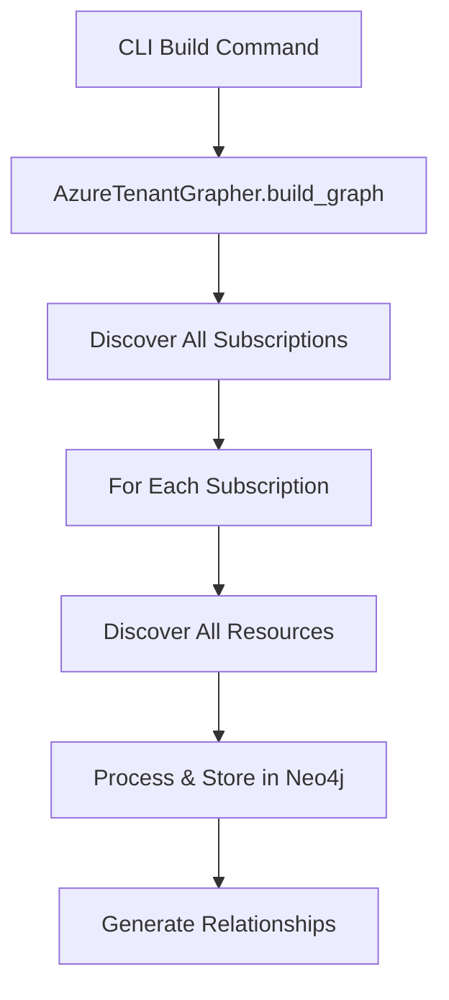
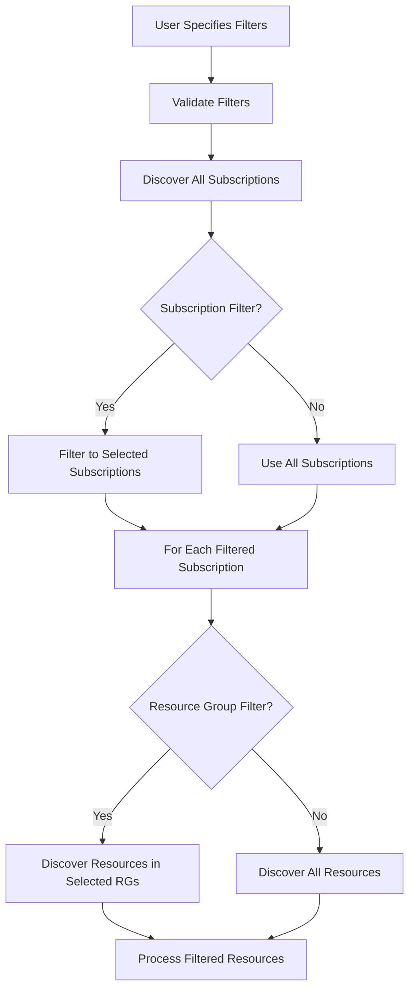

# Azure Tenant Graph Filtering Feature - Primer Document

## Overview
This document serves as a comprehensive primer for implementing subscription and resource group filtering in the Azure Tenant Grapher project. This feature will enable users to create digital twins of specific subsets of an Azure tenant rather than importing the entire tenant.

## Current Architecture

### Key Components

1. **CLI Entry Point** (`scripts/cli.py`)
   - Main command: `build` 
   - Current parameters include: tenant-id, resource-limit, max-llm-threads, max-build-threads, etc.
   - Delegates to `build_command_handler` in `src/cli_commands.py`

2. **Core Coordinator** (`src/azure_tenant_grapher.py`)
   - `AzureTenantGrapher` class orchestrates the entire graph building process
   - Method `build_graph()` manages the workflow:
     1. Discovers subscriptions via `AzureDiscoveryService`
     2. Discovers resources in each subscription
     3. Processes resources and creates Neo4j nodes/edges

3. **Discovery Service** (`src/services/azure_discovery_service.py`)
   - `AzureDiscoveryService` handles all Azure API interactions
   - Key methods:
     - `discover_subscriptions()` - Lists all tenant subscriptions
     - `discover_resources_in_subscription()` - Gets all resources in a subscription
     - `discover_resources_across_subscriptions()` - Concurrent discovery
   - Uses Azure SDK's `SubscriptionClient` and `ResourceManagementClient`

4. **Resource Processing** (`src/services/resource_processing_service.py`)
   - Handles creation of Neo4j nodes and relationships
   - Manages LLM-based description generation
   - Performs de-duplication and relationship analysis

5. **SPA Components**
   - **Frontend** (`spa/renderer/src/components/tabs/ScanTab.tsx`)
     - React component for scan configuration
     - Sends build parameters to backend
   - **Backend Server** (`spa/backend/src/server.ts`)
     - Express server that spawns CLI processes
     - WebSocket support for real-time progress

6. **CLI Dashboard** (`src/cli_dashboard_manager.py`)
   - Rich-based terminal UI for build progress
   - Displays real-time statistics and logs

## Current Resource Discovery Flow



## Proposed Filtering Architecture

### New CLI Parameters
```bash
# Filter by subscriptions
atg build --filter-by-subscriptions sub1,sub2,sub3

# Filter by resource groups  
atg build --filter-by-rgs rg1,rg2,rg3
```

### Implementation Strategy

#### 1. CLI Layer Changes
- Add new options to `build` command in `scripts/cli.py`
- Pass filter parameters through to `build_command_handler`
- Validate filter inputs (subscription IDs, resource group names)

#### 2. Discovery Service Enhancements
- Modify `AzureDiscoveryService` to accept filter criteria
- New methods:
  - `filter_subscriptions(subscription_ids: List[str])` - Filter discovered subscriptions
  - `filter_resource_groups(rg_names: List[str])` - Filter during resource discovery
- Update `discover_resources_in_subscription` to apply RG filters

#### 3. AzureTenantGrapher Updates
- Accept filter parameters in `build_graph()` method
- Apply subscription filtering after discovery
- Pass RG filters to resource discovery calls

#### 4. SPA Updates
- Add filter UI components to ScanTab:
  - Multi-select dropdown for subscriptions
  - Multi-select or text input for resource groups
- Populate subscription dropdown via API call
- Pass filters in build request to backend

#### 5. CLI Dashboard Updates
- Display active filters in dashboard header
- Show filtered vs total counts in statistics

### Data Flow with Filtering



## Implementation Phases

### Phase 1: Backend Core (Can be parallelized)
1. Update CLI argument parsing
2. Modify AzureDiscoveryService filtering logic
3. Update AzureTenantGrapher orchestration

### Phase 2: Frontend (Can be parallelized)
1. Update ScanTab UI components
2. Add filter validation
3. Update backend API calls

### Phase 3: Dashboard & Testing
1. Update CLI dashboard display
2. Write comprehensive tests
3. Integration testing

## Parallel Work Analysis

The following work streams can proceed in parallel:

**Stream 1 - Backend Core**
- CLI parameter additions
- Discovery service filtering logic
- Core orchestration updates

**Stream 2 - Frontend UI**
- ScanTab component updates
- Filter UI controls
- Validation logic

**Stream 3 - Testing**
- Unit tests for filtering logic
- Integration tests
- E2E testing scenarios

## Key Files to Modify

### Backend
- `scripts/cli.py` - Add filter parameters
- `src/cli_commands.py` - Pass filters to grapher
- `src/azure_tenant_grapher.py` - Apply filters in build_graph
- `src/services/azure_discovery_service.py` - Implement filtering logic
- `src/config_manager.py` - Add filter config options

### Frontend
- `spa/renderer/src/components/tabs/ScanTab.tsx` - Add filter UI
- `spa/backend/src/server.ts` - Handle filter parameters

### Dashboard
- `src/cli_dashboard_manager.py` - Display filter info
- `src/rich_dashboard.py` - Update statistics display

## Testing Strategy

### Unit Tests
- Test filter validation logic
- Test subscription filtering
- Test resource group filtering
- Test edge cases (empty filters, invalid IDs)

### Integration Tests
- Test filtered graph building end-to-end
- Test with various filter combinations
- Test error handling

### Manual Testing Scenarios
1. Filter by single subscription
2. Filter by multiple subscriptions
3. Filter by single resource group
4. Filter by multiple resource groups
5. Combine subscription and RG filters
6. Test with invalid inputs

## Configuration & Validation

### Subscription ID Format
- Standard UUID format: `xxxxxxxx-xxxx-xxxx-xxxx-xxxxxxxxxxxx`
- Validate against discovered subscriptions

### Resource Group Name Format
- Alphanumeric, underscores, periods, hyphens
- 1-90 characters
- Case-insensitive matching

## Error Handling

### Common Error Scenarios
1. Invalid subscription IDs
2. Non-existent resource groups
3. No resources found with filters
4. Permission issues on filtered resources

### User Feedback
- Clear error messages in CLI
- Progress indication during filtered discovery
- Summary of what was filtered

## Performance Considerations

- Filtering reduces API calls and processing time
- Concurrent discovery still applies to filtered subscriptions
- Consider caching subscription list for UI

## Security Considerations

- Filters don't bypass Azure RBAC
- User must have permissions for filtered resources
- Log filtered operations for audit

## Future Enhancements

1. Save/load filter presets
2. Filter by resource type
3. Filter by tags
4. Regex/wildcard support for RG names
5. Exclusion filters (everything except...)

## Dependencies

No new external dependencies required. Uses existing:
- Azure SDK for Python
- Click for CLI
- React/MUI for frontend
- Neo4j driver

## Migration Path

This feature is additive - existing functionality remains unchanged when no filters are specified. The default behavior (no filters) imports the entire tenant as before.

## Summary

This filtering feature enhances the Azure Tenant Grapher by allowing targeted imports of specific subscriptions and resource groups. The implementation leverages existing architecture with minimal changes to core components, focusing on adding filter logic at key decision points in the discovery flow.