# CLI Initialization Sequence Diagram

**Purpose**: Visual representation of amplihack CLI startup flow from entry point to memory backend instantiation.

---

## Complete Initialization Sequence

```mermaid
sequenceDiagram
    participant User
    participant Shell
    participant PyProject as pyproject.toml
    participant Main as amplihack:main()
    participant CLI as cli.py
    participant LaunchCmd as launch_command()
    participant Tracker as SessionTracker
    participant LaunchImpl as _launch_command_impl()
    participant Launcher as ClaudeLauncher
    participant Prepare as prepare_launch()
    participant Neo4jStartup as _interactive_neo4j_startup()
    participant ClaudeProc as Claude Process
    participant SessionHook as SessionStart Hook
    participant Memory as KuzuBackend

    User->>Shell: amplihack launch
    Shell->>PyProject: execute entry point
    PyProject->>Main: amplihack:main()
    Main->>CLI: cli.py:main()
    CLI->>CLI: parse arguments
    CLI->>LaunchCmd: launch_command(args)

    Note over LaunchCmd: Detect nesting, auto-stage if needed

    LaunchCmd->>Tracker: start_session(pid, cwd, argv)
    Tracker-->>LaunchCmd: session_id

    LaunchCmd->>LaunchImpl: _launch_command_impl(args, session_id)

    Note over LaunchImpl: Set environment variables<br/>(NEO4J, AUTO_MODE, etc.)

    LaunchImpl->>LaunchImpl: Check Docker mode

    alt Docker Mode Enabled
        LaunchImpl->>Docker: run_command(docker_args)
        Docker-->>User: Docker container execution
    else Normal Mode
        LaunchImpl->>Launcher: ClaudeLauncher(proxy, checkout_repo)
        LaunchImpl->>Prepare: launcher.prepare_launch()

        rect rgb(200, 220, 255)
            Note over Prepare: PREPARATION PHASE (Where blarify prompt fits)

            Prepare->>Prepare: 1. check_prerequisites()
            Note right of Prepare: Validate Claude CLI,<br/>Docker, Node.js

            Prepare->>Prepare: 2. _check_neo4j_credentials()
            Note right of Prepare: Sync credentials from containers

            Prepare->>Neo4jStartup: 3. _interactive_neo4j_startup()
            Neo4jStartup-->>User: Neo4j startup dialog
            User-->>Neo4jStartup: User decision
            Neo4jStartup-->>Prepare: continue/exit

            rect rgb(255, 255, 200)
                Note over Prepare: 🔵 INSERT BLARIFY PROMPT HERE (NEW STEP 4)
                Prepare->>Prepare: 4. _prompt_for_blarify_indexing()
                Note right of Prepare: - Check consent cache<br/>- Prompt user (30s timeout)<br/>- Run blarify analyze<br/>- Non-blocking
            end

            Prepare->>Prepare: 5-11. Remaining steps
            Note right of Prepare: - Repo checkout<br/>- Runtime dirs<br/>- Hook paths<br/>- LSP config<br/>- Proxy start
        end

        Prepare-->>Launcher: ready

        LaunchImpl->>Launcher: launcher.launch_interactive()
        Launcher->>ClaudeProc: subprocess.run([claude, args])

        rect rgb(200, 255, 200)
            Note over ClaudeProc,Memory: SESSION START PHASE (Memory initialization)

            ClaudeProc->>SessionHook: Trigger SessionStart hook
            SessionHook->>SessionHook: process(input_data)
            Note right of SessionHook: - Version check<br/>- Global hook migration<br/>- Context preservation<br/>- UVX staging

            SessionHook->>Memory: Initialize KuzuBackend
            Memory->>Memory: Create database connection
            Memory->>Memory: Initialize schema
            Memory-->>SessionHook: Backend ready

            SessionHook-->>ClaudeProc: Session context
        end

        ClaudeProc-->>User: Claude interactive session
    end

    Note over User,Memory: Blarify prompt happens BEFORE Claude starts<br/>Memory initialization happens AFTER Claude starts
```



---

## Timing Analysis

### Critical Timing Windows

```
Timeline (relative to user running `amplihack launch`):

T+0.0s    Entry point (pyproject.toml)
T+0.1s    CLI parsing
T+0.2s    Session tracking starts
T+0.3s    Environment variable setup
T+0.5s    ClaudeLauncher created
T+0.6s    ├─ Step 1: Prerequisites check (0.1s)
T+0.7s    ├─ Step 2: Neo4j credentials (0.1s)
T+0.8s    ├─ Step 3: Neo4j startup dialog (BLOCKING - user dependent)
T+30.0s   │  └─ User timeout or decision
T+30.1s   ├─ Step 4: 🔵 BLARIFY PROMPT (NEW - 30s timeout)
T+60.1s   │  └─ Timeout or user decision
T+60.2s   ├─ Step 5-11: Remaining prep (0.5s)
T+60.7s   └─ Preparation complete

T+61.0s   Claude subprocess starts
T+62.0s   SessionStart hook triggered
T+62.1s   Memory backend initialized
T+62.5s   Claude ready for user interaction
```

### Integration Point Comparison

| Integration Point | Timing | Claude State | Memory State | User Experience |
|-------------------|--------|--------------|--------------|-----------------|
| **CLI Pre-Launch** | T+0.3s | Not started | Not created | Too early |
| **Launcher Prepare (RECOMMENDED)** | T+30-60s | Not started | Not created | ✅ Perfect |
| **SessionStart Hook** | T+62s | Running | Creating | Too late |

---

## Blarify Integration Point Detail

### Option B: Launcher Prepare (RECOMMENDED)


### Consent File State Machine


---

## Memory Backend Initialization Detail

### Current Flow (No Changes Needed)


**Key Point**: Memory backend initialization is SEPARATE from blarify indexing. They don't interfere with each other.

---

## Data Flow: Blarify to Memory (Future Integration)

### Optional Phase 2 Integration


This integration is OPTIONAL and can be added in Phase 2 without affecting the prompt implementation.

---

## Comparison: Neo4j vs Blarify Prompts

### Similarities (Pattern to Follow)

| Aspect | Neo4j Startup | Blarify Indexing |
|--------|--------------|------------------|
| **Location** | `prepare_launch()` step 3 | `prepare_launch()` step 4 |
| **Timing** | Before Claude starts | Before Claude starts |
| **Blocking** | Yes (waits for decision) | Yes (waits for decision) |
| **User Choice** | Start/Skip/Exit | Index/Skip |
| **Timeout** | Yes (varies) | Yes (30s) |
| **Default** | Continue without | Continue without |
| **Error Handling** | Non-blocking | Non-blocking |
| **First Session** | Every session | Once per project |

### Differences

| Aspect | Neo4j Startup | Blarify Indexing |
|--------|--------------|------------------|
| **Frequency** | Every session | First session only |
| **Caching** | None | Consent file per project |
| **Infrastructure** | Docker container | CLI command |
| **Opt-in** | Environment variable | User prompt |
| **Failure Mode** | Fallback to SQLite | Continue without indexing |

---

## Key Architecture Decisions Visualized

### Decision Tree: Where to Prompt

```mermaid
graph TD
    Start[Where to add blarify prompt?] --> Q1{Before or after<br/>Claude starts?}
    Q1 -->|Before| Q2{Before or after<br/>prerequisites?}
    Q1 -->|After| Rejected1[❌ SessionStart Hook<br/>Too late]

    Q2 -->|Before| Rejected2[❌ CLI Pre-Launch<br/>Too early]
    Q2 -->|After| Q3{Infrastructure<br/>available?}

    Q3 -->|Yes| Q4{Follows existing<br/>patterns?}
    Q3 -->|No| Rejected3[❌ Custom Integration<br/>Complex]

    Q4 -->|Yes| Winner[✅ Launcher Prepare<br/>Step 4 after Neo4j]
    Q4 -->|No| Rejected4[❌ New Pattern<br/>Inconsistent]

    style Winner fill:#afa,stroke:#0a0,stroke-width:3px
    style Rejected1 fill:#faa,stroke:#a00
    style Rejected2 fill:#faa,stroke:#a00
    style Rejected3 fill:#faa,stroke:#a00
    style Rejected4 fill:#faa,stroke:#a00
```



### Caching Strategy Decision


---

## Testing Scenarios Flow

### Test Case: First Session (Happy Path)

```mermaid
sequenceDiagram
    participant Test as Test Runner
    participant Launcher as ClaudeLauncher
    participant Prompt as Blarify Prompt
    participant User as Simulated User
    participant ConsentFile as Consent File

    Test->>Launcher: Start launcher (first time)
    Launcher->>Prompt: _prompt_for_blarify_indexing()

    Prompt->>ConsentFile: Check existence
    ConsentFile-->>Prompt: Not found (first session)

    Prompt->>User: Display prompt
    User-->>Prompt: Accept ("yes")

    Prompt->>Prompt: Run blarify indexing
    Note right of Prompt: Success expected

    Prompt->>ConsentFile: Create file with state
    Prompt-->>Launcher: Return True (continue)

    Launcher-->>Test: Launch successful

    Test->>ConsentFile: Verify file created
    ConsentFile-->>Test: ✅ File exists
```



### Test Case: Subsequent Session (Skip Prompt)

```mermaid
sequenceDiagram
    participant Test as Test Runner
    participant Launcher as ClaudeLauncher
    participant Prompt as Blarify Prompt
    participant ConsentFile as Consent File

    Test->>Launcher: Start launcher (second time)
    Launcher->>Prompt: _prompt_for_blarify_indexing()

    Prompt->>ConsentFile: Check existence
    ConsentFile-->>Prompt: Found (already prompted)

    Prompt-->>Launcher: Return True immediately (skip)
    Launcher-->>Test: Launch successful

    Note over Test: ✅ No prompt shown<br/>✅ Fast startup
```



### Test Case: Timeout (Default Yes)

```mermaid
sequenceDiagram
    participant Test as Test Runner
    participant Prompt as Blarify Prompt
    participant Timeout as Timeout Handler
    participant User as Simulated User (No Input)

    Test->>Prompt: _prompt_for_blarify_indexing()
    Prompt->>User: Display prompt (30s timeout)

    Note over User: No input provided

    Prompt->>Timeout: get_user_input_with_timeout(30)

    loop Wait for input
        Timeout->>Timeout: Sleep 1s
        Note over Timeout: 1s... 2s... 3s... 30s
    end

    Timeout-->>Prompt: None (timeout)
    Prompt->>Prompt: Use default (yes)
    Prompt->>Prompt: Run blarify indexing
    Prompt-->>Test: Return True

    Note over Test: ✅ Default behavior correct<br/>✅ Non-blocking
```



---

## Performance Impact Analysis

### Startup Time Impact

```mermaid
gantt
    title CLI Startup Timeline (First Session vs Subsequent)
    dateFormat SSS
    axisFormat %Ss

    section First Session
    Prerequisites           :000, 100ms
    Neo4j Startup          :100, 30000ms
    Blarify Prompt         :30100, 30000ms
    Blarify Indexing       :60100, 30000ms
    Remaining Prep         :90100, 500ms
    Claude Start           :90600, 2000ms

    section Subsequent Session
    Prerequisites           :000, 100ms
    Neo4j Startup          :100, 100ms
    Blarify Check (cached) :200, 10ms
    Remaining Prep         :210, 500ms
    Claude Start           :710, 2000ms
```

**Analysis**:
- **First session**: +60s (30s prompt + 30s indexing) - acceptable for one-time setup
- **Subsequent sessions**: +10ms (file check) - negligible impact
- **User perception**: Smooth (happening during natural "setup" phase)

---

## Appendix: Mermaid Source Files

All diagrams in this document are in mermaid format and can be:
1. Rendered in GitHub markdown
2. Edited in mermaid.live
3. Exported to PNG/SVG for documentation

To regenerate any diagram:
1. Copy the mermaid code block
2. Paste into https://mermaid.live
3. Edit as needed
4. Export or copy back to markdown

---

*Diagram documentation created: 2026-01-22*
*Reference document: cli_integration_investigation.md*
