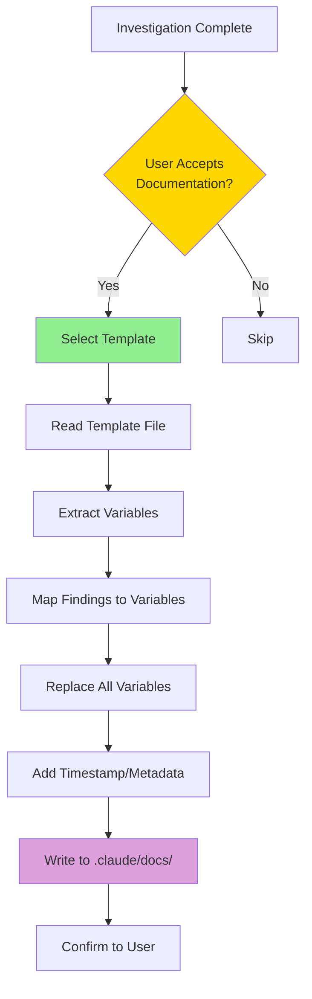
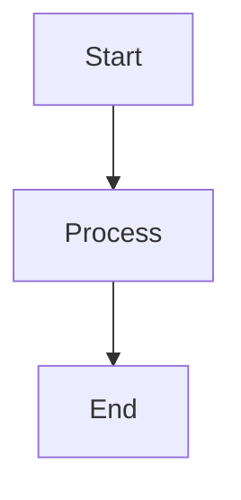

# INVESTIGATION: TEMPLATE_VARIABLE_REPLACEMENT

## Findings Summary

Investigated how template variable replacement works in the documentation generation system. Found that the system uses simple string replacement with `[VARIABLE]` placeholders in markdown templates. Key findings:

- Templates are pure markdown files stored in `.claude/templates/`
- Variables use `[BRACKET]` notation for easy identification
- Replacement is done via simple string substitution (no template engine)
- Optional sections can be omitted if data not available
- Timestamp and metadata added automatically during generation

The simplicity of this approach means zero external dependencies and maximum maintainability.

## Architecture Diagrams

### Template Processing Flow



## Key Files

| File Path                                                         | Purpose                | Key Components                         |
| ----------------------------------------------------------------- | ---------------------- | -------------------------------------- |
| `.claude/templates/investigation-doc-template.md`                 | Template structure     | Variable placeholders, section headers |
| `.claude/templates/architecture-doc-template.md`                  | Architecture template  | Extended sections, design decisions    |
| `.claude/agents/amplihack/specialized/knowledge-archaeologist.md` | Variable mapping logic | Template Variable Mapping table        |

## System Integration

The template system integrates with the knowledge-archaeologist agent through a simple variable mapping process:

1. **Agent collects findings** during investigation
2. **User accepts documentation** via prompt
3. **Agent selects template** based on investigation type
4. **Variable mapping** applied using table in agent definition
5. **String replacement** performs `[VARIABLE]` → actual value substitution
6. **File writing** creates final documentation in `.claude/docs/`

No intermediate processing or complex transformations occur - it's direct string replacement with markdown preservation.

## Verification Steps

1. **Verify template variables are defined**

   ```bash
   grep -o '\[.*\]' .claude/templates/investigation-doc-template.md | sort -u
   # Shows all variables in template
   ```

2. **Verify mapping table exists in agent**

   ```bash
   grep -A 10 "Template Variable Mapping" .claude/agents/amplihack/specialized/knowledge-archaeologist.md
   # Shows variable mapping table
   ```

3. **Test variable replacement** (manual)
   - Create test findings with known values
   - Generate documentation
   - Verify all `[VARIABLES]` replaced with actual data
   - Check no `[BRACKETS]` remain in output

4. **Verify optional sections work**
   - Generate doc without diagrams
   - Verify section omitted gracefully
   - Check no broken markdown syntax

## Examples

### Example 1: Basic Variable Replacement

**Template Content**:

```markdown
# INVESTIGATION: [TOPIC]

## Findings Summary

[FINDINGS]
```

**Variable Mapping**:

- `[TOPIC]` → "TEMPLATE_VARIABLE_REPLACEMENT"
- `[FINDINGS]` → "Investigated how template variable replacement works..."

**Generated Output**:

```markdown
# INVESTIGATION: TEMPLATE_VARIABLE_REPLACEMENT

## Findings Summary

Investigated how template variable replacement works...
```

### Example 2: File Table Replacement

**Template Content**:

```markdown
| File Path   | Purpose       | Key Components |
| ----------- | ------------- | -------------- |
| [file_path] | [description] | [details]      |
```

**Variable Mapping** (multiple rows):

- Row 1: `.claude/templates/investigation-doc-template.md` | Template structure | Variable placeholders
- Row 2: `.claude/templates/architecture-doc-template.md` | Architecture template | Extended sections

**Generated Output**:

```markdown
| File Path                                         | Purpose               | Key Components        |
| ------------------------------------------------- | --------------------- | --------------------- |
| `.claude/templates/investigation-doc-template.md` | Template structure    | Variable placeholders |
| `.claude/templates/architecture-doc-template.md`  | Architecture template | Extended sections     |
```

### Example 3: Optional Mermaid Diagram

**Template Content**:

````markdown
## Architecture Diagrams

```mermaid
[Insert mermaid diagram here if applicable]
```
````

````

**Scenario 1** (diagram available):
```markdown
## Architecture Diagrams



**Scenario 2** (no diagram):
Section omitted or replaced with "No diagrams created during investigation."

## Knowledge Gaps

None identified. The template variable replacement system is straightforward and well-documented in the agent definition.

## Related Documentation

- `.claude/templates/README.md` - Template usage guide
- `.claude/agents/amplihack/specialized/knowledge-archaeologist.md` - Variable mapping table
- `ARCHITECTURE_EXAMPLE.md` - Example of architecture documentation

## Generated

- **Date**: 2025-11-05 06:05:00
- **Source**: Investigation Session
- **Agent**: knowledge-archaeologist
- **Investigation Type**: General Investigation
```
