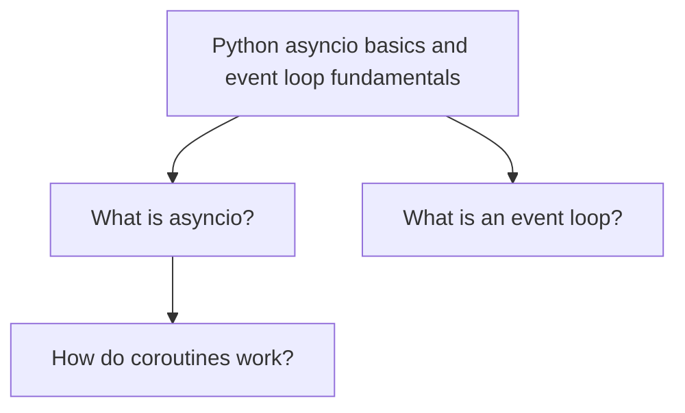

# Knowledge Graph: Python asyncio basics and event loop fundamentals

Generated: 2025-10-18 14:34:34

## Overview

This knowledge graph contains 3 questions organized in a Socratic hierarchy:

- 2 initial questions (depth 0)
- 1 follow-up questions (depth 1)
- 0 deeper questions (depth 2)
- 0 deepest questions (depth 3)

## Visual Representation

_Note: Diagram shows simplified view (first 5 initial questions with first child each)_

## Question Hierarchy

### What is asyncio?

**Answer:** Python library for asynchronous programming

**Follow-up questions:**

- How do coroutines work?

### What is an event loop?

**Answer:** Core of asyncio that manages async tasks
