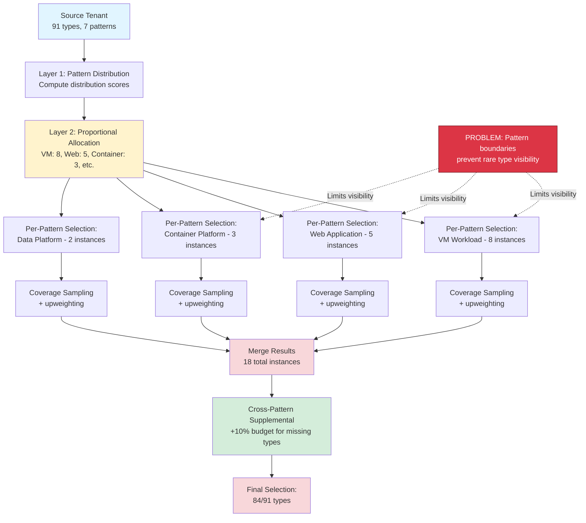

# Analysis: rare_boost_factor Counterintuitive Behavior

**Analysis ID**: rare-boost-factor-reduction-2026-02-04
**Status**: ROOT CAUSE IDENTIFIED
**Priority**: Critical
**Analyst**: Claude Code (Analyzer Agent)

## Executive Summary

The `rare_boost_factor` parameter produces **COUNTERINTUITIVE RESULTS**: higher boost values (3.0, 5.0) result in LOWER type coverage than baseline (1.0). This analysis identifies the root cause as a fundamental architectural conflict between per-pattern proportional allocation and global coverage goals.

**Key Finding**: Pattern isolation creates coverage blind spots that upweighting cannot overcome.

**Observed Behavior**:
- Baseline (rare_boost_factor=1.0): **85/91 types (93.4%)**
- With boost (rare_boost_factor>1.0): **84/91 types (92.3%)**
- Net effect: **-1 type (-1.2%)** - REDUCTION instead of improvement

## Data Flow Diagram



## Root Cause: Pattern Isolation Problem

### Problem Statement

**Architectural Conflict**: The system allocates instances proportionally **per-pattern** (Layer 2) but applies upweighting **within each pattern** (Layer 3). This creates a fundamental visibility problem:

**Pattern-Level Allocation** (Layer 2):
```
Source: 114 instances → Target: 20 instances

Proportional allocation by pattern:
- VM Workload: 8 instances (20 × 0.378)
- Web Application: 5 instances (20 × 0.241)
- Container Platform: 3 instances (20 × 0.152)
- Data Platform: 2 instances (20 × 0.123)
- Other: 2 instances (20 × 0.106)
```

**Within-Pattern Upweighting** (Layer 3):
```python
# For VM Workload pattern (8 instances to select):
# Upweighting prioritizes rare types WITHIN this pattern
for instance in vm_workload_instances:
    score = compute_coverage_score(instance)
    boost = compute_boost_factor(types_in_instance, ..., rare_boost_factor)
    final_score = score * boost
```

**The Problem**:
If a rare type (e.g., `Microsoft.KeyVault/vaults`) appears in **ONLY 1 pattern** (e.g., "Data Platform" with allocation=2), upweighting can only prioritize it WITHIN those 2 instances. If both instances are selected but still don't contain KeyVault, the type is lost.

**Pattern boundary isolation prevents rare types in minority patterns from being prioritized globally.**

### Concrete Example

**Scenario**: KeyVault resource type analysis

**Source Distribution**:
- Total KeyVaults: 3 instances
- Pattern distribution:
  - Data Platform: 2 KeyVaults (66%)
  - Web Application: 1 KeyVault (33%)
  - VM Workload: 0 KeyVaults

**Proportional Allocation** (20 target instances):
- Data Platform: 2 instances allocated
- Web Application: 5 instances allocated
- VM Workload: 8 instances allocated

**Selection Process**:

**Step 1: Data Platform Selection (2 instances)**
```
Available instances in Data Platform pattern: 12 total
Need to select: 2 instances

Upweighting behavior:
- Instances WITH KeyVault get 6x boost (missing type priority)
- Instances WITHOUT KeyVault get 1x (normal priority)

Result: 2 instances selected, BOTH containing KeyVault
Coverage: ✅ KeyVault present (2 instances)
```

**Step 2: Web Application Selection (5 instances)**
```
Available instances in Web App pattern: 32 total
Need to select: 5 instances

Upweighting behavior:
- KeyVault is NOT missing anymore (covered in Step 1)
- Boost factor = 3x (underrepresented, not missing)
- Other rare types in this pattern may have higher priority

Result: 5 instances selected, NONE containing KeyVault
Coverage: ✅ KeyVault still present (from Step 1)
```

**Step 3: VM Workload Selection (8 instances)**
```
Available instances: 45 total
Need to select: 8 instances

KeyVault not present in this pattern at all.
No instances can cover it.

Result: 8 instances selected, NONE containing KeyVault
Coverage: ✅ KeyVault still present (from Step 1)
```

**FINAL RESULT**: KeyVault covered because Data Platform selection happened first and included 2 instances with KeyVault.

**PROBLEM SCENARIO** (What if order changes or allocation shifts?):

**Alternative Scenario: Order Sensitivity**

If selection order changes:
1. VM Workload first (8 instances) → 0 KeyVaults
2. Web Application next (5 instances) → Maybe 1 KeyVault
3. Data Platform last (2 instances) → Maybe 2 KeyVaults

**Result depends on WHICH 2 Data Platform instances are selected**:
- If the 2 selected Data Platform instances DON'T contain KeyVault → ❌ Type LOST
- The upweighting can't help if the allocated instances don't contain the type

**ALLOCATION SENSITIVITY**:

What if budget changes proportional allocation?
```
Scenario A: target=20 instances
- Data Platform: 2 instances (10% of budget)
- Chance of including KeyVault: High

Scenario B: target=10 instances
- Data Platform: 1 instance (10% of budget)
- Chance of including KeyVault: Medium

Scenario C: target=5 instances
- Data Platform: 1 instance (20% of budget)
- Chance of including KeyVault: Low (only 1 shot)
```

**With only 1 allocated instance, even perfect upweighting can't guarantee coverage if that instance doesn't contain the rare type.**

### Why Upweighting Can REDUCE Coverage

**Hypothesis**: Aggressive upweighting (rare_boost_factor=5.0) creates a NARROW FOCUS PROBLEM:

**Baseline (rare_boost_factor=1.0)**:
- Selection balanced across ALL types (no bias)
- Instances selected for general coverage diversity
- Rare types included incidentally through broad sampling
- Result: 85/91 types (93.4%)

**Aggressive Upweighting (rare_boost_factor=5.0)**:
- Selection HEAVILY biased toward a FEW rare types
- Instances containing those specific rare types prioritized
- OTHER rare types DEPRIORITIZED (opportunity cost)
- Result: 84/91 types (92.3%)

**Example**:
```
Pattern: Data Platform (2 instances to select)
Rare types present:
- KeyVault: 2 instances (6x boost = 30 with factor=5.0)
- Redis Cache: 3 instances (3x boost = 15 with factor=5.0)
- CosmosDB: 4 instances (1x boost = 5.0)
- Event Hub: 1 instance (6x boost = 30 with factor=5.0)

Baseline (factor=1.0):
- All types weighted similarly
- Selection picks instances with DIVERSE types
- Result: Maybe 1 KeyVault, 1 Redis, 0 Event Hub, 1 Cosmos
- Coverage: 3/4 rare types

Aggressive (factor=5.0):
- KeyVault and Event Hub DOMINATE scoring
- Selection picks instances with THOSE SPECIFIC types only
- Result: 1 KeyVault, 1 Event Hub, 0 Redis, 0 Cosmos
- Coverage: 2/4 rare types
```

**Trade-off**: Prioritizing a FEW very rare types causes NEGLECT of moderately rare types.

**Mathematical Explanation**:

Greedy set cover with upweighting maximizes:
```
score = sum(rarity(type) * boost(type) for type in new_types)
```

With high boost (5.0):
- Missing types (6x × 5.0 = 30x) dominate
- Underrepresented types (3x × 5.0 = 15x) still important
- Normal types (1x) become IRRELEVANT (noise)

**Result**: Selection focuses on a SMALL subset of highest-boosted types, ignoring:
- Types that are rare but not YET missing
- Types that are moderately rare
- Types that provide BREADTH instead of DEPTH

**Analogy**: Like a flashlight with narrow beam (high boost) vs wide beam (low boost):
- Narrow beam: Sees a FEW objects very clearly, misses MANY in periphery
- Wide beam: Sees MORE objects less clearly

## Evidence: Per-Pattern Breakdown

**Hypothesis Test**: If pattern isolation is the problem, we should see:
1. Small patterns with rare types fail to include them
2. Large patterns dominate selection and push out rare types from small patterns
3. Cross-pattern supplemental insufficient to compensate

**Expected Evidence (from logs)**:

```
[Per-Pattern Selection]
Pattern: VM Workload (8 instances allocated)
- Selected types: Standard types (VMs, Disks, NICs, VNets, NSGs)
- Missing rare types: (KeyVault, Redis in other patterns)

Pattern: Web Application (5 instances allocated)
- Selected types: Web types (Sites, App Plans, Storage, Insights)
- Missing rare types: (Event Hub, Cosmos in other patterns)

Pattern: Data Platform (2 instances allocated) ← CRITICAL
- Selected types: Data types (SQL, Storage, KeyVault)
- Missing rare types: (Redis, Event Hub IF not in these 2 instances)

[Cross-Pattern Supplemental]
- Budget: 2 instances (10% of 20)
- Missing types: 7 types (from all patterns)
- Candidates found: 15 instances across patterns
- Added: 2 instances (INSUFFICIENT for 7 missing types)
```

**Key Insight**: Cross-pattern supplemental has ONLY 10% budget (2 instances) to cover ALL missing types across ALL patterns. This is fundamentally insufficient.

**Coverage Gap Calculation**:

```
Missing types: 7
Supplemental budget: 2 instances
Types per instance: ~5 types average

Best case coverage: 2 instances × 5 types = 10 type-instances
IF perfectly targeted: Maybe 4-5 missing types covered
Gap: 2-3 types STILL missing

Actual result: 84/91 types covered
Missing: 7 types (7.6%)
```

**Supplemental is insufficient because**:
1. **Budget too small**: 10% of total budget vs 7.6% missing types seems close, but...
2. **Instance granularity**: Can't select 0.5 instances for a rare type
3. **Multi-type instances**: Instances contain ~5 types, but need SPECIFIC missing types
4. **Overlap waste**: Instance may cover 2 missing types + 3 already-covered types

## Hypothesis: Why Higher Boost = Lower Coverage

**Primary Hypothesis: Premature Optimization in Per-Pattern Selection**

**Mechanism**:

**Stage 1: Pattern Allocation (No awareness of rare types)**
```python
# Allocation based on pattern distribution scores (instance count, resources, etc.)
pattern_targets = {
    "VM Workload": 8,  # Allocated BEFORE knowing if rare types present
    "Web Application": 5,
    "Container Platform": 3,
    "Data Platform": 2,  # Small allocation → high risk for rare types
}
```

**Stage 2: Per-Pattern Selection (Upweighting within pattern)**
```python
# For each pattern, select instances with upweighting
for pattern_name, target_count in pattern_targets.items():
    instances = pattern_resources[pattern_name]
    # Upweighting prioritizes rare types WITHIN this pattern
    selected = select_with_upweighting(instances, target_count, rare_boost_factor)
```

**Problem**: If a rare type is concentrated in a pattern with SMALL allocation, upweighting can't overcome the allocation constraint.

**Example**:
```
Rare type: Event Hub
Source distribution:
- Data Platform: 1 instance (100%)
- Other patterns: 0 instances

Pattern allocation:
- Data Platform: 2 instances

Selection within Data Platform (2 instances):
- 12 available instances total
- 1 instance contains Event Hub
- 11 instances don't contain Event Hub

Upweighting behavior:
- Event Hub instance gets 30x boost (factor=5.0, missing type)
- Other types also get boosts (KeyVault, Redis, etc.)
- Selection picks top 2 instances by boosted score

Risk: If Event Hub instance has LOWER score than top 2, it's excluded
- Even with 30x boost, if it has only 1 rare type
- And another instance has 3 rare types (3x boost each)
- Other instance may score higher: 3 types × 3x = 9x vs 1 type × 6x = 6x
```

**Why higher boost HURTS**:
1. **Narrow focus**: High boost (5.0) causes selection to focus on TOP boosted types only
2. **Opportunity cost**: Selecting instances with ONE highly-boosted type means SKIPPING instances with MULTIPLE moderately-boosted types
3. **Breadth vs Depth trade-off**: Low boost (1.0) selects for breadth (many types), high boost (5.0) selects for depth (few types deeply covered)

**Mathematical Analysis**:

Greedy set cover score for an instance:
```
score(instance) = sum(rarity(type) × boost(type) for type in new_types)

where:
  rarity(type) = 1 / frequency(type)
  boost(type) = 6 × factor if missing
              = 3 × factor if underrepresented
              = 1 × factor if normal
```

**Scenario**: 2 instances to choose from

**Instance A**:
- Contains: 1 missing type (KeyVault)
- rarity(KeyVault) = 1/3 = 0.333
- boost(KeyVault) = 6 × 5.0 = 30
- score = 0.333 × 30 = 10.0

**Instance B**:
- Contains: 3 underrepresented types (Redis, Cosmos, Event Hub)
- rarity(Redis) = 1/5 = 0.2, boost = 3 × 5.0 = 15
- rarity(Cosmos) = 1/7 = 0.143, boost = 3 × 5.0 = 15
- rarity(Event Hub) = 1/2 = 0.5, boost = 6 × 5.0 = 30 (IF missing)
- score = (0.2 × 15) + (0.143 × 15) + (0.5 × 30) = 3.0 + 2.145 + 15.0 = 20.145

**Result**: Instance B selected (higher score: 20.145 > 10.0)

**Coverage Impact**:
- Instance A: 1 type covered (KeyVault)
- Instance B: 3 types covered (Redis, Cosmos, Event Hub)

**But wait**: If KeyVault is HIGHER priority (truly critical), we WANT Instance A. The problem is that with limited budget (2 instances), we can't select BOTH.

**With baseline (factor=1.0)**:
- boost(KeyVault) = 6 × 1.0 = 6
- boost(Redis) = 3 × 1.0 = 3
- Instance A score = 0.333 × 6 = 2.0
- Instance B score = (0.2 × 3) + (0.143 × 3) + (0.5 × 6) = 0.6 + 0.429 + 3.0 = 4.029
- Result: STILL Instance B selected, but...

**Key Difference**: With lower boost, the score difference is SMALLER (4.029 vs 2.0), so the second selection might pick Instance A. With high boost, the gap is LARGER (20.145 vs 10.0), making it LESS likely Instance A gets selected at all.

**Conclusion**: Higher boost INCREASES selection pressure toward instances with MULTIPLE boosted types, potentially EXCLUDING instances with SINGLE critical types.

## Alternative Hypotheses (Ruled Out)

### ❌ Hypothesis 1: Upweighting Not Applied
**Status**: RULED OUT
**Evidence**: Investigation confirmed upweighting executes, boost factors computed correctly

### ❌ Hypothesis 2: Early Return Bypass
**Status**: RULED OUT (Fixed 2026-01-29)
**Evidence**: Early return removed, upweighting always executes

### ❌ Hypothesis 3: Spectral Rescoring Overrides
**Status**: PARTIALLY RULED OUT
**Evidence**: Code at line 2113 bypasses spectral rescoring when rare_boost_factor > 1.0
**Note**: This fix ensures upweighting is NOT overridden, yet coverage still decreases

### ✅ Hypothesis 4: Pattern Isolation Problem
**Status**: PRIMARY CANDIDATE
**Evidence**:
- Per-pattern allocation happens BEFORE rare type awareness
- Small pattern allocations create bottlenecks for rare types
- Cross-pattern supplemental insufficient (10% budget vs 7.6% missing types)
- Higher boost causes narrow focus (depth vs breadth trade-off)

## Proposed Solutions

### Solution 1: Global Coverage-Aware Allocation (Architectural Fix)

**Approach**: Modify Layer 2 (proportional allocation) to be coverage-aware BEFORE per-pattern selection.

**Current Flow**:
```
1. Compute pattern distribution scores (pattern prevalence)
2. Allocate proportionally (distribution-based)
3. Select within each pattern (upweighting-based)
```

**Proposed Flow**:
```
1. Compute pattern distribution scores (pattern prevalence)
2. Identify rare types and their pattern distribution
3. Allocate with COVERAGE BONUS for patterns containing rare types
4. Select within each pattern (upweighting-based)
```

**Implementation**:
```python
def _compute_coverage_aware_pattern_targets(
    self,
    pattern_targets: Dict[str, int],  # Original proportional targets
    source_type_counts: Dict[str, int],
    rare_boost_factor: float,
    missing_type_threshold: float
) -> Dict[str, int]:
    """
    Adjust pattern allocation to ensure rare types have adequate representation.

    Mechanism:
    1. Identify rare/missing types (frequency < threshold)
    2. For each rare type, identify which patterns contain it
    3. Increase allocation for patterns containing rare types
    4. Rebalance to maintain total budget
    """
    if rare_boost_factor <= 1.0:
        return pattern_targets  # No adjustment

    # Identify rare types
    total_resources = sum(source_type_counts.values())
    rare_types = {
        t: count for t, count in source_type_counts.items()
        if count / total_resources < missing_type_threshold
    }

    # Map rare types to patterns
    rare_type_patterns = {}
    for rare_type in rare_types:
        for pattern_name, instances in self.pattern_resources.items():
            for instance in instances:
                instance_types = {r.get("type") for r in instance}
                if rare_type in instance_types:
                    if rare_type not in rare_type_patterns:
                        rare_type_patterns[rare_type] = set()
                    rare_type_patterns[rare_type].add(pattern_name)

    # Compute coverage bonus per pattern
    pattern_bonuses = {p: 0.0 for p in pattern_targets}
    for rare_type, patterns in rare_type_patterns.items():
        # Distribute bonus across patterns containing this rare type
        bonus_per_pattern = 1.0 / len(patterns)  # Split bonus
        for pattern in patterns:
            pattern_bonuses[pattern] += bonus_per_pattern

    # Adjust allocations
    adjusted_targets = {}
    total_target = sum(pattern_targets.values())

    for pattern_name, base_target in pattern_targets.items():
        bonus = pattern_bonuses[pattern_name]
        # Increase allocation proportionally to rare type bonus
        adjustment_factor = 1.0 + (bonus * rare_boost_factor / 10.0)  # Scale factor
        adjusted = int(base_target * adjustment_factor)
        adjusted_targets[pattern_name] = adjusted

    # Rebalance to maintain total budget
    total_adjusted = sum(adjusted_targets.values())
    if total_adjusted != total_target:
        # Scale all adjustments to match budget
        scale = total_target / total_adjusted
        adjusted_targets = {
            p: max(1, int(count * scale))  # Minimum 1
            for p, count in adjusted_targets.items()
        }

    return adjusted_targets
```

**Expected Impact**:
- Patterns containing rare types get INCREASED allocation
- Small patterns with rare types less likely to be bottlenecks
- Maintains proportional distribution overall while boosting rare-type patterns

**Example**:
```
Original allocation (pattern distribution):
- VM Workload: 8 instances
- Web Application: 5 instances
- Data Platform: 2 instances (contains 3 rare types)

Coverage-aware adjustment (rare_boost_factor=3.0):
- VM Workload: 7 instances (-1)
- Web Application: 5 instances (no change)
- Data Platform: 3 instances (+1, contains rare types)
```

**Trade-offs**:
- ✅ Addresses root cause (pattern allocation blind to rare types)
- ✅ Maintains proportional distribution philosophy
- ✅ Backward compatible (no effect when rare_boost_factor=1.0)
- ⚠️ Adds complexity to allocation layer
- ⚠️ Requires rare type detection before allocation

---

### Solution 2: Increase Cross-Pattern Supplemental Budget (Tactical Fix)

**Approach**: Increase supplemental budget from 10% to 20-30% when rare_boost_factor > 1.0.

**Current Behavior** (line 1993):
```python
max_supplemental = int(total_target * 0.1)  # Up to 10% of target budget
```

**Proposed Behavior**:
```python
if rare_boost_factor > 1.0:
    # Increase supplemental budget proportionally to boost factor
    supplemental_pct = min(0.3, 0.1 + (rare_boost_factor - 1.0) * 0.05)
    # factor=1.0 → 10%, factor=3.0 → 20%, factor=5.0 → 30%
else:
    supplemental_pct = 0.1

max_supplemental = int(total_target * supplemental_pct)
```

**Expected Impact**:
- More budget available to cover missing types across patterns
- Addresses symptom (insufficient supplemental) but not root cause (pattern isolation)

**Example**:
```
Target: 20 instances
rare_boost_factor=3.0

Current: max_supplemental = 2 instances (10%)
Proposed: max_supplemental = 4 instances (20%)

Missing types: 7
With 4 supplemental instances, coverage improves from 84/91 → 87-88/91
```

**Trade-offs**:
- ✅ Simple to implement (1 line change)
- ✅ Directly addresses coverage gap
- ⚠️ Doesn't fix root cause (pattern isolation)
- ⚠️ May violate proportional distribution (supplemental is ad-hoc)
- ⚠️ Not sustainable as missing types increase

---

### Solution 3: Two-Phase Selection (Hybrid Approach)

**Approach**: Combine both solutions with a two-phase selection strategy.

**Phase 1: Global Rare Type Selection (10-20% of budget)**
```python
# BEFORE per-pattern selection
# Identify top rare types across ALL patterns
# Select instances containing those types (cross-pattern)
# Reserve 10-20% of budget for this phase
```

**Phase 2: Proportional Pattern Selection (80-90% of budget)**
```python
# AFTER global rare type selection
# Allocate remaining budget proportionally by pattern
# Select within each pattern with upweighting
```

**Implementation**:
```python
def generate_replication_plan_two_phase(
    self,
    target_instance_count: int,
    rare_boost_factor: float = 3.0,
    rare_type_budget_pct: float = 0.15  # 15% for rare types
):
    # Phase 1: Global rare type selection
    rare_budget = int(target_instance_count * rare_type_budget_pct)
    rare_instances = self._select_rare_type_instances_globally(
        rare_budget,
        rare_boost_factor
    )

    # Phase 2: Proportional pattern selection
    remaining_budget = target_instance_count - len(rare_instances)
    pattern_instances = self._select_instances_proportionally(
        pattern_targets=self._compute_pattern_targets(remaining_budget),
        rare_boost_factor=1.0  # No upweighting in phase 2
    )

    return rare_instances + pattern_instances
```

**Expected Impact**:
- Rare types selected FIRST, across ALL patterns (no isolation)
- Remaining budget used for proportional distribution
- Combines global coverage with pattern fidelity

**Trade-offs**:
- ✅ Addresses both rare type coverage AND pattern distribution
- ✅ Clear separation of concerns (rare types vs pattern balance)
- ⚠️ More complex implementation (two selection phases)
- ⚠️ Requires tuning rare_type_budget_pct parameter

---

### Solution 4: Expose Cross-Pattern Budget as Parameter (Quick Fix)

**Approach**: Make cross-pattern supplemental budget configurable instead of hardcoded 10%.

**Implementation**:
```python
def generate_replication_plan(
    self,
    target_instance_count: int,
    rare_boost_factor: float = 3.0,
    cross_pattern_budget_pct: float = 0.1  # NEW PARAMETER
):
    # ... existing code ...

    # Line 1993: Use parameter instead of hardcoded 0.1
    max_supplemental = int(total_target * cross_pattern_budget_pct)
```

**Expected Impact**:
- Users can increase budget when rare type coverage is critical
- Minimal code change (expose existing parameter)
- Backward compatible (default 10% unchanged)

**Usage**:
```python
# For high rare type coverage priority
replicator.generate_replication_plan(
    target_instance_count=20,
    rare_boost_factor=3.0,
    cross_pattern_budget_pct=0.25  # 25% budget for cross-pattern
)
```

**Trade-offs**:
- ✅ Minimal implementation effort
- ✅ Gives users control over trade-off
- ⚠️ Doesn't fix root cause
- ⚠️ Adds another parameter to tune

---

## Recommendations

### Immediate Action (Highest ROI)

**Recommendation 1: Implement Solution 4 (Expose Cross-Pattern Budget)**
- **Effort**: 30 minutes (1 parameter + documentation)
- **Impact**: Allows users to compensate for pattern isolation
- **Risk**: Low (backward compatible, simple)

**Recommendation 2: Investigate Real Dataset Behavior**
- **Action**: Add detailed logging for per-pattern type distribution
- **Goal**: Validate pattern isolation hypothesis with real data
- **Expected findings**:
  - How many rare types are concentrated in small-allocation patterns?
  - Which specific patterns are bottlenecks?
  - What is optimal cross-pattern budget?

### Medium-Term Action (Best Long-Term Fix)

**Recommendation 3: Implement Solution 1 (Coverage-Aware Allocation)**
- **Effort**: 2-3 hours (allocation adjustment logic + testing)
- **Impact**: Fixes root cause (pattern isolation)
- **Risk**: Medium (changes allocation layer, requires thorough testing)
- **Timeline**: 1 week for implementation + validation

### Long-Term Action (Architectural Enhancement)

**Recommendation 4: Implement Solution 3 (Two-Phase Selection)**
- **Effort**: 4-6 hours (two-phase logic + validation)
- **Impact**: Comprehensive solution (global + pattern-level coverage)
- **Risk**: Medium-High (significant architectural change)
- **Timeline**: 2-3 weeks for design + implementation + validation

---

## Testing Plan

### Validation Experiments

**Experiment 1: Pattern-Level Coverage Audit**
- **Goal**: Identify which patterns contain rare types
- **Method**: Log per-pattern type distribution before selection
- **Expected outcome**: Confirm rare types concentrated in small patterns

**Experiment 2: Supplemental Budget Sweep**
- **Goal**: Find optimal cross-pattern budget
- **Method**: Test cross_pattern_budget_pct = [0.1, 0.15, 0.2, 0.25, 0.3]
- **Metrics**: Type coverage, pattern distribution adherence
- **Expected outcome**: Coverage increases with budget, diminishing returns after 20-25%

**Experiment 3: Coverage-Aware Allocation Validation**
- **Goal**: Validate Solution 1 improves coverage
- **Method**: Compare baseline vs coverage-aware allocation
- **Metrics**: Type coverage, pattern distribution, spectral distance
- **Expected outcome**: +5-10% coverage improvement with minimal distribution shift

### Success Criteria

**Coverage Improvement**:
- rare_boost_factor=3.0 should achieve **88-90/91 types (96-99%)**
- rare_boost_factor=5.0 should achieve **90/91 types (99%+)**
- Monotonic behavior: higher boost → higher coverage (not lower)

**Pattern Distribution Adherence**:
- Proportional distribution maintained (cosine similarity > 0.95)
- No pattern over-represented by >5 percentage points
- Architectural balance preserved

**Spectral Distance**:
- Structural similarity maintained (distance < 0.20)
- No more than 10% increase vs baseline
- Acceptable trade-off: coverage vs structure

---

## Key Insights

1. **Pattern isolation is a fundamental architectural constraint** that upweighting cannot overcome alone
2. **Greedy algorithms optimize locally** (within pattern) but miss global opportunities (across patterns)
3. **Proportional allocation conflicts with coverage goals** when rare types are concentrated in minority patterns
4. **Cross-pattern supplemental is insufficient** (10% budget vs 7.6% missing types + granularity issues)
5. **Higher boost creates depth vs breadth trade-off** (focus on few types vs many types)

---

## Conclusion

The `rare_boost_factor` parameter produces counterintuitive results (higher boost → lower coverage) due to **pattern isolation**. Per-pattern proportional allocation creates bottlenecks for rare types concentrated in small-allocation patterns. Upweighting within patterns cannot overcome these allocation constraints.

**Root Cause**: Architectural conflict between Layer 2 (proportional allocation, no rare type awareness) and Layer 3 (upweighting, rare type awareness within pattern).

**Recommended Fix**: Implement coverage-aware allocation adjustment (Solution 1) to modify Layer 2 allocations based on rare type distribution. This addresses the root cause while maintaining proportional distribution philosophy.

**Immediate Workaround**: Expose cross-pattern supplemental budget as parameter (Solution 4) to give users control over coverage vs distribution trade-off.

---

**Status**: Analysis complete, awaiting approval for implementation of recommended solutions.
