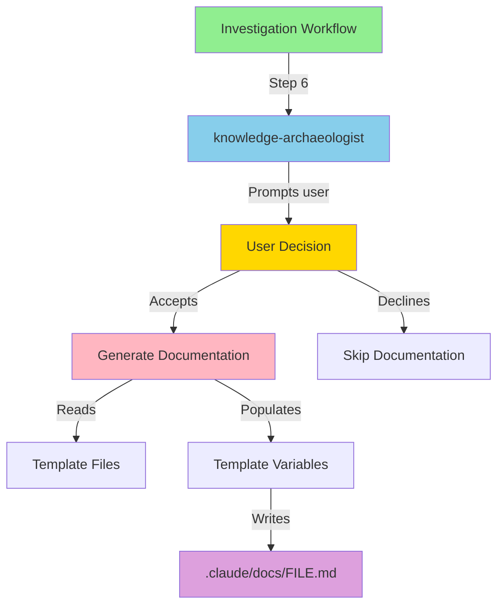
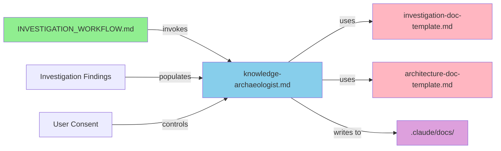
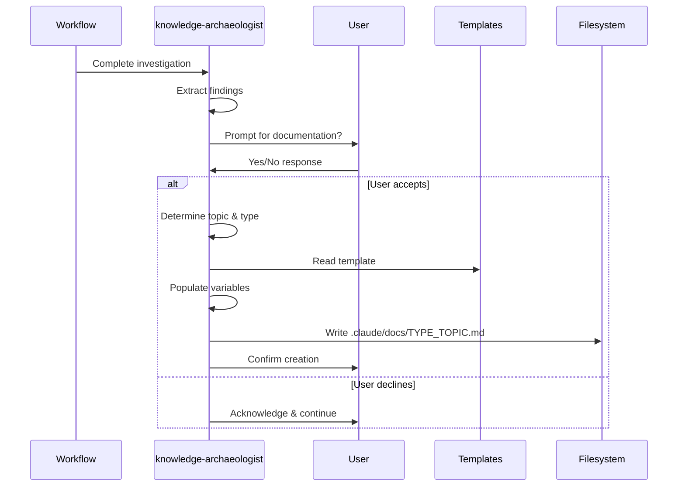

# ARCHITECTURE: DOCUMENTATION_GENERATION_SYSTEM

## Findings Summary

The documentation generation system is a lightweight feature that extends the knowledge-archaeologist agent to capture investigation findings in persistent markdown files. The system uses simple template-based generation with user consent, integrating seamlessly with the investigation workflow. Key architectural decisions include:

- Extending existing knowledge-archaeologist agent (not creating new agent)
- Simple markdown templates with variable placeholders (no template engine)
- User prompt for explicit consent (never automatic)
- Flat directory structure in `.claude/docs/` with TYPE_TOPIC naming convention

The architecture prioritizes simplicity and user control over sophisticated automation.

## Architecture Diagrams

### System Overview



### Component Relationships



### Data Flow



## Key Files

| File Path                                                         | Purpose                                                | Key Components                          |
| ----------------------------------------------------------------- | ------------------------------------------------------ | --------------------------------------- |
| `.claude/workflow/INVESTIGATION_WORKFLOW.md`                      | Defines investigation workflow with documentation step | Step 6: Documentation generation        |
| `.claude/agents/amplihack/specialized/knowledge-archaeologist.md` | Agent with documentation generation capability         | Documentation Generation section        |
| `.claude/templates/investigation-doc-template.md`                 | Template for general investigations                    | Findings, Files, Integration, Examples  |
| `.claude/templates/architecture-doc-template.md`                  | Template for architecture investigations               | Architecture diagrams, Design decisions |
| `.claude/templates/README.md`                                     | Template usage documentation                           | Usage guide, examples, conventions      |
| `.claude/docs/`                                                   | Directory for generated documentation                  | Storage location for all generated docs |

## System Integration

### Integration Points

**INVESTIGATION_WORKFLOW.md Integration:**

- Step 6 added as optional documentation capture step
- Invokes knowledge-archaeologist agent
- Handles user prompt and response
- Continues workflow regardless of documentation decision

**knowledge-archaeologist Agent Extension:**

- New "Documentation Generation" section added
- Preserves existing investigation capabilities
- Adds optional output format (persistent docs)
- Integrates with existing "Output Formats" pattern

**Template System:**

- Simple markdown files with `[VARIABLE]` placeholders
- No external dependencies or template engines
- Easy to modify and extend
- Human-readable and maintainable

### Dependencies

- **Internal**:
  - INVESTIGATION_WORKFLOW.md (workflow orchestration)
  - knowledge-archaeologist.md (documentation generation logic)
  - Template files (documentation structure)

- **External**:
  - None (pure markdown, no libraries)

- **Configuration**:
  - File naming convention: `[ARCHITECTURE|INVESTIGATION]_[TOPIC].md`
  - Directory structure: `.claude/docs/` for generated docs
  - Topic naming: UPPER_SNAKE_CASE format

### Communication Patterns

**Workflow → Agent:**

- Workflow invokes agent at Step 6 after investigation complete
- Agent receives investigation findings in conversation context

**Agent → User:**

- Agent prompts user with clear documentation preview
- User responds with explicit Yes/No decision
- Agent acknowledges response and acts accordingly

**Agent → Filesystem:**

- Agent reads template files from `.claude/templates/`
- Agent writes generated docs to `.claude/docs/`
- Creates directories if they don't exist

## Verification Steps

1. **Verify template structure**

   ```bash
   ls -la .claude/templates/
   # Should show: investigation-doc-template.md, architecture-doc-template.md, README.md
   ```

2. **Verify docs directory exists**

   ```bash
   ls -la .claude/docs/
   # Should exist and contain example files
   ```

3. **Verify workflow integration**

   ```bash
   grep -n "Step 6.*Documentation" .claude/workflow/INVESTIGATION_WORKFLOW.md
   # Should find Step 6 with documentation generation
   ```

4. **Verify agent extension**

   ```bash
   grep -n "Documentation Generation" .claude/agents/amplihack/specialized/knowledge-archaeologist.md
   # Should find new documentation section
   ```

5. **Test template rendering** (manual)
   - Copy a template
   - Replace `[VARIABLES]` with test data
   - Verify markdown renders correctly

## Examples

### Example 1: Architecture Documentation Generation

**Context**: Investigation of user preferences and hooks integration

**Command**: Follow INVESTIGATION_WORKFLOW.md

**Agent Prompt**:

```
I've completed the investigation of the user preferences and hooks integration system.

Shall I create a permanent record of this investigation in the ship's logs (documentation)?

This would create `.claude/docs/ARCHITECTURE_USER_PREFERENCES_HOOKS.md` with:
- Findings summary explaining the integration pattern
- Architecture diagram showing preference → hook flow
- Key files: USER_PREFERENCES.md, hook implementations
- Integration details on lifecycle and event handling
- Verification steps for testing the integration
- Examples of preference changes triggering hooks

[Yes/No]
```

**Result** (if user accepts):

- File created: `.claude/docs/ARCHITECTURE_USER_PREFERENCES_HOOKS.md`
- Contains populated template with investigation findings
- User notified of creation and location

### Example 2: Investigation Documentation Generation

**Context**: Bug investigation for hook execution issues

**Command**: Follow INVESTIGATION_WORKFLOW.md

**Agent Prompt**:

```
I've completed the investigation of the hook execution timing bug.

Shall I create a permanent record of this investigation in the ship's logs (documentation)?

This would create `.claude/docs/INVESTIGATION_HOOK_EXECUTION_BUG.md` with:
- Findings summary of root cause
- Key files involved in the bug
- System integration details
- Verification steps to reproduce and verify fix
- Examples demonstrating the bug and fix

[Yes/No]
```

**Result** (if user accepts):

- File created: `.claude/docs/INVESTIGATION_HOOK_EXECUTION_BUG.md`
- Contains bug analysis and resolution details
- Preserves knowledge for future reference

## Design Decisions

### Decision 1: Extend knowledge-archaeologist vs Create New Agent

- **Choice**: Extend existing knowledge-archaeologist agent
- **Rationale**:
  - Natural fit with agent's mission (knowledge preservation)
  - Avoids creating new agent for related responsibility
  - Simpler architecture with one less component
  - Follows "ruthless simplicity" principle
- **Trade-offs**:
  - Pro: Less maintenance, simpler coordination
  - Con: Adds responsibility to existing agent
- **Alternatives**:
  - Create documentation-generator agent (rejected: too complex)
  - Extend analyzer agent (rejected: wrong responsibility)

### Decision 2: Simple Templates vs Template Engine

- **Choice**: Simple markdown with `[VARIABLE]` placeholders
- **Rationale**:
  - No external dependencies
  - Easy to read and modify
  - Simple string replacement logic
  - Human-readable templates
- **Trade-offs**:
  - Pro: Zero dependencies, maximum simplicity
  - Con: Limited template features (but not needed)
- **Alternatives**:
  - Jinja2 templates (rejected: adds dependency, overkill)
  - Python f-strings (rejected: harder to modify templates)

### Decision 3: User Prompt vs Automatic Generation

- **Choice**: Always prompt user for explicit consent
- **Rationale**:
  - User control over filesystem operations
  - Explicit requirement from issue #1097
  - Respects user workflow preferences
  - No surprise file creation
- **Trade-offs**:
  - Pro: User control, transparency, requirement compliance
  - Con: Requires user interaction (but minimal)
- **Alternatives**:
  - Automatic generation (rejected: violates requirements)
  - Configuration flag (rejected: adds complexity)

### Decision 4: Flat Directory vs Subdirectories

- **Choice**: Flat `.claude/docs/` directory with TYPE_TOPIC naming
- **Rationale**:
  - Simpler to implement and maintain
  - Easy to search and discover
  - No premature organization
  - Can reorganize later if volume grows
- **Trade-offs**:
  - Pro: Maximum simplicity, easy discovery
  - Con: May need organization later (YAGNI)
- **Alternatives**:
  - Subdirectories by type (rejected: premature optimization)
  - Date-based organization (rejected: harder to find)

## Related Documentation

- `.claude/workflow/INVESTIGATION_WORKFLOW.md` - Investigation workflow definition
- `.claude/templates/README.md` - Template usage guide
- `.claude/agents/amplihack/specialized/knowledge-archaeologist.md` - Agent definition
- `.claude/context/PATTERNS.md` - Project patterns (should add documentation pattern)
- `CLAUDE.md` - Project overview (should reference investigation workflow)

## Future Considerations

### Potential Enhancements

1. **Auto-linking**: Automatically link related documentation files
2. **Index generation**: Create index of all documentation
3. **Search capability**: Search across generated documentation
4. **Version tracking**: Track documentation updates over time
5. **Template validation**: Validate templates before generation

### Scalability

If documentation volume grows significantly:

- Consider subdirectory organization by category
- Add tagging or metadata system
- Create documentation index/catalog
- Add search/discovery tools

### Integration Opportunities

- Integrate with DDD (Document-Driven Development) workflow
- Use documentation in onboarding workflows
- Reference documentation in code reviews
- Generate reports from documentation

## Generated

- **Date**: 2025-11-05 06:00:00
- **Source**: Architecture Investigation Session
- **Agent**: knowledge-archaeologist
- **Investigation Type**: Architecture Analysis
