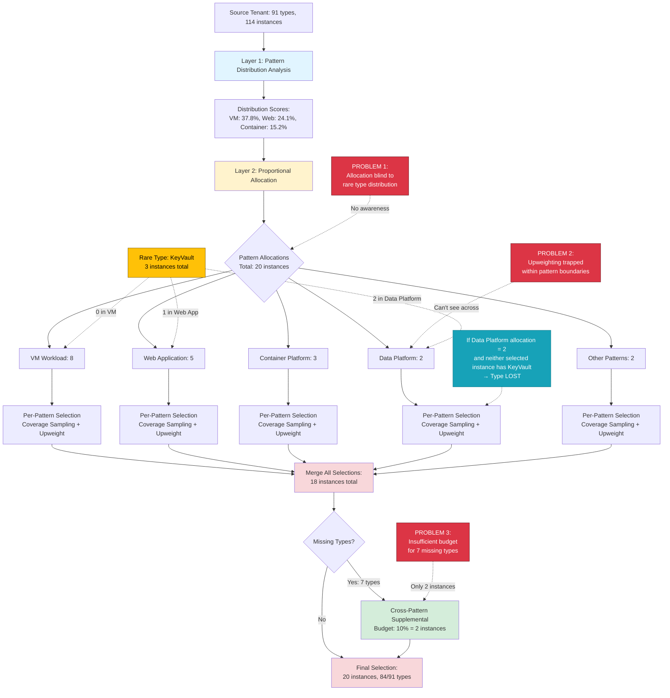
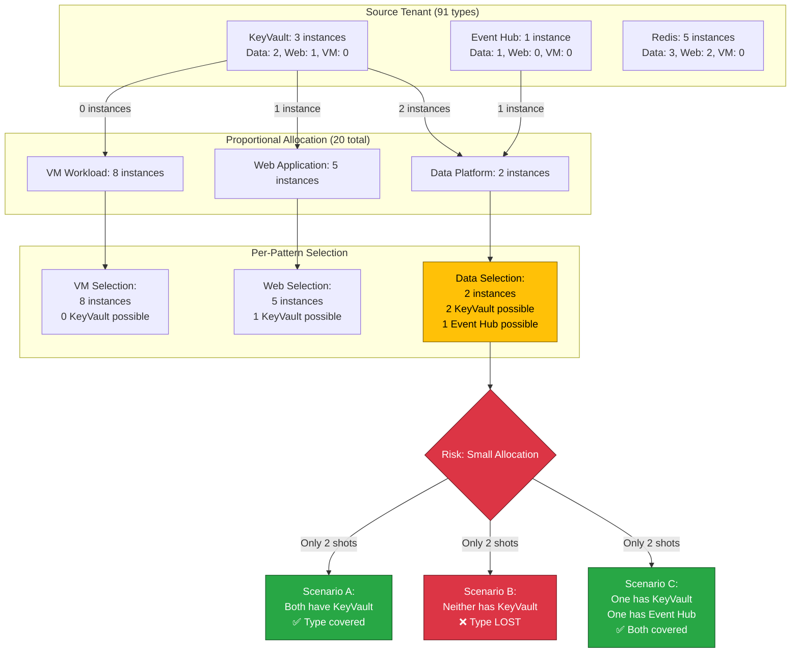
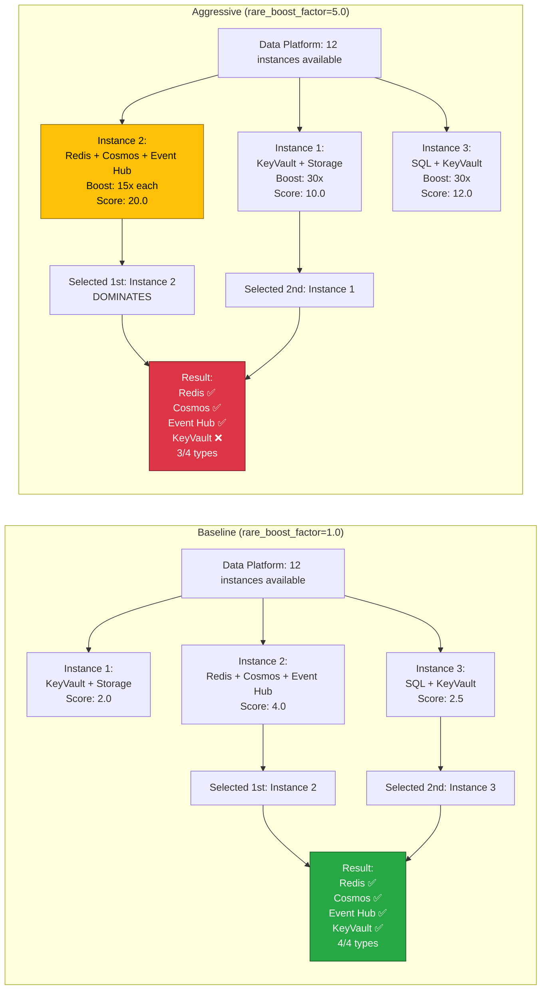
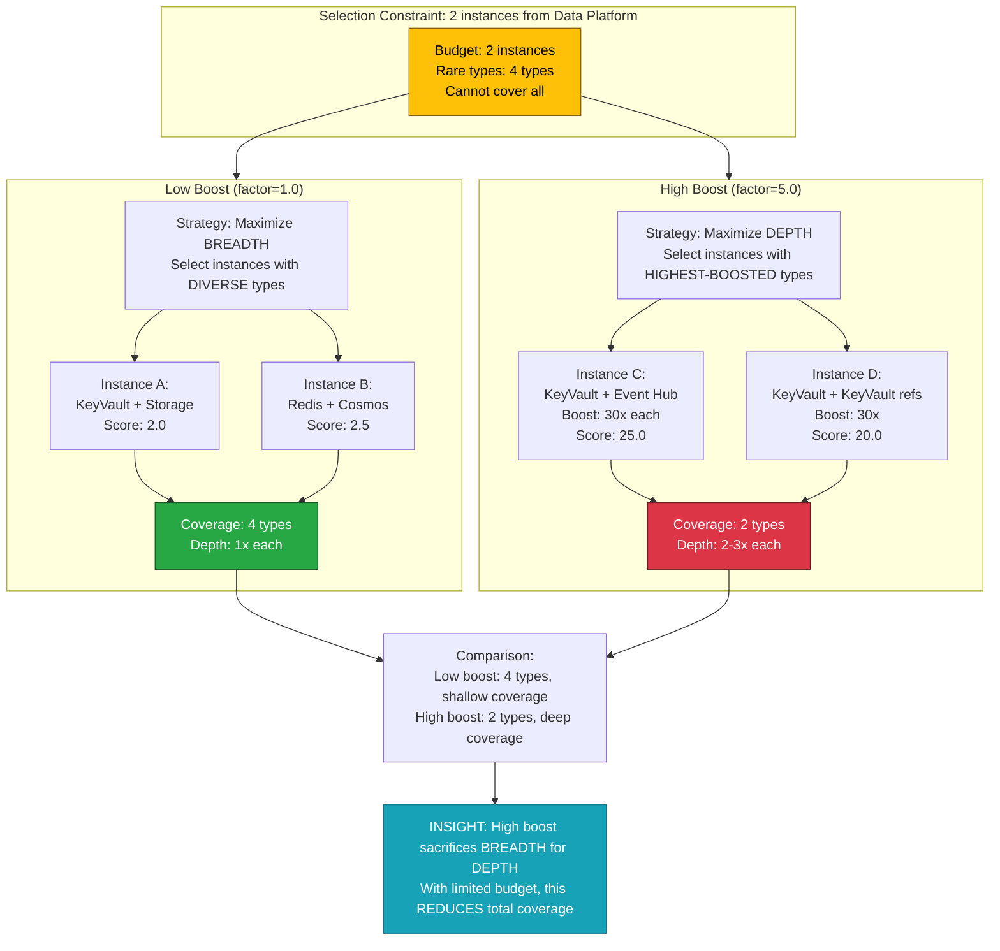

# Visual Diagrams: rare_boost_factor Problem

## 1. Complete Data Flow with Problem Annotations



## 2. Pattern Isolation Problem - Concrete Example



## 3. Upweighting Behavior: Baseline vs Aggressive



## 4. Depth vs Breadth Trade-off



## 5. Solution Comparison

```mermaid
flowchart TB
    Start[Problem: rare_boost_factor reduces coverage]

    Start --> Current[Current Architecture:<br/>Allocation → Selection → Supplemental]

    Current --> Sol1[Solution 1:<br/>Coverage-Aware Allocation]
    Current --> Sol2[Solution 2:<br/>Increase Supplemental Budget]
    Current --> Sol3[Solution 3:<br/>Two-Phase Selection]
    Current --> Sol4[Solution 4:<br/>Expose Budget Parameter]

    Sol1 --> Sol1_Detail[Modify Layer 2 allocation<br/>based on rare type distribution<br/>✅ Fixes root cause<br/>⚠️ Medium complexity]

    Sol2 --> Sol2_Detail[Increase cross-pattern budget<br/>from 10% to 20-30%<br/>✅ Simple fix<br/>⚠️ Doesn't fix root cause]

    Sol3 --> Sol3_Detail[Phase 1: Global rare type selection<br/>Phase 2: Proportional selection<br/>✅ Comprehensive<br/>⚠️ High complexity]

    Sol4 --> Sol4_Detail[Make supplemental budget configurable<br/>✅ Minimal effort<br/>⚠️ User must tune parameter]

    Sol1_Detail --> Rec[RECOMMENDED:<br/>Implement Sol4 immediately (30 min)<br/>Implement Sol1 medium-term (1 week)]
    Sol2_Detail --> Rec
    Sol3_Detail --> Rec
    Sol4_Detail --> Rec

    style Start fill:#dc3545,stroke:#721c24,color:#fff
    style Current fill:#ffc107,stroke:#856404,color:#000
    style Rec fill:#28a745,stroke:#155724,color:#fff
```

## 6. Root Cause Summary (Single Diagram)

```mermaid
flowchart TD
    RootCause[ROOT CAUSE:<br/>Pattern Isolation]

    RootCause --> Symptom1[Symptom 1:<br/>Allocation blind to rare types]
    RootCause --> Symptom2[Symptom 2:<br/>Upweighting trapped within patterns]
    RootCause --> Symptom3[Symptom 3:<br/>Insufficient supplemental budget]

    Symptom1 --> Effect1[Effect: Small patterns<br/>bottleneck rare types]
    Symptom2 --> Effect2[Effect: Can't prioritize<br/>across pattern boundaries]
    Symptom3 --> Effect3[Effect: 10% budget insufficient<br/>for 7.6% missing types]

    Effect1 --> Result[RESULT:<br/>Higher boost → LOWER coverage<br/>Baseline: 85/91 (93.4%)<br/>Boost 5.0: 84/91 (92.3%)]
    Effect2 --> Result
    Effect3 --> Result

    Result --> Mechanism[MECHANISM:<br/>High boost creates depth vs breadth trade-off<br/>Focuses on FEW highly-boosted types<br/>Neglects MANY moderately-rare types]

    style RootCause fill:#dc3545,stroke:#721c24,color:#fff
    style Result fill:#dc3545,stroke:#721c24,color:#fff
    style Mechanism fill:#ffc107,stroke:#856404,color:#000
```

## Usage Notes

**Diagram 1**: Complete data flow showing where problems occur
**Diagram 2**: Concrete example of pattern isolation risk
**Diagram 3**: Behavioral difference between baseline and aggressive upweighting
**Diagram 4**: Depth vs breadth trade-off explanation
**Diagram 5**: Solution comparison with recommendations
**Diagram 6**: Root cause summary (single-page reference)

These diagrams support the analysis in `ANALYSIS_rare_boost_factor_counterintuitive_behavior.md`.
