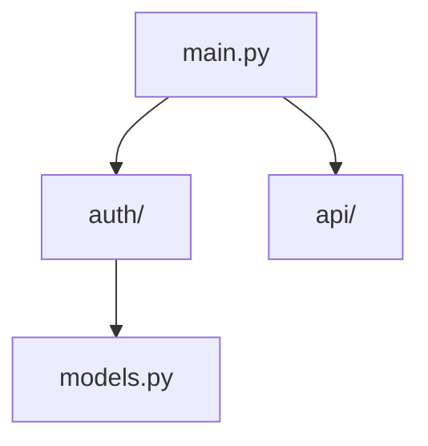

# Code Visualizer

Auto-generates and maintains visual code flow diagrams from Python module analysis.

## Quick Start

Simply describe what you want:

```
Generate a code flow diagram for the auth module
```

```
Check if my architecture diagrams are up to date
```

```
Show what architecture changes this PR introduces
```

## Features

### Auto-Generation

Analyzes Python imports and generates mermaid diagrams:



### Staleness Detection

Warns when diagrams become out of sync with code:

```
STALE: README.md diagram (last updated: Jan 1, code changed: Jan 15)
Missing: new_module.py, api/v2.py
```

### PR Impact Analysis

Shows architecture changes in pull requests:

- New modules added
- Changed dependencies
- Deleted relationships

## How It Works

1. **Analyze**: Parse Python files for imports and classes
2. **Generate**: Create mermaid diagrams from relationships (delegates to mermaid-diagram-generator)
3. **Monitor**: Compare timestamps to detect staleness
4. **Report**: Provide freshness status and recommendations

## Skill Architecture

```
code-visualizer
├── Analyzes: Python AST for imports/classes
├── Detects: Stale diagrams via timestamps
└── Delegates to:
    ├── mermaid-diagram-generator (syntax)
    └── visualization-architect (complex diagrams)
```

## Limitations (Important)

- **Staleness is timestamp-based**: 70-80% accuracy, false positives common
- **Python-only**: No TypeScript/JS/Rust support
- **Static analysis**: Dynamic imports not detected
- **Import-centric**: Internal logic changes invisible

See SKILL.md for complete limitations and accuracy expectations.

## Philosophy Alignment

| Principle               | How This Skill Follows It                                           |
| ----------------------- | ------------------------------------------------------------------- |
| **Ruthless Simplicity** | Timestamp-based staleness is "good enough" for 90% of cases         |
| **Zero-BS**             | Real AST parsing, no mock data, honest about limitations            |
| **Modular Design**      | Single brick, delegates diagram syntax to mermaid-diagram-generator |

## Integration

Works with:

- `mermaid-diagram-generator` skill for diagram syntax
- `visualization-architect` agent for complex diagrams
- PR review workflow for impact analysis

## Dependencies

- **Required**: mermaid-diagram-generator skill
- **Recommended**: Python 3.8+, Git for enhanced staleness detection
