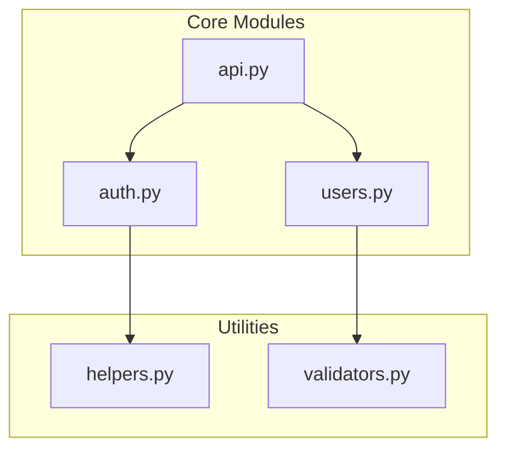
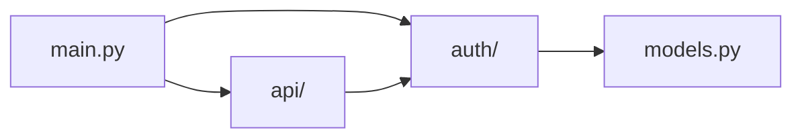
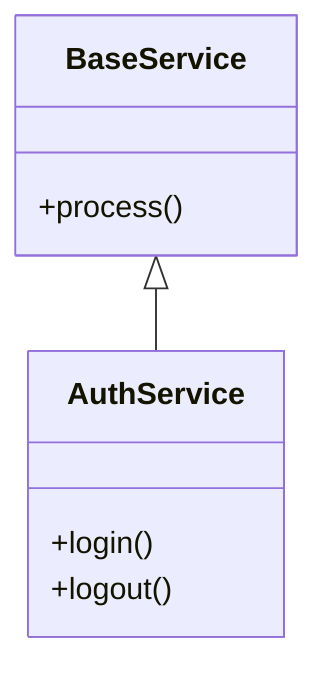
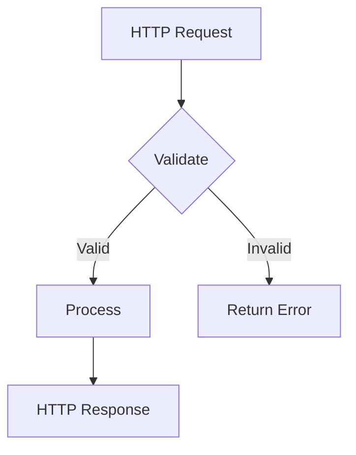
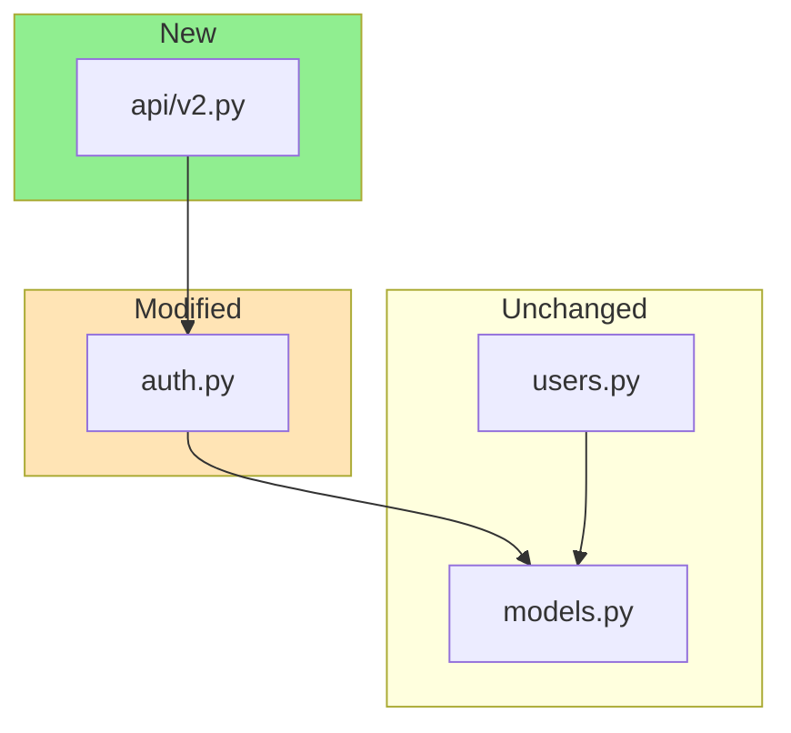
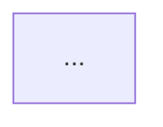
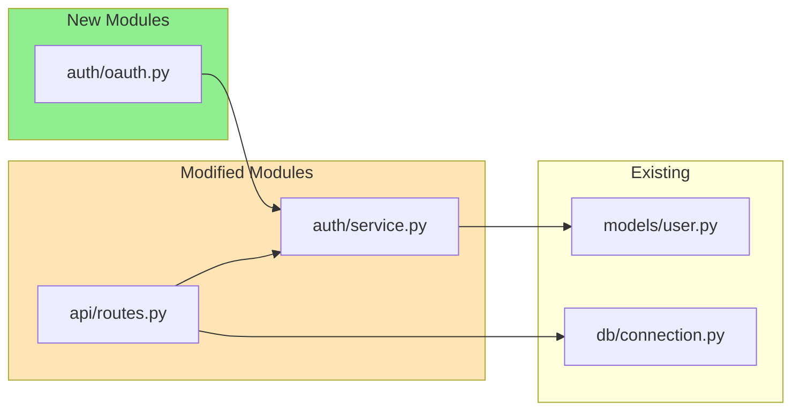

# Code Visualizer Skill

## Purpose

Automatically generate and maintain visual code flow diagrams. This skill analyzes Python module structure, detects import relationships, and generates mermaid diagrams. It also monitors for staleness when code changes but diagrams don't.

## Philosophy Alignment

This skill embodies amplihack's core philosophy:

### Ruthless Simplicity

- **Single responsibility**: Visualize code structure - nothing more
- **Minimal dependencies**: Uses only Python AST for analysis, delegates diagram syntax to mermaid-diagram-generator
- **No over-engineering**: Timestamp-based staleness is simple and "good enough" for 90% of cases

### Zero-BS Implementation

- **Real analysis**: Actually parses Python AST to extract imports - no mock data
- **Honest limitations**: Staleness detection is timestamp-based, not semantic (see Limitations section)
- **Working code**: All algorithms shown are functional, not pseudocode

### Modular Design (Bricks & Studs)

- **This skill is one brick**: Code analysis and staleness detection
- **Delegates to other bricks**: mermaid-diagram-generator for syntax, visualization-architect for complex diagrams
- **Clear studs (public contract)**: Analyze modules, generate diagrams, check freshness

## Skill Delegation Architecture

```
code-visualizer (this skill)
├── Responsibilities:
│   ├── Python module analysis (AST parsing)
│   ├── Import relationship extraction
│   ├── Staleness detection (timestamp-based)
│   └── Orchestration of diagram generation
│
└── Delegates to:
    ├── mermaid-diagram-generator skill
    │   ├── Mermaid syntax generation
    │   ├── Diagram formatting and styling
    │   └── Markdown embedding
    │
    └── visualization-architect agent
        ├── Complex multi-level architecture
        ├── ASCII art alternatives
        └── Cross-module dependency graphs
```

**Invocation Pattern:**

```python
# code-visualizer analyzes code structure
modules = analyze_python_modules("src/")
relationships = extract_import_relationships(modules)

# Then delegates to mermaid-diagram-generator for syntax
Skill(skill="mermaid-diagram-generator")
# Provide: Module relationships, diagram type (flowchart/class), styling preferences
# Receive: Valid mermaid syntax ready for embedding

# For complex architectures, delegates to visualization-architect
Task(subagent_type="visualization-architect", prompt="Create multi-level diagram for...")
```

## When to Use This Skill

- **New Module Creation**: Auto-generate architecture diagram for new modules
- **PR Reviews**: Show architecture impact of proposed changes
- **Staleness Detection**: Check if existing diagrams reflect current code
- **Dependency Analysis**: Visualize import relationships
- **Refactoring**: Understand module dependencies before changes

## Quick Start

### Generate Diagram for Module

```
User: Generate a code flow diagram for the authentication module
```

### Check Diagram Freshness

```
User: Are my architecture diagrams up to date?
```

### Show PR Impact

```
User: What architecture changes does this PR introduce?
```

## Core Capabilities

### 1. Module Analysis

Analyzes Python files to extract:

- Import statements (internal and external)
- Class definitions and inheritance
- Function exports (`__all__`)
- Module dependencies

### 2. Diagram Generation

Creates mermaid diagrams showing:

- Module relationships (flowchart)
- Class hierarchies (class diagram)
- Data flow between components
- Dependency graphs

### 3. Staleness Detection

Compares:

- File modification timestamps
- Git history for changes
- Diagram content vs actual code structure
- Missing modules in diagrams

## Analysis Process

### Step 1: Discover Modules

```python
# Scan target directory for Python modules
modules = glob("**/*.py")
packages = identify_packages(modules)
```

### Step 2: Extract Relationships

For each module:

1. Parse import statements
2. Identify local vs external imports
3. Build dependency graph
4. Detect circular dependencies

### Step 3: Generate Diagram



### Step 4: Check Freshness

Compare diagram timestamps with source files:

- Diagram older than sources = STALE
- Missing modules in diagram = INCOMPLETE
- Extra modules in diagram = OUTDATED

## Diagram Types

### Module Dependency Graph

Best for: Showing import relationships between files



### Class Hierarchy

Best for: Showing inheritance and composition



### Data Flow

Best for: Showing how data moves through system



## Staleness Detection

### How It Works

1. **Find Diagrams**: Locate mermaid diagrams in README.md, ARCHITECTURE.md
2. **Extract Modules**: Parse diagram for referenced modules
3. **Compare**: Check if all current modules are represented
4. **Report**: Generate freshness report

### Freshness Report Format

```markdown
## Diagram Freshness Report

### Status: STALE

**Diagrams Checked**: 3
**Fresh**: 1
**Stale**: 2

### Details

| File         | Last Updated | Code Changed | Status |
| ------------ | ------------ | ------------ | ------ |
| README.md    | 2025-01-01   | 2025-01-15   | STALE  |
| docs/ARCH.md | 2025-01-10   | 2025-01-10   | FRESH  |

### Missing from Diagrams

- `new_module.py` (added 2025-01-12)
- `api/v2.py` (added 2025-01-14)

### Recommended Actions

1. Update README.md architecture diagram
2. Add new_module.py to dependency graph
```

## PR Architecture Impact

### What It Shows

For a given PR or set of changes:

1. New modules/files added
2. Changed import relationships
3. Deleted dependencies
4. Modified class hierarchies

### Impact Diagram



## Integration with Other Skills

### Mermaid Diagram Generator

This skill uses `mermaid-diagram-generator` for:

- Syntax generation
- Diagram formatting
- Embedding in markdown

### Visualization Architect Agent

Delegates to `visualization-architect` for:

- Complex architecture visualization
- ASCII art alternatives
- Multi-level diagrams

## Usage Examples

### Example 1: New Module Diagram

```
User: I just created a new payment module. Generate an architecture diagram.

Claude:
1. Analyzes payment/ directory
2. Extracts imports and dependencies
3. Generates mermaid flowchart
4. Suggests where to embed (README.md)
```

### Example 2: Check Staleness

```
User: Are my diagrams up to date?

Claude:
1. Finds all mermaid diagrams in docs
2. Compares with current codebase
3. Reports stale diagrams
4. Lists missing modules
5. Suggests updates
```

### Example 3: PR Impact

```
User: Show architecture impact of this PR

Claude:
1. Gets changed files from PR
2. Identifies new/modified/deleted modules
3. Generates impact diagram
4. Highlights dependency changes
```

## Detection Algorithms

### Import Analysis

```python
# Extract imports from Python file
import ast

def extract_imports(file_path):
    """Extract import statements from Python file."""
    tree = ast.parse(Path(file_path).read_text())
    imports = []
    for node in ast.walk(tree):
        if isinstance(node, ast.Import):
            for alias in node.names:
                imports.append(alias.name)
        elif isinstance(node, ast.ImportFrom):
            if node.module:
                imports.append(node.module)
    return imports
```

### Staleness Check

```python
def check_staleness(diagram_file, source_dir):
    """Check if diagram is stale compared to source."""
    diagram_mtime = Path(diagram_file).stat().st_mtime

    for source in Path(source_dir).rglob("*.py"):
        if source.stat().st_mtime > diagram_mtime:
            return True, source  # Stale

    return False, None  # Fresh
```

## Best Practices

### When to Update Diagrams

1. **New modules**: Add to dependency graph
2. **Changed imports**: Update relationships
3. **Deleted files**: Remove from diagrams
4. **Architectural changes**: Regenerate completely

### Diagram Placement

| Diagram Type          | Recommended Location |
| --------------------- | -------------------- |
| Module overview       | README.md            |
| Detailed architecture | docs/ARCHITECTURE.md |
| Package structure     | package/README.md    |
| API flow              | api/README.md        |

### Naming Conventions

````markdown
## Architecture

<!-- code-visualizer:auto-generated -->
<!-- last-updated: 2025-01-15 -->
<!-- source-hash: abc123 -->


````

## Success Criteria

A good visualization:

- [ ] Shows all current modules
- [ ] Reflects actual import relationships
- [ ] Uses appropriate diagram type
- [ ] Placed in discoverable location
- [ ] Includes freshness metadata
- [ ] Clear and not overcrowded

## Limitations

**IMPORTANT**: Understand these limitations before relying on this skill:

### Staleness Detection Limitations

1. **Timestamp-based, not semantic**: Detection compares file modification times, not actual code changes
   - A file touched but not meaningfully changed will trigger "stale"
   - Reformatting code triggers false positives
   - Git operations that update mtime trigger false positives

2. **Cannot detect logic changes**: Adding a function that doesn't change imports won't be detected
   - Internal refactoring within a module is invisible
   - Changes to function signatures not reflected
   - New class methods added without import changes won't show

3. **Import-centric view**: Only tracks import relationships
   - Runtime dependencies (dependency injection) not detected
   - Configuration-based connections invisible
   - Duck typing relationships not captured

### Scope Limitations

1. **Python-only**: Currently only analyzes Python files
   - No TypeScript, JavaScript, Rust, Go support
   - Multi-language projects partially covered

2. **Static analysis only**: No runtime information
   - Dynamic imports (`__import__`, `importlib`) not detected
   - Conditional imports may be missed
   - Plugin architectures not fully represented

3. **Single-project scope**: Cannot analyze cross-repository dependencies
   - External package internals not shown
   - Monorepo relationships require manual configuration

### Accuracy Expectations

| Scenario                      | Accuracy | Notes                       |
| ----------------------------- | -------- | --------------------------- |
| New module detection          | 95%+     | Reliable for Python modules |
| Import relationship mapping   | 90%+     | Misses dynamic imports      |
| Staleness detection           | 70-80%   | False positives common      |
| Circular dependency detection | 85%+     | May miss complex cycles     |
| Class hierarchy extraction    | 85%+     | Mixins can be tricky        |

### When NOT to Use This Skill

- **Security-critical dependency audits**: Use proper security scanning tools
- **Runtime dependency analysis**: Use profilers or dynamic analysis tools
- **Cross-language projects**: Manual analysis may be more accurate
- **Heavily dynamic codebases**: Plugin architectures, metaprogramming

## Dependencies

This skill requires:

1. **mermaid-diagram-generator skill**: Must be available for diagram syntax generation
2. **Python 3.8+**: For AST parsing features used
3. **Git (optional)**: For enhanced staleness detection using git history

If mermaid-diagram-generator is unavailable, this skill will provide raw relationship data but cannot generate embedded diagrams.

## PR Review Integration

### How Diagrams Appear in PRs

When reviewing PRs, this skill generates impact diagrams that can be added to PR descriptions:

**PR Description Template:**

````markdown
## Architecture Impact

<!-- Generated by code-visualizer -->

### Changed Dependencies



### Impact Summary

- **New modules**: 1 (oauth.py)
- **Modified modules**: 2 (auth/service.py, api/routes.py)
- **New dependencies**: oauth.py -> auth/service.py
- **Diagrams to update**: README.md (STALE)
````

### CI Integration Example

Add to `.github/workflows/pr-review.yml`:

```yaml
- name: Check Diagram Staleness
  run: |
    # Claude Code analyzes and reports
    # Outputs: STALE diagrams that need updating
    # Generates: Suggested diagram updates
```

### Reviewer Workflow

1. **PR opened** -> code-visualizer generates impact diagram
2. **Reviewer sees** -> Visual diff of architecture changes
3. **Staleness check** -> Warns if existing diagrams need updates
4. **Action items** -> Lists diagrams requiring manual update

## Remember

This skill automates what developers often forget:

- Keeping diagrams in sync with code
- Documenting architecture changes
- Understanding dependency impacts

The goal is diagrams that stay fresh automatically.

**But remember the limitations**: Staleness detection is approximate. When accuracy matters, verify manually.
