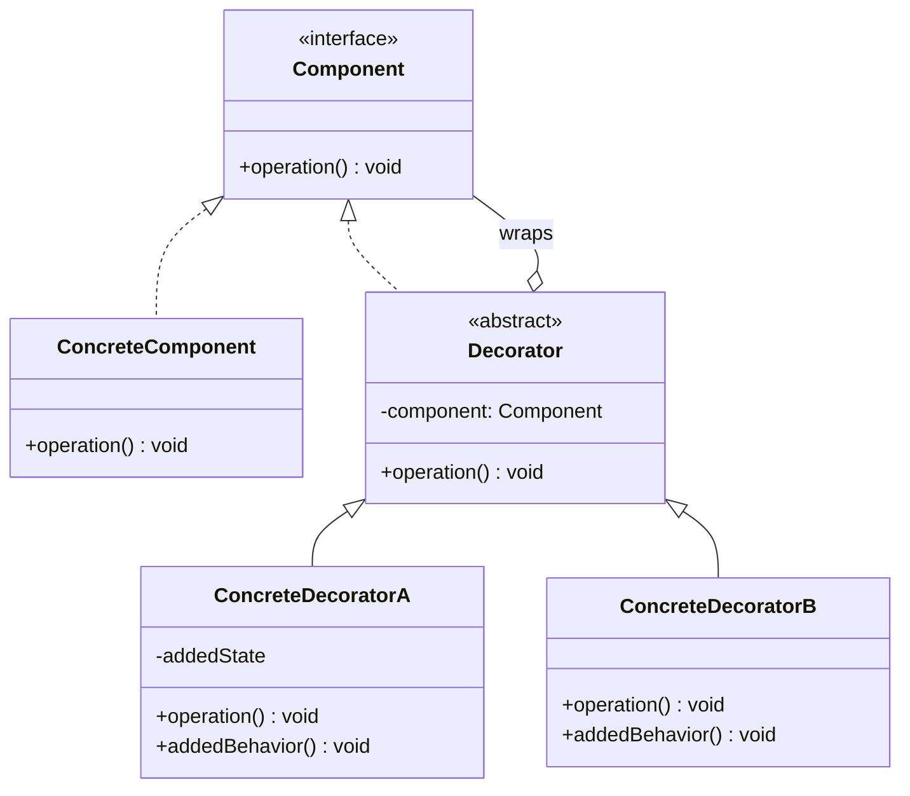
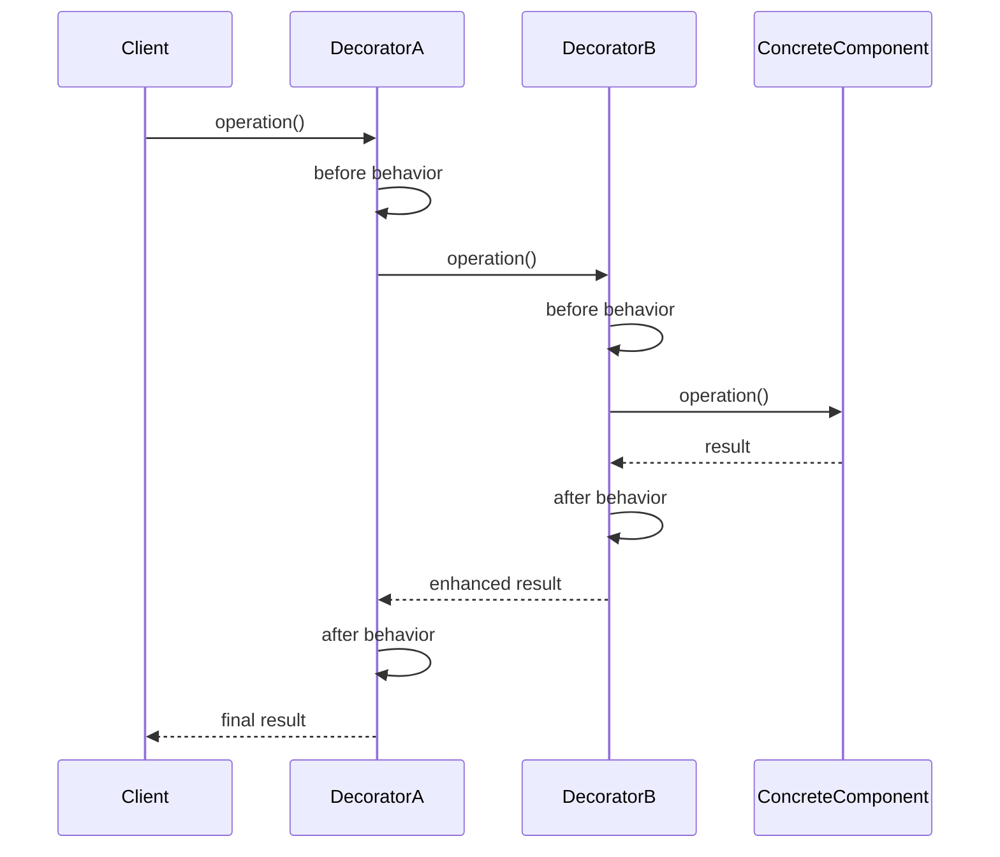

# Example 6: Deep Dive Request

## Scenario

User wants comprehensive, in-depth information about a pattern including multiple implementations, variations, and advanced topics.

## User Query

```
User: "Deep dive into the Decorator pattern - I want to understand all the variations and when to use each"
```

## Skill Response (Excerpt - Full Response Would Be Much Longer)

## Decorator Pattern - Deep Dive

### Full Structure Explanation

**Participants**:

1. **Component** (interface/abstract class):
   - Defines interface for objects that can have responsibilities added
   - Example: `Widget`, `DataSource`, `InputStream`

2. **ConcreteComponent** (concrete class):
   - Defines an object to which additional responsibilities can be attached
   - Example: `TextView`, `FileDataSource`, `FileInputStream`

3. **Decorator** (abstract class):
   - Maintains reference to Component object
   - Defines interface conforming to Component's interface
   - Example: `WidgetDecorator`, `DataSourceDecorator`

4. **ConcreteDecorator** (concrete class):
   - Adds responsibilities to the component
   - Example: `ScrollDecorator`, `BorderDecorator`, `EncryptionDecorator`

**Collaborations**:

- Decorator forwards requests to its Component object
- May perform additional operations before/after forwarding
- Decorators can be stacked (decorator wraps decorator wraps component)

**Key Insight**: Decorator has same interface as Component, so clients can't tell difference between decorated and undecorated objects.

---

### Mermaid Diagrams





---

### Complete Implementation: Python

```python
from abc import ABC, abstractmethod

# ============ Component Hierarchy ============

class DataSource(ABC):
    """Component interface"""

    @abstractmethod
    def write_data(self, data: str) -> None:
        pass

    @abstractmethod
    def read_data(self) -> str:
        pass


class FileDataSource(DataSource):
    """ConcreteComponent - basic file operations"""

    def __init__(self, filename: str):
        self.filename = filename
        self.data = ""

    def write_data(self, data: str) -> None:
        print(f"Writing to {self.filename}: {data}")
        self.data = data

    def read_data(self) -> str:
        print(f"Reading from {self.filename}")
        return self.data


# ============ Decorator Hierarchy ============

class DataSourceDecorator(DataSource):
    """Base Decorator - forwards to wrapped component"""

    def __init__(self, source: DataSource):
        self.wrappee = source

    def write_data(self, data: str) -> None:
        self.wrappee.write_data(data)

    def read_data(self) -> str:
        return self.wrappee.read_data()


class EncryptionDecorator(DataSourceDecorator):
    """ConcreteDecorator - adds encryption"""

    def write_data(self, data: str) -> None:
        encrypted = self._encrypt(data)
        print(f"[Encryption] Encrypting data")
        super().write_data(encrypted)

    def read_data(self) -> str:
        data = super().read_data()
        print(f"[Encryption] Decrypting data")
        return self._decrypt(data)

    def _encrypt(self, data: str) -> str:
        # Simple Caesar cipher for demo
        return ''.join(chr(ord(c) + 3) for c in data)

    def _decrypt(self, data: str) -> str:
        return ''.join(chr(ord(c) - 3) for c in data)


class CompressionDecorator(DataSourceDecorator):
    """ConcreteDecorator - adds compression"""

    def write_data(self, data: str) -> None:
        compressed = self._compress(data)
        print(f"[Compression] Compressing data")
        super().write_data(compressed)

    def read_data(self) -> str:
        data = super().read_data()
        print(f"[Compression] Decompressing data")
        return self._decompress(data)

    def _compress(self, data: str) -> str:
        # Simple run-length encoding for demo
        if not data:
            return data
        result = []
        count = 1
        prev = data[0]
        for char in data[1:]:
            if char == prev:
                count += 1
            else:
                result.append(f"{count}{prev}")
                prev = char
                count = 1
        result.append(f"{count}{prev}")
        return ''.join(result)

    def _decompress(self, data: str) -> str:
        # Decode run-length encoding
        result = []
        i = 0
        while i < len(data):
            count = int(data[i])
            char = data[i + 1]
            result.append(char * count)
            i += 2
        return ''.join(result)


# ============ Client Code ============

def client_code(source: DataSource):
    """Client works with all objects via Component interface"""
    source.write_data("Hello World")
    print(f"Result: {source.read_data()}")
    print()


# ============ Usage Examples ============

if __name__ == "__main__":
    # Simple component
    print("=== Simple File DataSource ===")
    simple = FileDataSource("data.txt")
    client_code(simple)

    # Single decorator
    print("=== Encrypted File DataSource ===")
    encrypted = EncryptionDecorator(FileDataSource("encrypted.txt"))
    client_code(encrypted)

    # Stacked decorators (compression + encryption)
    print("=== Compressed + Encrypted File DataSource ===")
    compressed_encrypted = CompressionDecorator(
        EncryptionDecorator(FileDataSource("secure.txt"))
    )
    client_code(compressed_encrypted)

    # Different order (encryption + compression)
    print("=== Encrypted + Compressed File DataSource ===")
    encrypted_compressed = EncryptionDecorator(
        CompressionDecorator(FileDataSource("secure2.txt"))
    )
    client_code(encrypted_compressed)
```

**Output**:

```
=== Simple File DataSource ===
Writing to data.txt: Hello World
Reading from data.txt
Result: Hello World

=== Encrypted File DataSource ===
[Encryption] Encrypting data
Writing to encrypted.txt: Khoor#Zruog
Reading from encrypted.txt
[Encryption] Decrypting data
Result: Hello World

=== Compressed + Encrypted File DataSource ===
[Compression] Compressing data
[Encryption] Encrypting data
Writing to secure.txt: 4K2h...
Reading from secure.txt
[Encryption] Decrypting data
[Compression] Decompressing data
Result: Hello World
```

---

### Complete Implementation: TypeScript

```typescript
// ============ Component Hierarchy ============

interface DataSource {
  writeData(data: string): void;
  readData(): string;
}

class FileDataSource implements DataSource {
  private data: string = "";

  constructor(private filename: string) {}

  writeData(data: string): void {
    console.log(`Writing to ${this.filename}: ${data}`);
    this.data = data;
  }

  readData(): string {
    console.log(`Reading from ${this.filename}`);
    return this.data;
  }
}

// ============ Decorator Hierarchy ============

abstract class DataSourceDecorator implements DataSource {
  constructor(protected wrappee: DataSource) {}

  writeData(data: string): void {
    this.wrappee.writeData(data);
  }

  readData(): string {
    return this.wrappee.readData();
  }
}

class EncryptionDecorator extends DataSourceDecorator {
  writeData(data: string): void {
    const encrypted = this.encrypt(data);
    console.log("[Encryption] Encrypting data");
    super.writeData(encrypted);
  }

  readData(): string {
    const data = super.readData();
    console.log("[Encryption] Decrypting data");
    return this.decrypt(data);
  }

  private encrypt(data: string): string {
    return data
      .split("")
      .map((c) => String.fromCharCode(c.charCodeAt(0) + 3))
      .join("");
  }

  private decrypt(data: string): string {
    return data
      .split("")
      .map((c) => String.fromCharCode(c.charCodeAt(0) - 3))
      .join("");
  }
}

class CompressionDecorator extends DataSourceDecorator {
  writeData(data: string): void {
    const compressed = this.compress(data);
    console.log("[Compression] Compressing data");
    super.writeData(compressed);
  }

  readData(): string {
    const data = super.readData();
    console.log("[Compression] Decompressing data");
    return this.decompress(data);
  }

  private compress(data: string): string {
    // Simple run-length encoding
    if (!data) return data;
    const result: string[] = [];
    let count = 1;
    let prev = data[0];

    for (let i = 1; i < data.length; i++) {
      if (data[i] === prev) {
        count++;
      } else {
        result.push(`${count}${prev}`);
        prev = data[i];
        count = 1;
      }
    }
    result.push(`${count}${prev}`);
    return result.join("");
  }

  private decompress(data: string): string {
    const result: string[] = [];
    for (let i = 0; i < data.length; i += 2) {
      const count = parseInt(data[i]);
      const char = data[i + 1];
      result.push(char.repeat(count));
    }
    return result.join("");
  }
}

// ============ Client Code ============

function clientCode(source: DataSource): void {
  source.writeData("Hello World");
  console.log(`Result: ${source.readData()}`);
  console.log();
}

// Usage
const simple = new FileDataSource("data.txt");
clientCode(simple);

const encrypted = new EncryptionDecorator(new FileDataSource("encrypted.txt"));
clientCode(encrypted);

const compressedEncrypted = new CompressionDecorator(
  new EncryptionDecorator(new FileDataSource("secure.txt"))
);
clientCode(compressedEncrypted);
```

---

### Pattern Variations

#### 1. **Transparent Decorator** (Standard GoF)

- Decorator has same interface as Component
- Client can't distinguish decorated from undecorated
- **When**: Need complete interface compatibility

```python
class Decorator(Component):
    def __init__(self, component: Component):
        self.component = component

    def operation(self):
        return self.component.operation()  # Transparent
```

#### 2. **Semi-Transparent Decorator**

- Decorator adds new methods not in Component interface
- Client can access decorator-specific functionality
- **When**: Need both forwarding AND new capabilities

```python
class Decorator(Component):
    def operation(self):
        return self.component.operation()

    def decorator_specific_method(self):
        return "Additional functionality"
```

#### 3. **Function Decorators** (Python-specific)

- Use @decorator syntax
- Wrap functions instead of objects
- **When**: Decorating functions, not classes

```python
def timing_decorator(func):
    def wrapper(*args, **kwargs):
        start = time.time()
        result = func(*args, **kwargs)
        print(f"Time: {time.time() - start}s")
        return result
    return wrapper

@timing_decorator
def slow_function():
    time.sleep(1)
```

#### 4. **Streaming Decorator**

- Process data in chunks (I/O streams)
- Chain decorators for layered processing
- **When**: Large data, memory constraints

```python
class BufferedDecorator(StreamDecorator):
    def __init__(self, stream, buffer_size=8192):
        super().__init__(stream)
        self.buffer_size = buffer_size

    def read(self):
        return self.stream.read(self.buffer_size)
```

---

### Advanced Topics

#### Thread Safety

- **Problem**: Shared decorator state in concurrent environment
- **Solution**: Make decorators stateless OR use thread-local storage

```python
import threading

class ThreadSafeDecorator(Decorator):
    def __init__(self, component):
        super().__init__(component)
        self.local = threading.local()

    def operation(self):
        if not hasattr(self.local, 'cache'):
            self.local.cache = {}
        # Use thread-local cache
```

#### Memory Leaks in Decorator Chains

- **Problem**: Long decorator chains hold references
- **Solution**: Use weak references OR limit chain depth

```python
import weakref

class SmartDecorator(Decorator):
    def __init__(self, component):
        self._component_ref = weakref.ref(component)

    @property
    def component(self):
        return self._component_ref()
```

#### Performance Considerations

- Each decorator adds indirection (performance cost)
- Consider limit: 3-5 decorators maximum
- Profile before optimizing

---

### When to Use Each Variation

| Variation               | Use When                                          | Avoid When                      |
| ----------------------- | ------------------------------------------------- | ------------------------------- |
| **Transparent**         | Need interface compatibility, multiple decorators | Need decorator-specific methods |
| **Semi-Transparent**    | Need both forwarding and new methods              | Interface purity is critical    |
| **Function Decorators** | Decorating functions (logging, timing)            | Need object state               |
| **Streaming**           | Large data, I/O operations                        | Small in-memory data            |

---

### Philosophy Alignment Check

**Amplihack Perspective**:

✅ **Good fit when**:

- You have ≥3 orthogonal responsibilities to add
- Responsibilities need to be combined flexibly
- Subclassing would create explosion of classes
- You need runtime composition

⚠️ **Caution when**:

- Only 1-2 simple decorations needed (use simple wrapper function)
- Decorations are not orthogonal (consider Strategy or State)
- Interface has many methods (Decorator must forward all)

❌ **Avoid when**:

- Single decoration (use simple subclass or wrapper)
- Decorations are mutually exclusive (use Strategy)
- Performance is critical (indirection overhead)

**Ruthless Simplicity Test**:

1. Do you have ≥3 combinable behaviors? If no → use simple wrapper
2. Are behaviors orthogonal? If no → use Strategy
3. Will you actually combine them? If no → use simple subclassing

---

### Historical Context

**Origin**: Gang of Four, "Design Patterns" (1994), pp. 175-184

**Also Known As**: Wrapper

**Evolution**:

- Classic GoF: Object-oriented decorator (classes)
- Modern languages: Function decorators (Python @decorator)
- React/JavaScript: Higher-Order Components (HOC pattern)
- Java: I/O streams (BufferedInputStream wraps FileInputStream)

**Modern Relevance**:

- Still widely used in I/O libraries
- Function decorators ubiquitous in Python
- Middleware pattern in web frameworks
- Aspect-Oriented Programming influence

---

### Related Patterns - Deep Comparison

| Pattern       | Similarity                    | Key Difference                                            | When to Choose                                                                 |
| ------------- | ----------------------------- | --------------------------------------------------------- | ------------------------------------------------------------------------------ |
| **Adapter**   | Both wrap objects             | Adapter changes interface; Decorator enhances behavior    | Use Adapter for incompatible interfaces, Decorator for adding responsibilities |
| **Proxy**     | Both have same interface      | Proxy controls access; Decorator adds behavior            | Use Proxy for lazy init/access control, Decorator for flexible enhancement     |
| **Composite** | Similar structure (recursion) | Composite focuses on part-whole; Decorator on enhancement | Use Composite for trees, Decorator for layered behavior                        |
| **Strategy**  | Both change behavior          | Strategy swaps algorithm; Decorator stacks behaviors      | Use Strategy for alternatives, Decorator for combinations                      |

---

### References

- Gamma, E., Helm, R., Johnson, R., & Vlissides, J. (1994). _Design Patterns: Elements of Reusable Object-Oriented Software_. Addison-Wesley, pp. 175-184.
- Freeman, E., & Freeman, E. (2004). _Head First Design Patterns_. O'Reilly, Chapter 3.
- Refactoring Guru: https://refactoring.guru/design-patterns/decorator
- Python Decorator PEP: https://www.python.org/dev/peps/pep-0318/

---

**Would you like**:

- More code examples for specific use cases?
- Comparison with Proxy pattern in detail?
- Implementation in another language (Java, C#, Go)?
