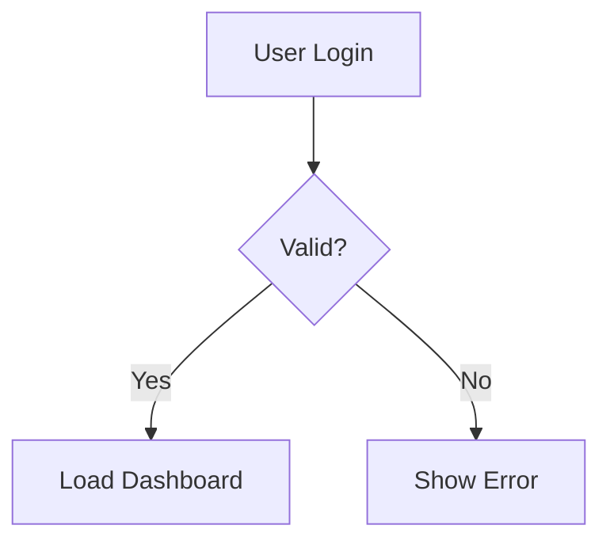

# Mermaid Diagram Generator

Converts architecture descriptions, module specs, or workflow docs into Mermaid diagrams.

## When to Use

- Visualizing system architecture
- Documenting module relationships
- Creating workflow diagrams
- Showing sequence of interactions
- Mapping state machines or data models

## How to Use

Simply describe what you want to visualize:

```
Convert this workflow to a diagram: User logs in → System validates → Dashboard loads
```

The skill will:

1. Identify the appropriate diagram type
2. Extract entities and relationships
3. Generate valid Mermaid syntax
4. Provide embeddable markdown

## Supported Diagram Types

- **Flowcharts**: Workflows, decision trees, process flows
- **Sequence Diagrams**: Agent interactions, API calls
- **Class Diagrams**: Module structure, data models
- **State Diagrams**: Workflow states, state machines
- **Entity Relationship**: Database schemas
- **Gantt Charts**: Project timelines

## Example Output



## Features

- **Auto-Detection**: Chooses best diagram type for your content
- **Valid Syntax**: Generates Mermaid code that renders correctly
- **Embeddable**: Ready to paste into markdown docs
- **Clear Labels**: Descriptive node names

## Philosophy

Follows amplihack's principles:

- **Ruthless Simplicity**: One concept per diagram
- **Zero-BS**: All diagrams render without errors
- **Modular**: Each diagram is self-contained
