# Mermaid Diagram Generator Skill

## Purpose

This skill automatically converts text descriptions of system architectures, module specifications, workflow documentation, and design concepts into valid Mermaid diagram syntax. It enables clear visual communication of complex systems, ensuring diagrams are production-ready and embeddable in markdown documentation.

## When to Use This Skill

- **Architecture Visualization**: Convert architecture descriptions into flowcharts or block diagrams
- **Module Relationships**: Create diagrams showing how brick modules connect via their studs (public contracts)
- **Workflow Documentation**: Visualize workflow states, decisions, and transitions (DDD phases, investigation stages)
- **System Design**: Display system components, data flow, and interactions
- **Sequence Diagrams**: Show agent interactions, request/response patterns, or call sequences
- **Class Hierarchies**: Document module structure and class relationships
- **State Machines**: Model workflow states and valid transitions
- **Entity Relationships**: Display data model structures and relationships
- **Timeline Planning**: Create Gantt charts for project phases or milestones

## Supported Diagram Types

### 1. Flowcharts (Default)

Best for: workflow sequences, decision trees, process flows, module relationships

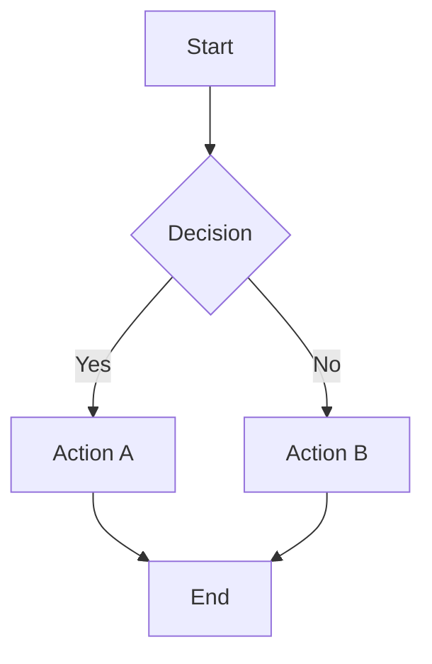

### 2. Sequence Diagrams

Best for: agent interactions, API calls, multi-step processes, request/response patterns

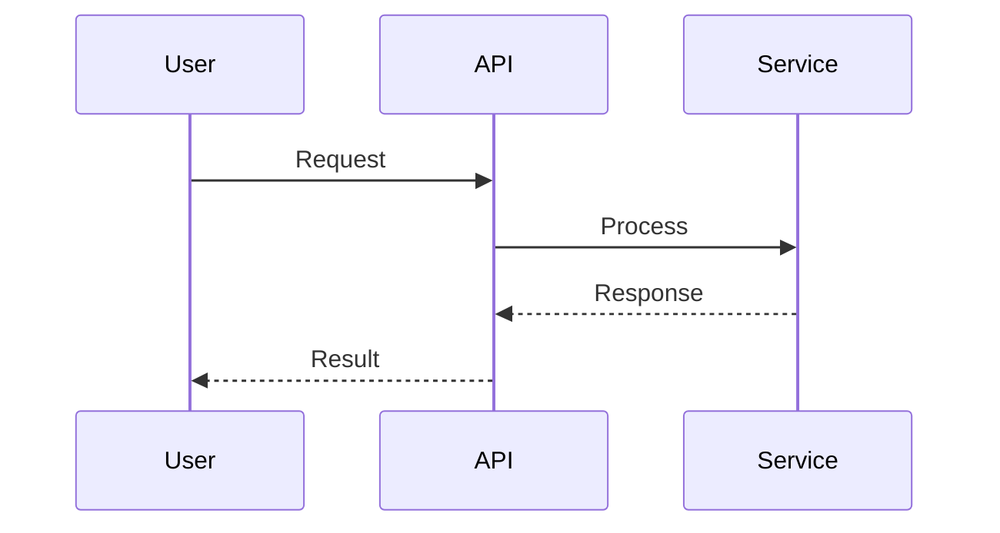

### 3. Class Diagrams

Best for: module structure, inheritance hierarchies, data models, component relationships

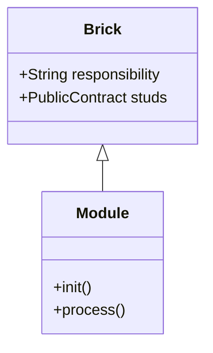

### 4. State Diagrams

Best for: workflow states, state machines, workflow phases, condition-based transitions

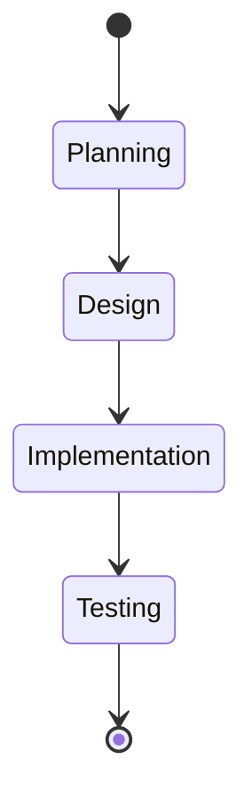

### 5. Entity Relationship Diagrams

Best for: data models, database schemas, entity relationships

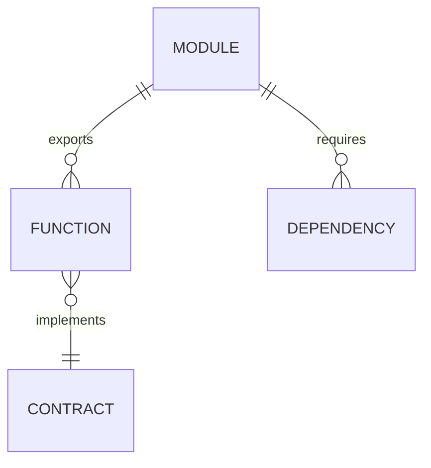

### 6. Gantt Charts

Best for: project timelines, workflow phases, milestone planning

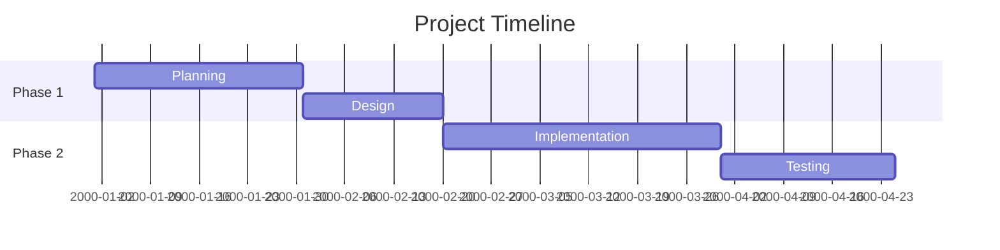

## Step-by-Step Generation Process

### Step 1: Understand the Source Material

1. Read the architecture description, spec, or workflow document
2. Identify the main entities or nodes
3. Determine how they relate or flow
4. Choose the appropriate diagram type

### Step 2: Identify Diagram Type

| Source Material                         | Best Diagram Type          |
| --------------------------------------- | -------------------------- |
| Workflow steps, process flow            | Flowchart                  |
| Module relationships, brick connections | Flowchart or Class Diagram |
| Agent interactions, call sequences      | Sequence Diagram           |
| States and transitions                  | State Diagram              |
| Data models, entities                   | Class Diagram or ERD       |
| Database schema                         | ERD                        |
| Project timeline                        | Gantt Chart                |
| Complex hierarchies                     | Class Diagram              |

### Step 3: Extract Entities and Relationships

1. List all nodes/entities from the source
2. Identify connections between them
3. Determine connection types (data flow, inheritance, calling, etc.)
4. Note any decision points or conditions

### Step 4: Generate Mermaid Syntax

1. Use appropriate Mermaid diagram declaration
2. Create nodes with descriptive labels
3. Draw connections with proper syntax
4. Add styling if needed for clarity
5. Ensure valid Mermaid syntax

### Step 5: Validate and Enhance

1. Ensure all entities are included
2. Verify connections are accurate
3. Add styling for important elements
4. Make diagram readable and not cluttered
5. Test syntax for validity

### Step 6: Document and Embed

1. Add title and description
2. Include explanation of diagram
3. Provide legend if needed
4. Embed in markdown with proper formatting

## Usage Examples

### Example 1: Architecture Description to Flowchart

**Input:**

```
The authentication module handles JWT token validation. When a request arrives,
it first checks if a token exists. If not, it returns unauthorized. If it does,
it validates the token signature. If valid, it extracts the payload and continues.
If invalid, it returns forbidden. The payload is passed to the authorization
module for role-based access control.
```

**Output:**

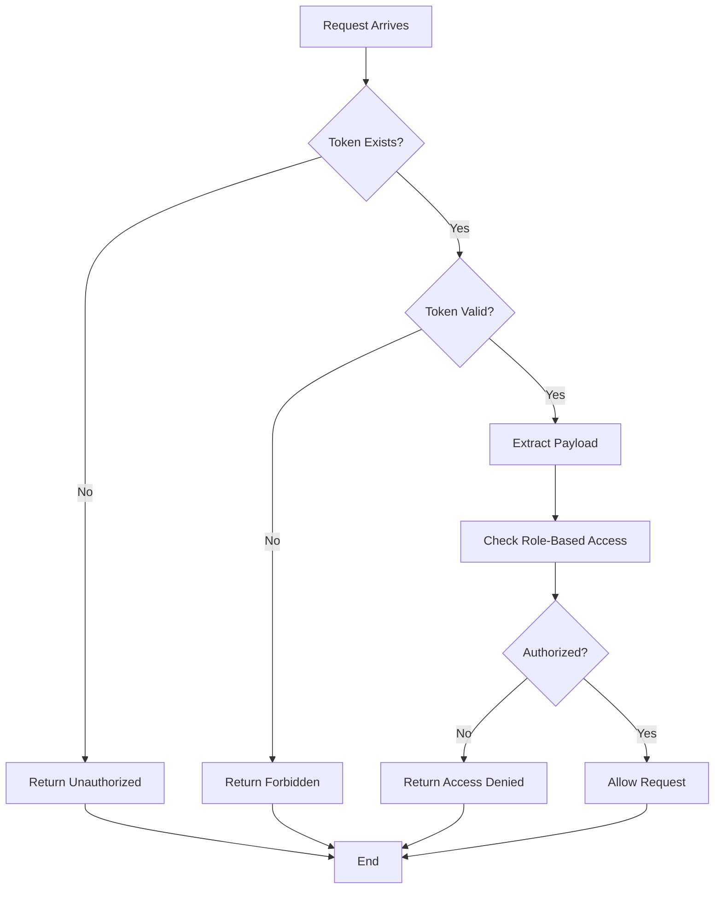

### Example 2: Module Spec to Class Diagram

**Input:**

```
Module: authentication
- Exports: validate_token, TokenPayload, AuthError
- Classes: TokenPayload (user_id, role, expires_at), AuthError (message, code)
- Functions: validate_token(token, secret) -> TokenPayload
- Internal: JWT (PyJWT library), Models (TokenPayload)
```

**Output:**

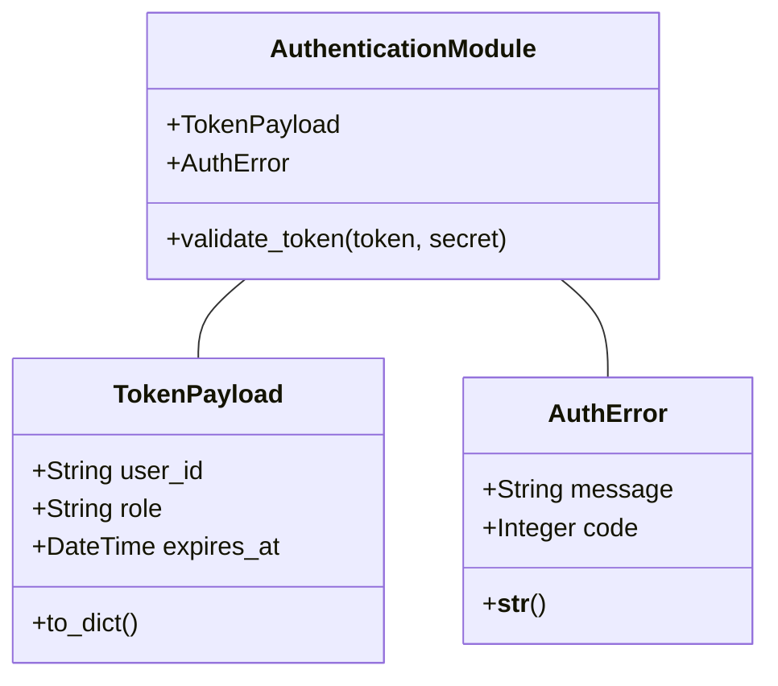

### Example 3: Workflow to State Diagram

**Input:**

```
DDD Workflow: Phase 0 (Planning) -> Phase 1 (Documentation) ->
Approval Gate -> Phase 2 (Code Planning) -> Phase 3 (Implementation) ->
Phase 4 (Testing & Cleanup) -> Complete
```

**Output:**

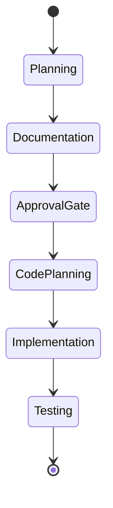

### Example 4: Agent Interaction to Sequence Diagram

**Input:**

```
The prompt-writer agent clarifies requirements from the user. It then sends
the clarified requirements to the architect agent. The architect creates a
specification and sends it to the builder agent. The builder implements code
and sends it to the reviewer. The reviewer checks quality and sends feedback
back to the builder if issues are found, or to the user if complete.
```

**Output:**

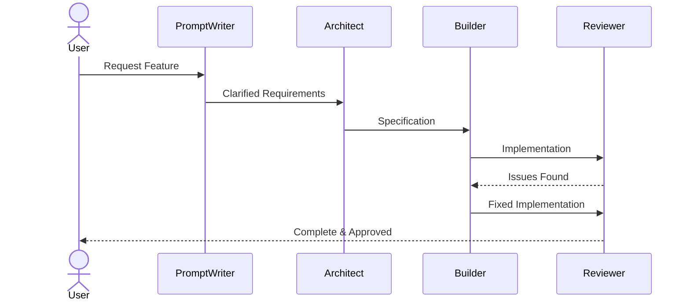

### Example 5: System Architecture to Flowchart

**Input:**

```
Client requests flow through API Gateway to Services. Services can be
Authentication Service, User Service, or Data Service. All services
connect to a shared Database and Logger. Services return responses
through the API Gateway back to Client.
```

**Output:**

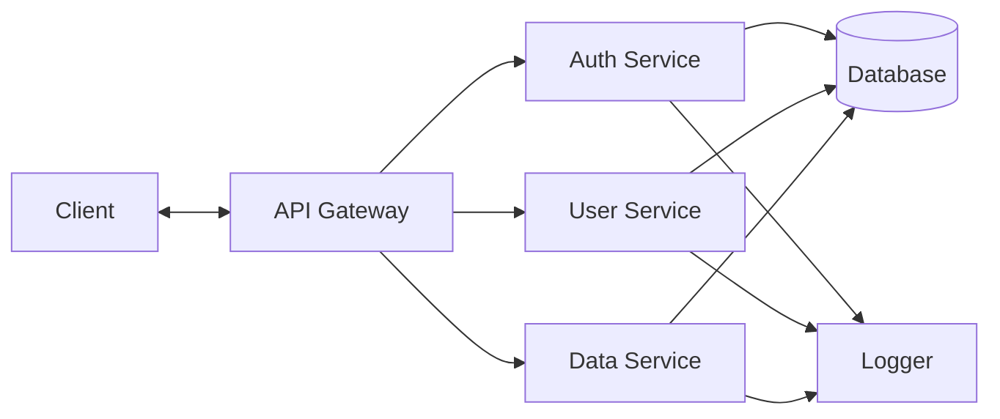

## Mermaid Syntax Reference

### Flowchart Nodes

```
A[Rectangle]
B(Rounded Rectangle)
C{Diamond/Decision}
D[(Database)]
E[/Parallelogram Right/]
F[\Parallelogram Left\]
G[[Subroutine]]
H((Circle))
```

### Flowchart Connections

```
A --> B          # Arrow
A -- Text --> B  # Arrow with label
A ---|Yes| B     # Arrow with yes/no
A -->|Condition| B
A -.-> B         # Dotted line
A ==> B          # Bold arrow
```

### Styling

```
classDef className fill:#f9f,stroke:#333,stroke-width:2px,color:#000
class A,B className
style A fill:#f9f,stroke:#333,stroke-width:4px
```

## Quality Checklist

Before presenting a diagram, verify:

- [ ] All entities from source are included
- [ ] Connections accurately represent relationships
- [ ] Diagram type matches content (flowchart for flows, sequence for interactions, etc.)
- [ ] Labels are clear and descriptive
- [ ] No circular logic or dead ends (unless intentional)
- [ ] Mermaid syntax is valid
- [ ] Diagram is readable and not overly complex
- [ ] Decision points have clear yes/no paths
- [ ] Legend provided if needed for understanding
- [ ] Comments explain non-obvious elements

## Common Patterns

### Brick Module Visualization

```mermaid
flowchart TD
    B1["Brick Module 1<br/>(Responsibility)"]
    B2["Brick Module 2<br/>(Responsibility)"]
    S1["Stud: public_function"]
    S2["Stud: public_class"]

    B1 --> S1
    B1 --> S2
    S1 -.depends on.-> B2
    B2 --> "Stud: get_data"
```

### Workflow Decision Tree

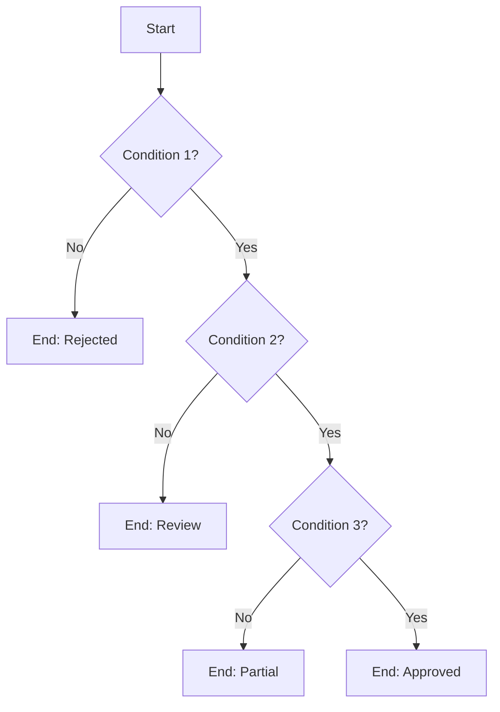

### Error Handling Flow

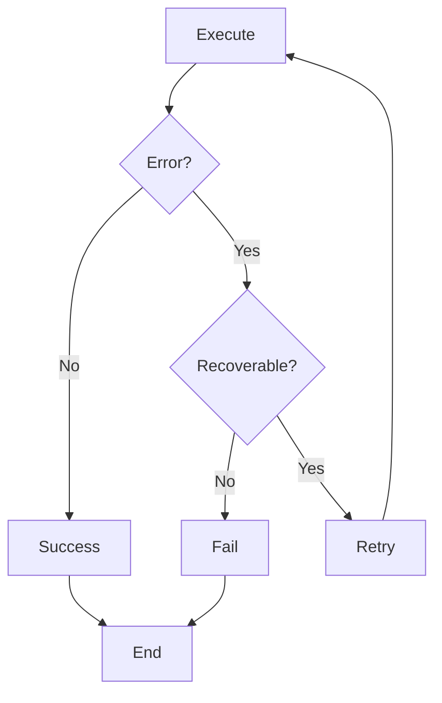

## Integration with Documentation

### Embedding in Markdown

````markdown
## System Architecture

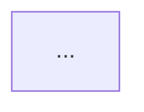
````

**Key Components:**

- Component A handles...
- Component B processes...

````

### Using with Document-Driven Development
- Create diagrams during documentation phase
- Include architecture diagrams in spec docs
- Use sequence diagrams to explain workflows
- Add state diagrams to describe state machines

### Using with Investigation Workflow
- Visualize discovered architecture
- Show data flow between components
- Map discovered dependencies
- Display call sequences between services

## Tips for Effective Diagrams

1. **Keep It Simple**: One concept per diagram
2. **Use Clear Labels**: Names should describe purpose
3. **Follow Visual Conventions**: Diamonds for decisions, circles for states
4. **Avoid Crossing Lines**: Reorganize to reduce visual clutter
5. **Logical Flow**: Top-to-bottom or left-to-right
6. **Consistent Styling**: Similar elements should look similar
7. **Legend**: Include if symbols aren't obvious
8. **Test Syntax**: Ensure Mermaid renders without errors
9. **Add Comments**: Explain non-obvious relationships
10. **Iterate**: Refine based on feedback

## Common Pitfalls to Avoid

- **Too Complex**: Diagram has too many elements (break into multiple diagrams)
- **Unclear Labels**: Node names don't describe their purpose
- **Missing Connections**: Important relationships not shown
- **Invalid Syntax**: Mermaid errors prevent rendering
- **Ambiguous Decision Points**: Yes/no paths not clearly marked
- **Crossing Arrows**: Visual confusion from overlapping connections
- **No Legend**: Symbols or colors not explained
- **Wrong Diagram Type**: Using flowchart for sequence data
- **Inconsistent Style**: Different formatting for similar elements
- **No Context**: Diagram shown without explanation

## Success Criteria

A good Mermaid diagram:
- [ ] Shows all key entities from source material
- [ ] Accurately represents relationships and flow
- [ ] Uses appropriate diagram type for content
- [ ] Clear, descriptive labels on all nodes
- [ ] Valid Mermaid syntax (renders without error)
- [ ] Readable without excessive complexity
- [ ] Supports understanding of the system
- [ ] Could be embedded in documentation
- [ ] Decision points clearly marked
- [ ] Legend included if needed
- [ ] Purpose and scope clear from context

## Related Skills

- **module-spec-generator**: Generate specs that can be visualized as class diagrams
- **Document-Driven Development**: Use diagrams in specification documents
- **Investigation Workflow**: Create architecture diagrams from discovered systems

## Output Format

Diagrams are generated in Mermaid markdown format, ready to embed:

```markdown
    ```mermaid
    [Generated Mermaid Syntax]
    ```
````

Include explanation before or after the diagram.

## Feedback and Improvement

This skill evolves based on usage patterns:

- What types of diagrams are most useful?
- What features make diagrams clearer?
- What errors occur and how to prevent them?
- How can diagrams better support documentation?

Document learnings and suggest improvements for `.claude/context/DISCOVERIES.md`.
