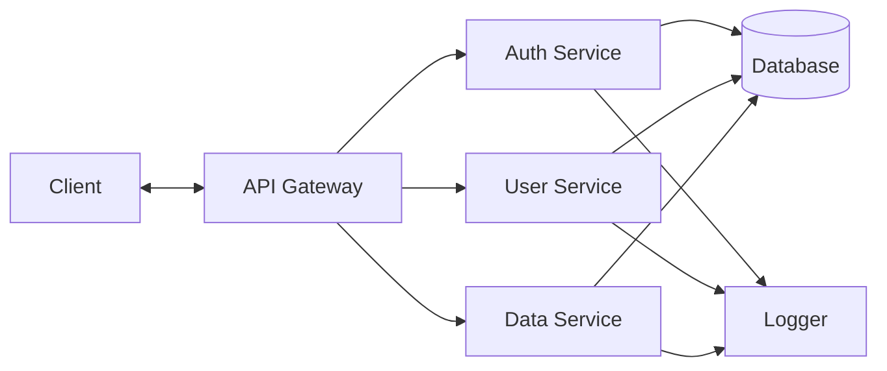

# Architecture Diagram Example

## Input Description

```
Our system has a Client that sends requests to an API Gateway. The gateway routes to three services: Auth Service, User Service, and Data Service. All services connect to a shared Database and Logger.
```

## Generated Mermaid Diagram



## Usage

This diagram shows:

- Clear data flow from client through gateway
- Service independence (each connects to shared resources)
- Centralized logging pattern
- Database as single source of truth
