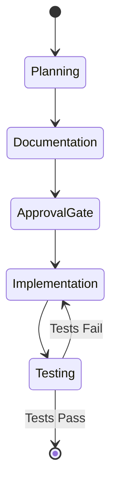

# Workflow Diagram Example

## Input Description

```
When a PR is created, it goes through these phases: Planning → Documentation → Approval Gate → Implementation → Testing → Complete. If testing fails, go back to Implementation.
```

## Generated Mermaid Diagram



## Usage

This state diagram shows:

- Sequential workflow phases
- Approval gate as a decision point
- Feedback loop for failed tests
- Clear start and end states
