# Component Relationships Template

## When to Use This Template

Use this template when investigating or explaining:

- System architecture and module interactions
- Microservice dependencies
- Component communication patterns
- Class/object relationships
- Service integration architecture
- Plugin and extension systems

**Trigger Conditions:**

- System has multiple interacting components
- Need to show dependencies between modules
- Explaining how services communicate
- Documenting integration points

**Examples:**

- Microservice architecture diagrams
- Module dependency graphs
- Plugin system architectures
- Frontend/backend integration
- Service mesh topologies
- Class hierarchy and interactions

## Template Diagram

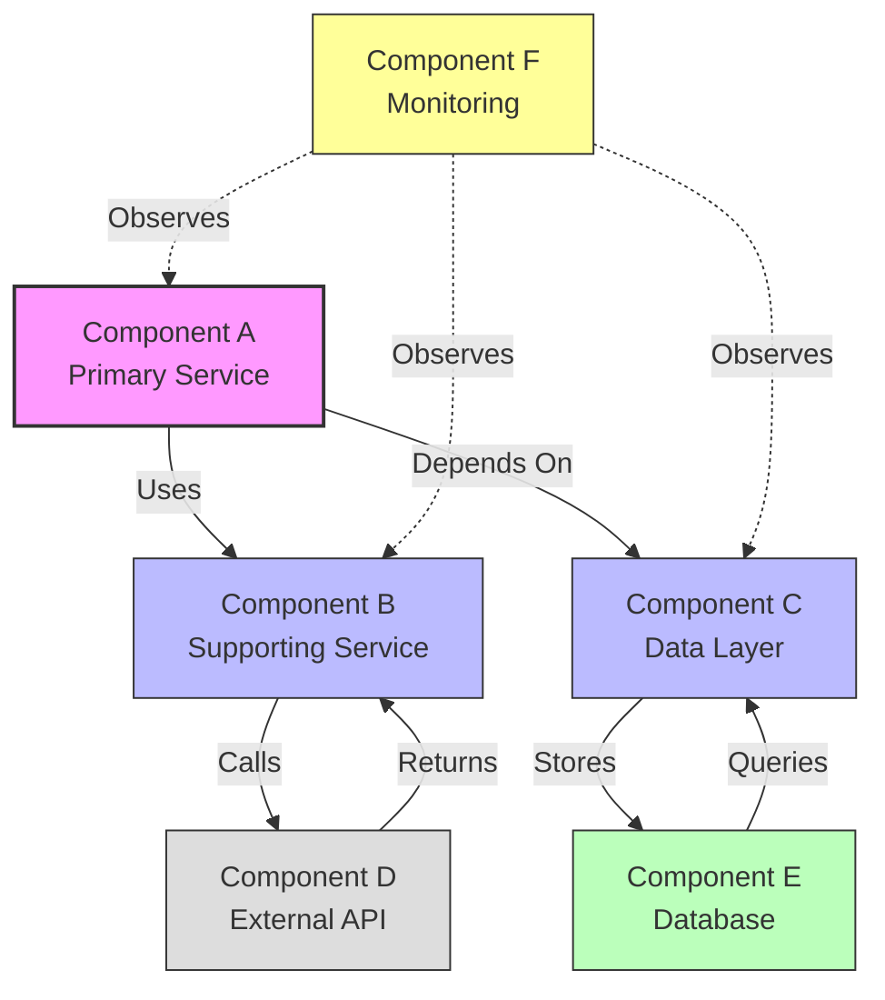

## Customization Guide

Replace these placeholders with your specific components:

1. **Component A** → Your primary component (e.g., "API Gateway", "Frontend App")
2. **Component B** → Supporting component (e.g., "Auth Service", "Business Logic")
3. **Component C** → Data layer (e.g., "Data Access Layer", "Repository")
4. **Component D** → External component (e.g., "Third-party API", "Payment Gateway")
5. **Component E** → Storage component (e.g., "PostgreSQL", "Redis Cache")
6. **Component F** → Cross-cutting concern (e.g., "Logging", "Monitoring")

**Edge Labels:** Use specific verbs:

- "Uses", "Calls", "Depends On", "Queries", "Publishes", "Subscribes", "Stores", "Retrieves"

**Optional Components:**

- Cross-cutting concerns (monitoring, logging) - use dotted lines
- External systems (grayed out style)

### Example: Microservice Architecture

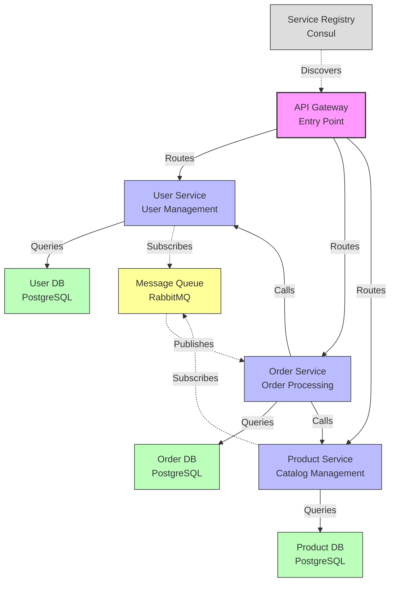

## Layered Architecture Variation

For systems with clear architectural layers:

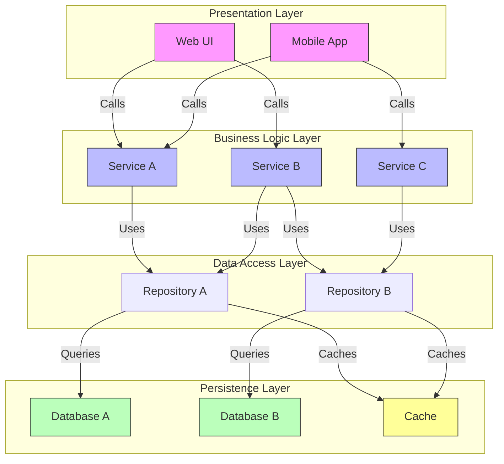

## Hub-and-Spoke Variation

For systems with a central coordinator:

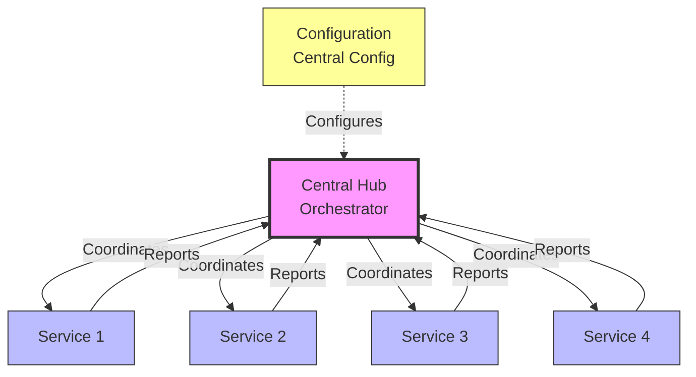

## Quality Checklist

Before using this diagram, verify:

- [ ] **All major components shown** - No critical pieces missing
- [ ] **Relationships are clear** - Edge labels describe interactions
- [ ] **Direction is correct** - Arrows show dependency/call direction
- [ ] **External systems distinguished** - Different styling for third-party
- [ ] **Layers are logical** - If using layers, they're correctly organized
- [ ] **Cross-cutting concerns shown** - Monitoring, logging, etc. (dotted lines)
- [ ] **Not too cluttered** - If >15 components, consider grouping
- [ ] **Labels match codebase** - Use actual component names

## Common Variations

### Variation 1: Simple Client-Server

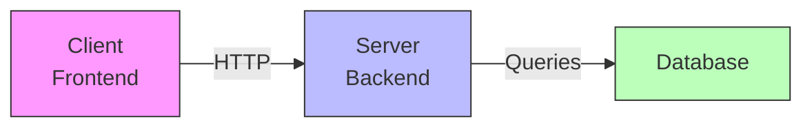

### Variation 2: Event-Driven Architecture

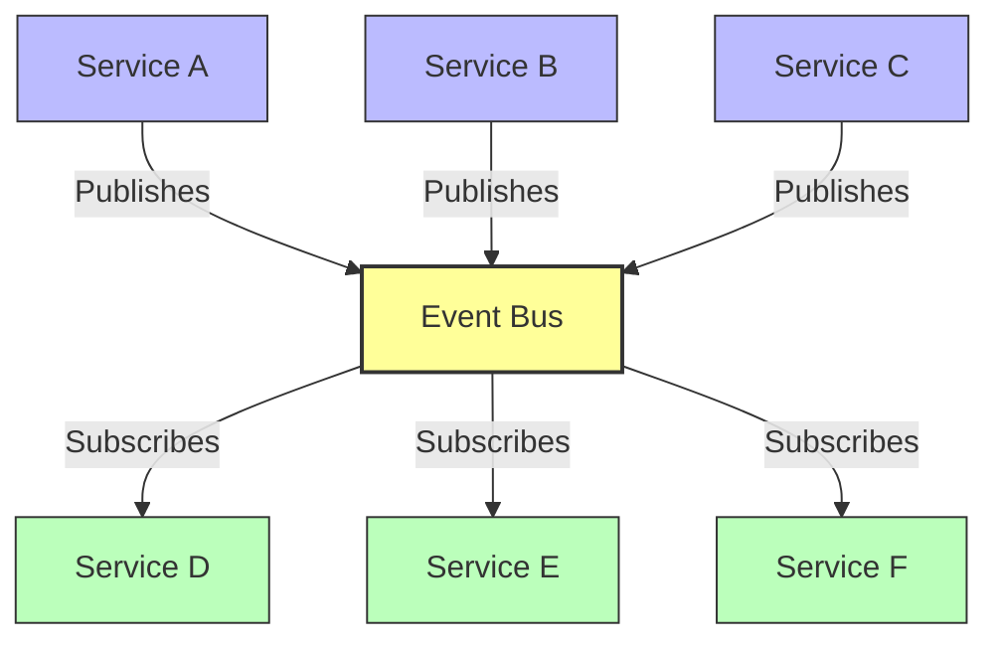

### Variation 3: Plugin Architecture

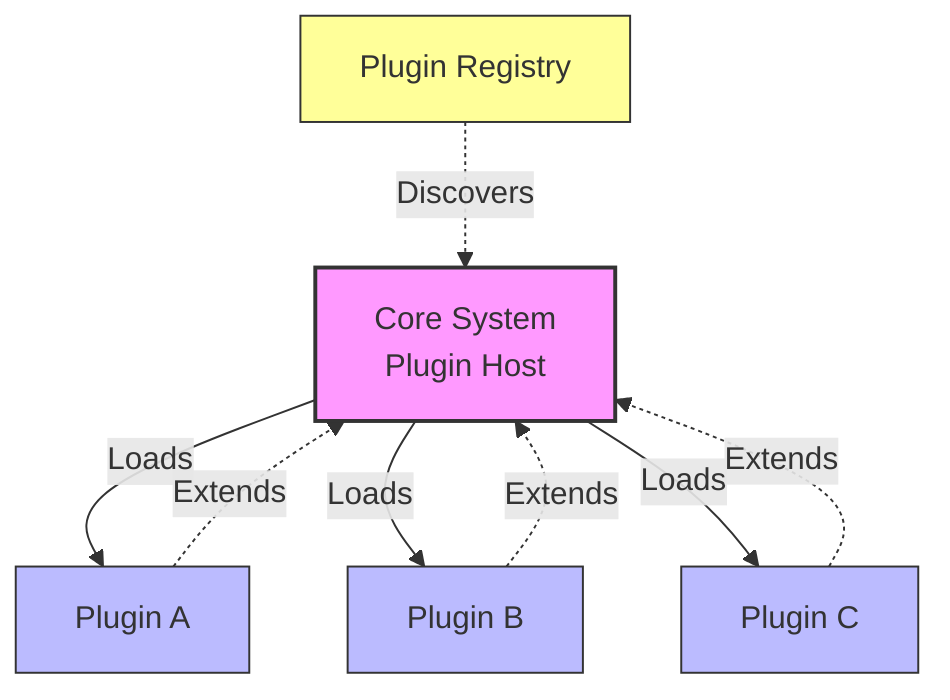

### Variation 4: Dependency Injection

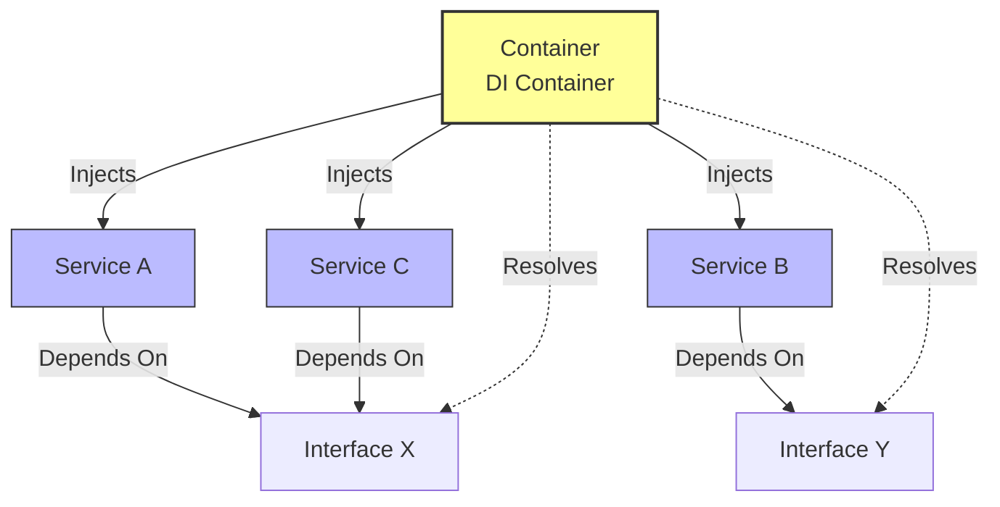

## Usage Tips

**When to use this template:**

- User asks "how do these components interact?"
- Explaining system architecture
- Documenting dependencies
- Showing integration points

**What to emphasize:**

- Primary components and their roles
- Critical dependencies (who depends on whom)
- External integrations (third-party services)
- Communication patterns (sync/async, pub/sub)
- Cross-cutting concerns (monitoring, security)

**What to avoid:**

- Internal class details (keep component-level)
- Every possible relationship (show critical paths)
- Too many layers (simplify if possible)
- Unclear dependency direction (always explicit arrows)

## Real-World Example: Claude Code Agent System

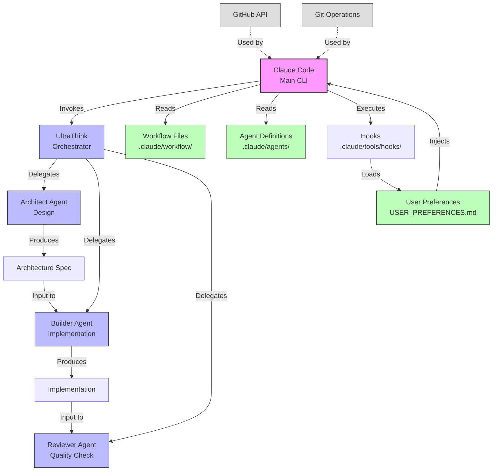

**Caption:** Claude Code's agent system showing how the main CLI orchestrates specialized agents (architect, builder, reviewer) using workflow definitions and agent files. Hooks load user preferences at runtime and inject them into the session. Agents follow a pipeline: architect designs, builder implements, reviewer validates. External integrations with GitHub API and Git provide version control capabilities.

## Related Templates

- **EXECUTION_SEQUENCE.md** - For showing detailed interaction sequences
- **DATA_FLOW.md** - For showing data movement between components
- **HOOK_SYSTEM_FLOW.md** - For showing hook integration with components

## Anti-Patterns

**Too Shallow:**

```
Frontend → Backend → Database
```

(Not helpful - too generic, no detail about components)

**Too Deep:**

```
UserController → UserService → UserValidator → UserMapper → UserRepository → DatabaseConnection → PostgreSQL → Disk
```

(Too granular - combine related components)

**Unclear Direction:**

```
A --- B --- C --- D
```

(Use arrows to show dependency/call direction)

**Better:**

```
A -->|Calls| B -->|Uses| C -->|Queries| D
```

**No Context:**

```
ServiceA → ServiceB → ServiceC
```

(What do these services do? Add descriptions)

**Better:**

```
ServiceA<br/>User Auth → ServiceB<br/>Order Processing → ServiceC<br/>Payment Gateway
```

## Advanced Example: Multi-Tier Web Application

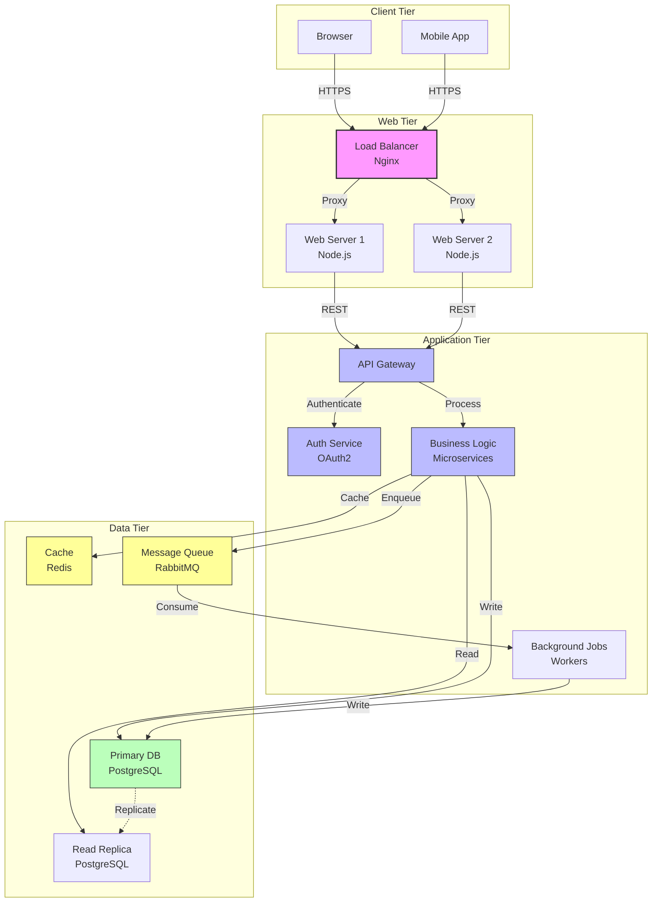

**Caption:** Multi-tier web application showing client tier (browser/mobile), web tier (load balancer + servers), application tier (API gateway, auth, business logic, workers), and data tier (primary DB, read replica, cache, message queue). Load balancer distributes traffic, API gateway routes requests, business logic writes to primary DB and reads from replica, with Redis caching and RabbitMQ for async jobs.

## Circular Dependency Detection

For identifying problematic circular dependencies:

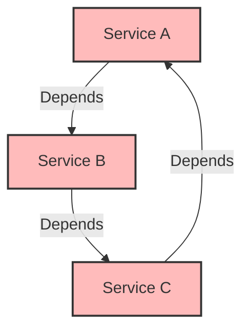

**Caption:** ANTI-PATTERN - Circular dependency detected. Services A, B, C form a dependency cycle that should be broken by introducing an interface or refactoring responsibilities.
