# Data Flow Template

## When to Use This Template

Use this template when investigating or explaining:

- Data processing pipelines
- ETL (Extract, Transform, Load) systems
- Data transformation workflows
- Stream processing architectures
- Request/response data flows
- Data validation and sanitization pipelines

**Trigger Conditions:**

- Data flows through multiple processing stages
- Data is transformed or enriched at each stage
- System processes data from input to output
- Multiple data transformations in sequence

**Examples:**

- Data processing pipelines (Spark, Airflow)
- API request/response transformations
- File processing workflows
- Stream processing (Kafka, event streams)
- Data validation and cleaning pipelines
- Machine learning data preprocessing

## Template Diagram

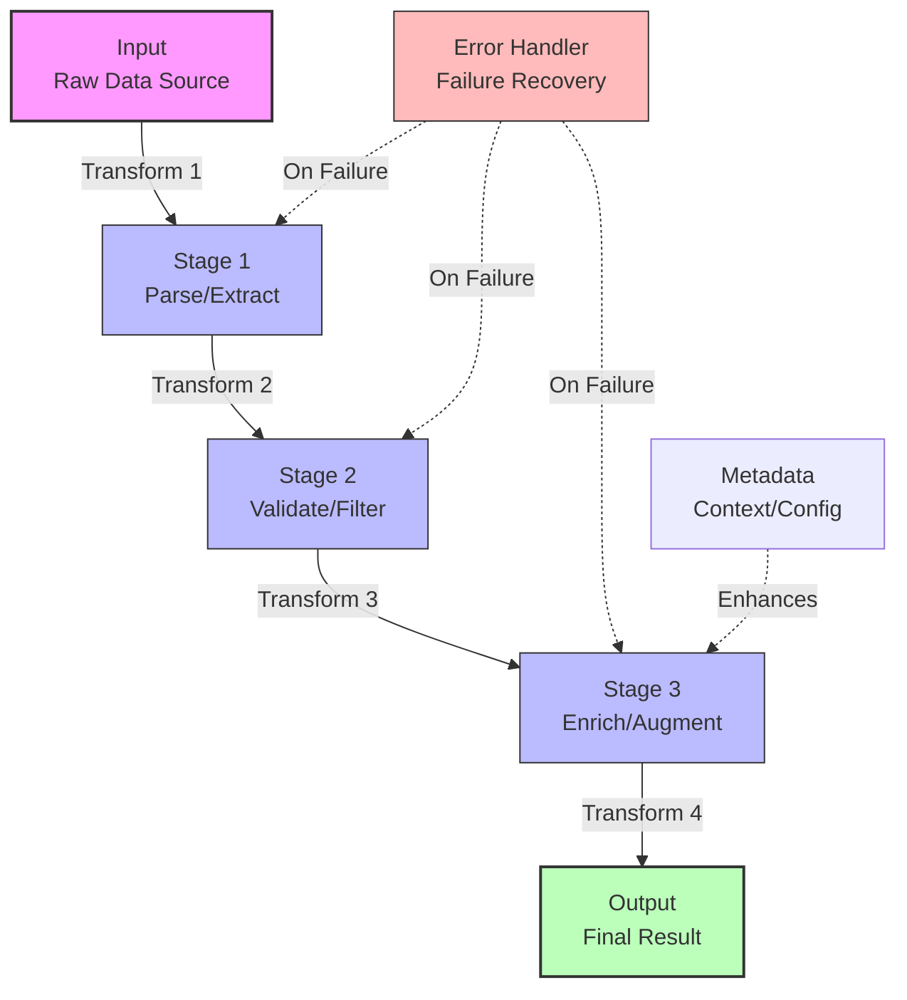

## Customization Guide

Replace these placeholders with your specific data flow stages:

1. **Input** → Your data source (e.g., "API Request", "CSV File", "Event Stream")
2. **Stage 1** → First transformation (e.g., "Parse JSON", "Extract Fields", "Deserialize")
3. **Stage 2** → Second transformation (e.g., "Validate Schema", "Filter Invalid", "Sanitize")
4. **Stage 3** → Third transformation (e.g., "Enrich with DB Data", "Calculate Fields", "Aggregate")
5. **Output** → Final result (e.g., "API Response", "Database Record", "Published Event")

**Optional Components:**

- **Error Handler** → If failures at any stage are handled (dotted line)
- **Metadata/Config** → If context enhances processing (dotted line)

### Example: API Request Processing

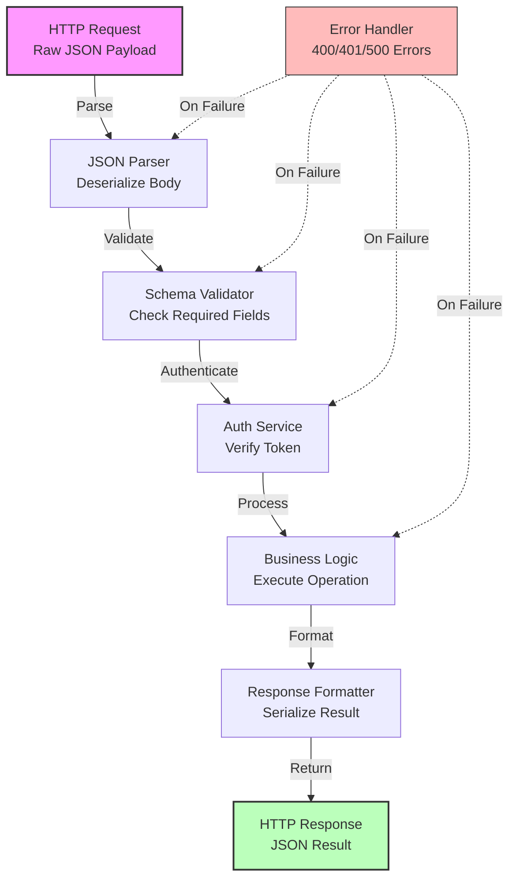

## Branching Data Flow Variation

For pipelines where data splits and merges:

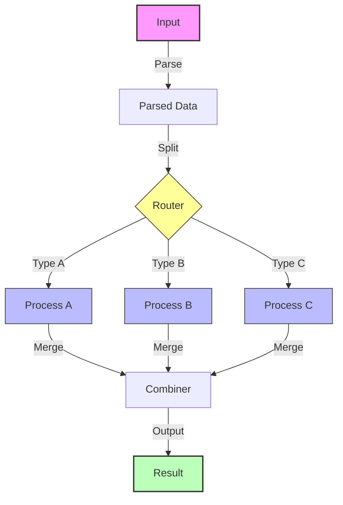

## Parallel Processing Variation

For pipelines with independent parallel stages:

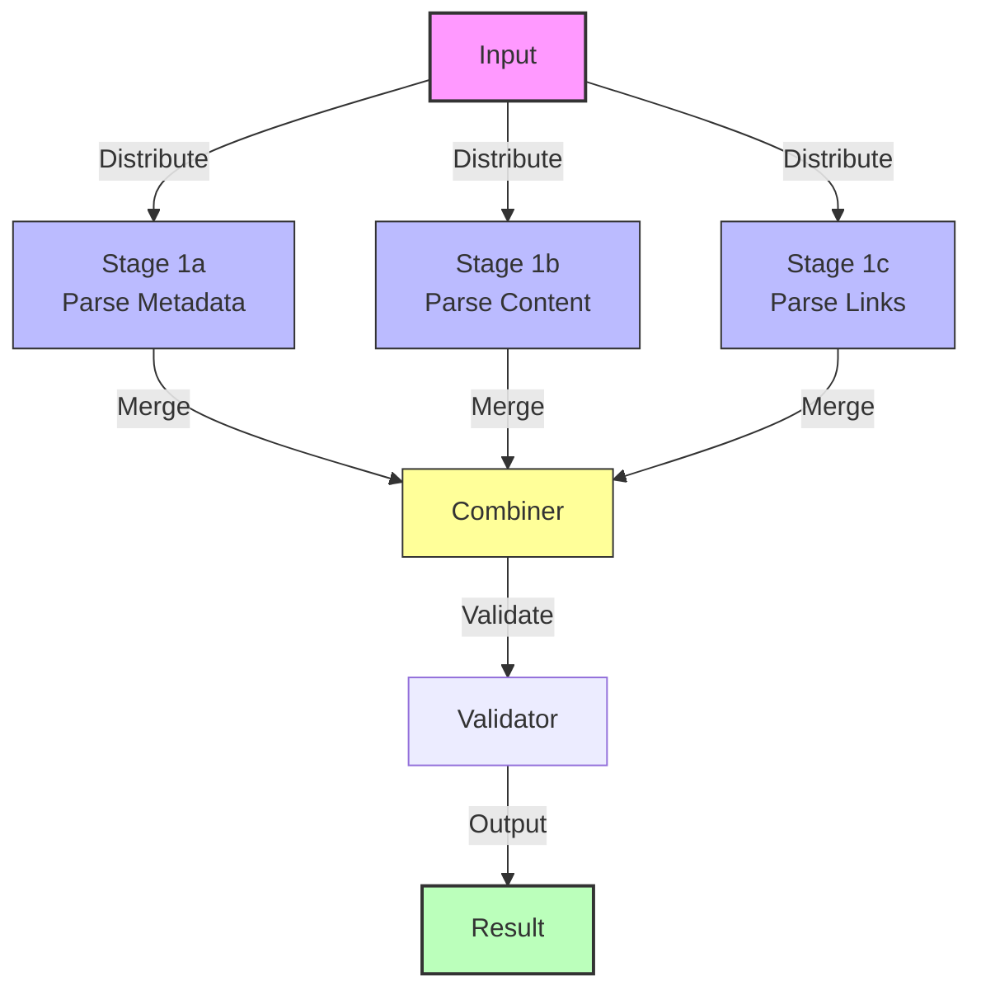

## Quality Checklist

Before using this diagram, verify:

- [ ] **Input is clear** - What data enters the pipeline?
- [ ] **Transformations are labeled** - What happens at each stage?
- [ ] **Output is explicit** - What is the final result?
- [ ] **Flow direction is obvious** - Follows left-to-right or top-to-bottom
- [ ] **Error handling shown** - What happens when stages fail?
- [ ] **Side effects visible** (if any) - Logging, metrics, external calls
- [ ] **Branching is clear** (if applicable) - How data splits/merges
- [ ] **Labels describe transformations** - Not just "Step 1", "Step 2"

## Common Variations

### Variation 1: Simple Linear Pipeline

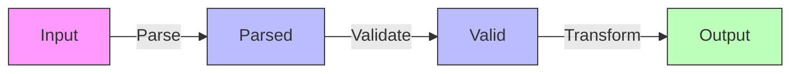

### Variation 2: Pipeline with Side Effects

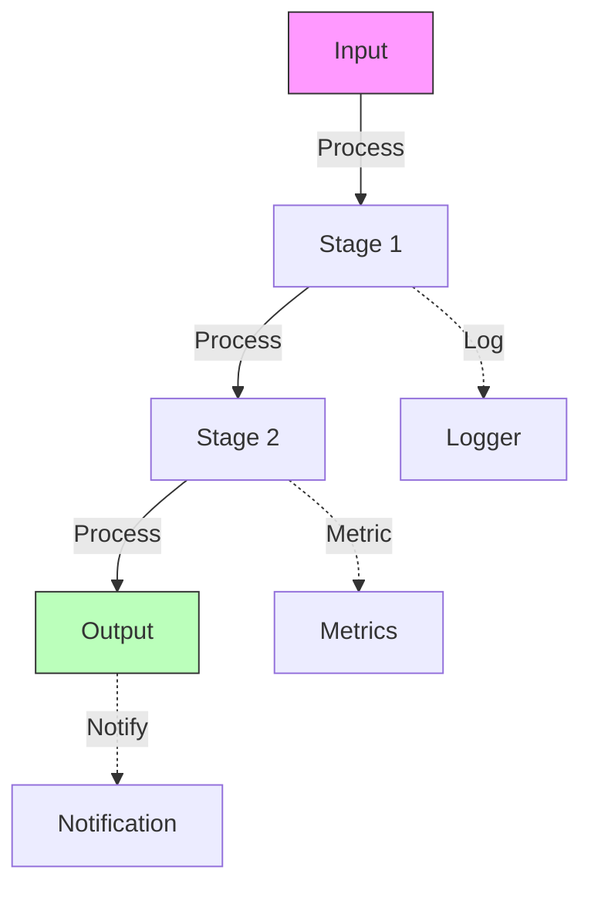

### Variation 3: Feedback Loop

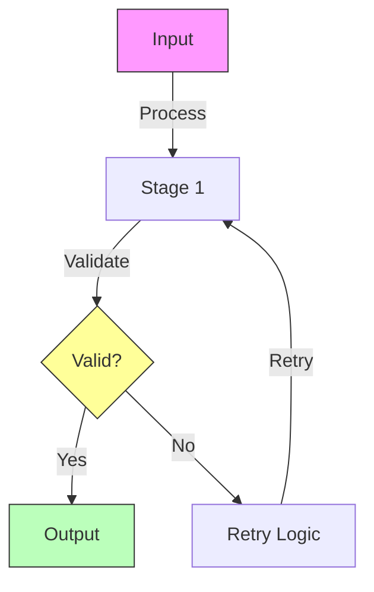

### Variation 4: Stream Processing

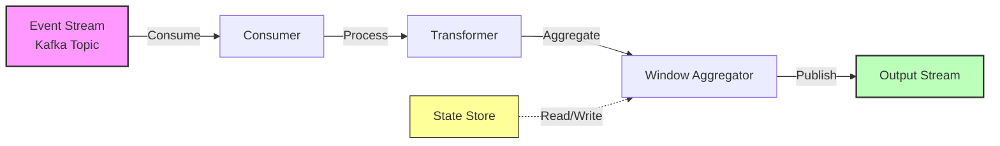

## Usage Tips

**When to use this template:**

- User asks "how does data flow through X?"
- Explaining processing pipelines
- Documenting ETL workflows
- Showing data transformations

**What to emphasize:**

- Input format and source
- Transformation at each stage (be specific)
- Output format and destination
- Error handling (critical for pipelines)
- Branching/merging logic (if applicable)

**What to avoid:**

- Too many stages (>6-7) - group related stages
- Vague labels ("Process", "Handle") - be specific about transformation
- Missing error handling - always show failure paths
- Unclear data format - label with types when relevant

## Real-World Example: Document Processing Pipeline

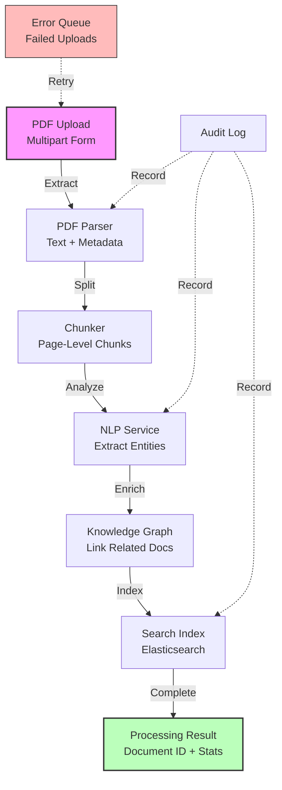

**Caption:** This diagram shows how uploaded PDF documents flow through a processing pipeline. Documents are parsed, chunked, analyzed for entities, enriched with knowledge graph links, and indexed for search. Failed uploads go to an error queue for retry, and key stages are logged for audit.

## Related Templates

- **EXECUTION_SEQUENCE.md** - For showing detailed step-by-step execution (more granular)
- **COMPONENT_RELATIONSHIPS.md** - For showing how pipeline components integrate
- **HOOK_SYSTEM_FLOW.md** - For showing pipeline hooks/interceptors

## Anti-Patterns

**Too Generic:**

```
Input → Process → Output
```

(Not helpful - no context about transformations)

**Too Detailed:**

```
Read File → Open Buffer → Read Line 1 → Parse Line 1 → Validate Line 1 → Write Line 1 → Read Line 2 → ...
```

(Too granular - show batch operations, not per-item)

**Missing Error Handling:**

```
A → B → C → D
```

(What happens if B or C fails? Always show failure paths)

**Better:**

```
A → B → C → D
Error Handler -.->|Retry| B
Error Handler -.->|Retry| C
```

**Unclear Transformations:**

```
Data → Step 1 → Step 2 → Step 3 → Result
```

(What does each step do? Be specific)

**Better:**

```
Raw JSON → Parse → Validate Schema → Enrich with DB → Final JSON
```

## Complex Example: ETL Pipeline with Multiple Sources

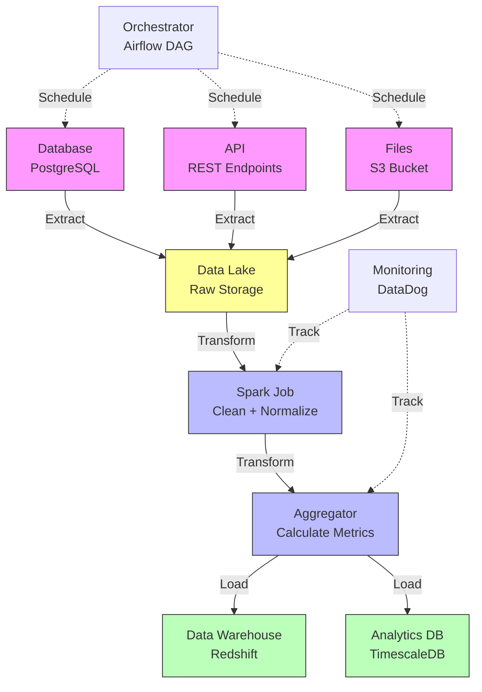

**Caption:** Multi-source ETL pipeline showing data extraction from database, API, and files into a data lake, transformation with Spark and aggregation, then loading into both a data warehouse and analytics database. Airflow orchestrates the pipeline schedule, and DataDog monitors transformation stages.

## Advanced: Real-Time Stream Processing

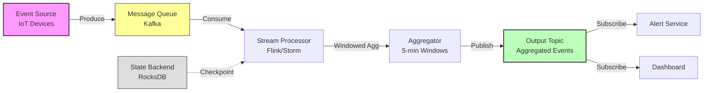

**Caption:** Real-time stream processing showing IoT device events flowing through Kafka, processed with windowed aggregation in Flink, and published to an output topic consumed by alert service and dashboard. State backend provides checkpointing for fault tolerance.
