# Execution Sequence Template

## When to Use This Template

Use this template when investigating or explaining:

- Request/response flows
- API call sequences
- User interaction workflows
- Multi-step processes
- Actor interactions
- System lifecycle events

**Trigger Conditions:**

- Process has specific sequence of steps
- Multiple actors/systems interact
- Time-based flow is important
- Request/response pattern exists

**Examples:**

- API request/response flows
- User authentication sequences
- Database transaction flows
- Multi-service orchestration
- Login workflows
- Payment processing flows

## Template Diagram

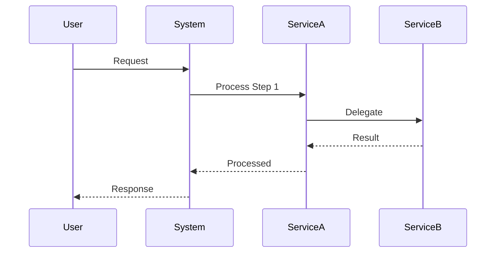

## Customization Guide

Replace these placeholders with your specific actors and actions:

1. **Participants** → Your actual actors/systems (e.g., "Browser", "API Gateway", "Database")
2. **Request** → The initiating action (e.g., "Login Request", "Place Order")
3. **Process Steps** → Specific operations (e.g., "Validate Token", "Check Inventory")
4. **Results** → Return values (e.g., "User Details", "Order Confirmation")

**Arrow Types:**

- `->>` : Synchronous call (waits for response)
- `-->>` : Return/response
- `--)` : Asynchronous call (fire and forget)

### Example: User Authentication Flow

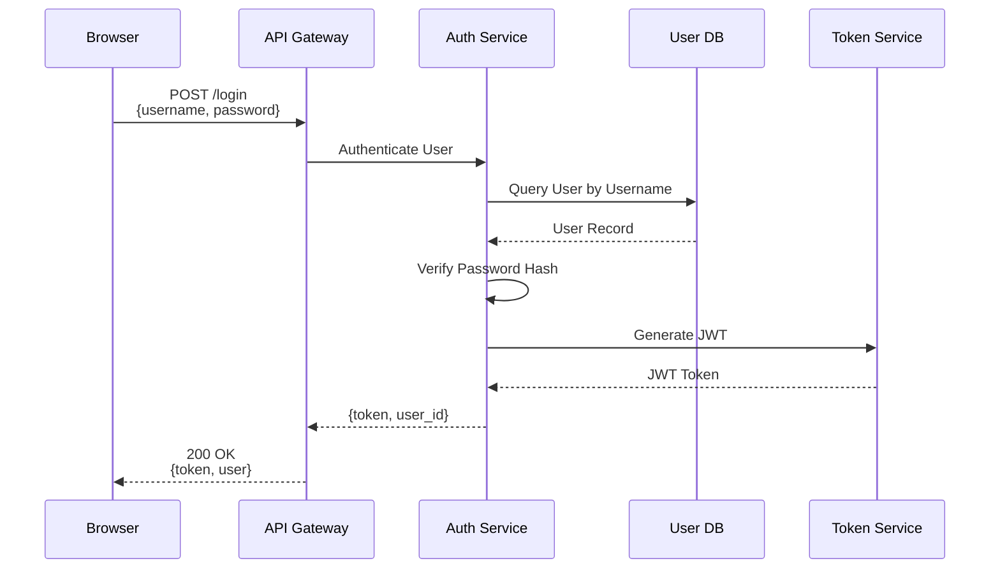

## Alternative Format: Flowchart Style

For simpler sequences without multiple participants:

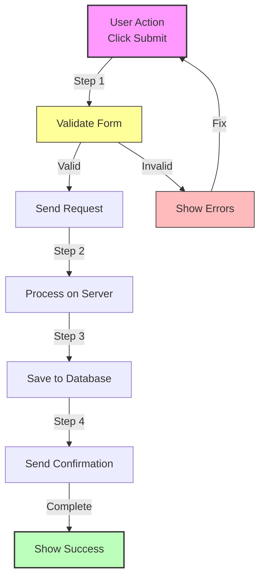

## Error Handling Variation

For sequences with error paths:

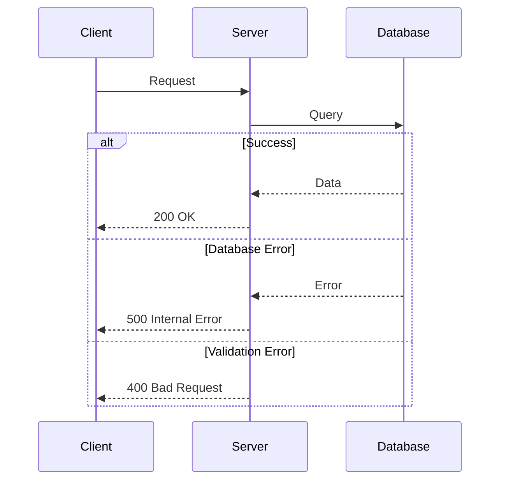

## Loop Variation

For sequences with repetitive operations:

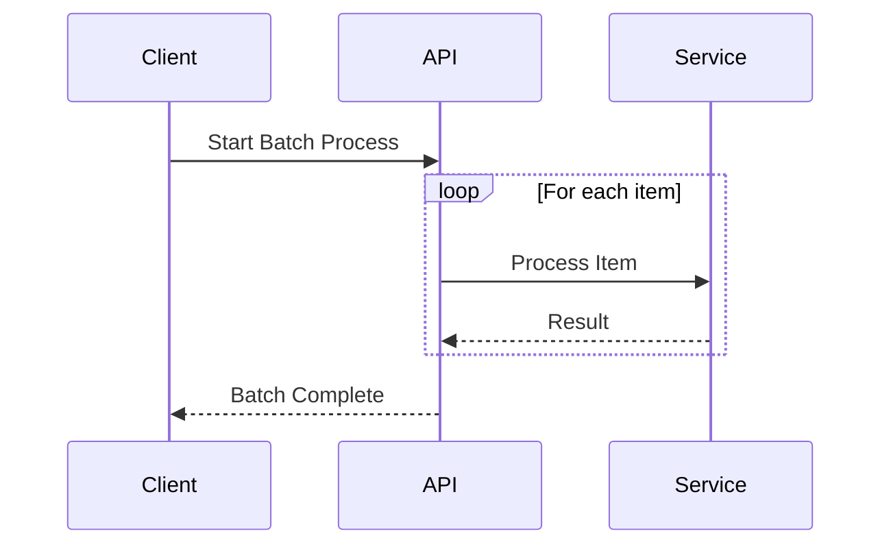

## Quality Checklist

Before using this diagram, verify:

- [ ] **Participants are clear** - All actors/systems listed
- [ ] **Actions are specific** - Not just "request"/"response"
- [ ] **Order is correct** - Follows actual execution sequence
- [ ] **Return values shown** - Response arrows with data
- [ ] **Error paths included** - What happens on failure
- [ ] **Not too detailed** - High-level steps, not every function call
- [ ] **Labels are descriptive** - Clear action descriptions
- [ ] **Response direction correct** - Always back to caller

## Common Variations

### Variation 1: Simple Request/Response

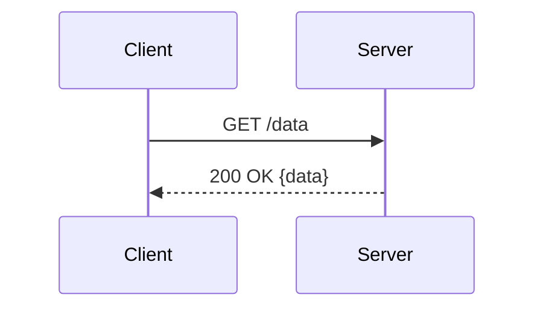

### Variation 2: Multi-Service Call

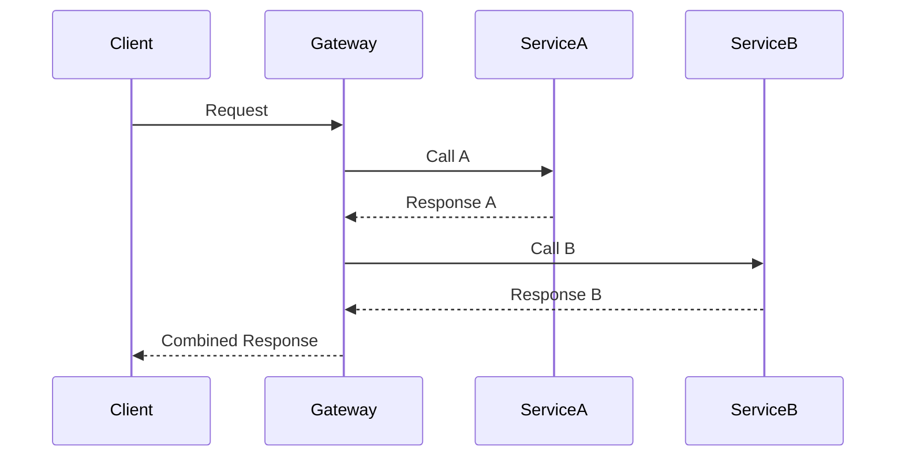

### Variation 3: Asynchronous Processing

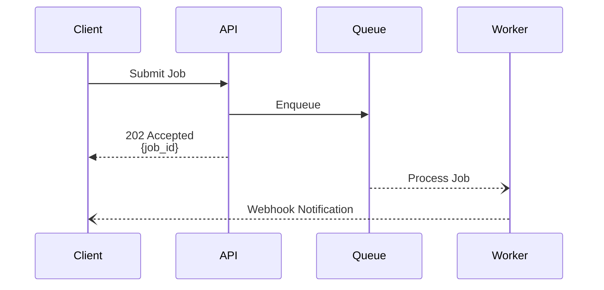

### Variation 4: Conditional Flow

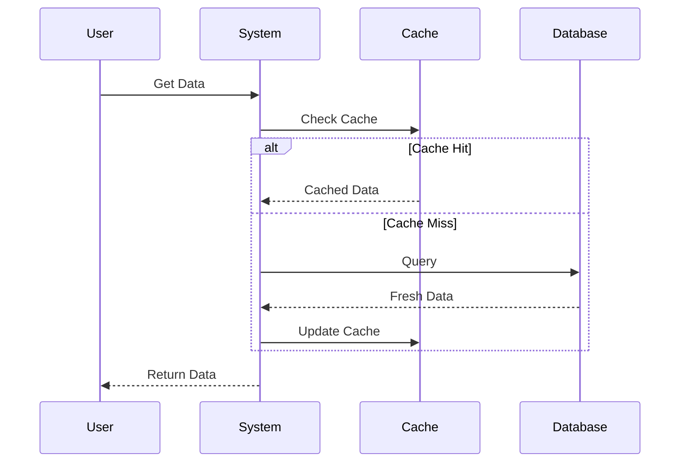

## Usage Tips

**When to use this template:**

- User asks "what happens when I do X?"
- Explaining API call flows
- Documenting user workflows
- Showing multi-step processes

**What to emphasize:**

- Actor/participant roles
- Order of operations (critical for sequences)
- Request and response data
- Error handling (alternative paths)
- Asynchronous operations (fire-and-forget)

**What to avoid:**

- Too many participants (>5-6 becomes cluttered)
- Every internal function call (keep high-level)
- Missing return arrows (always show responses)
- Unclear labels (be specific about actions)

## Real-World Example: OAuth2 Authorization Code Flow

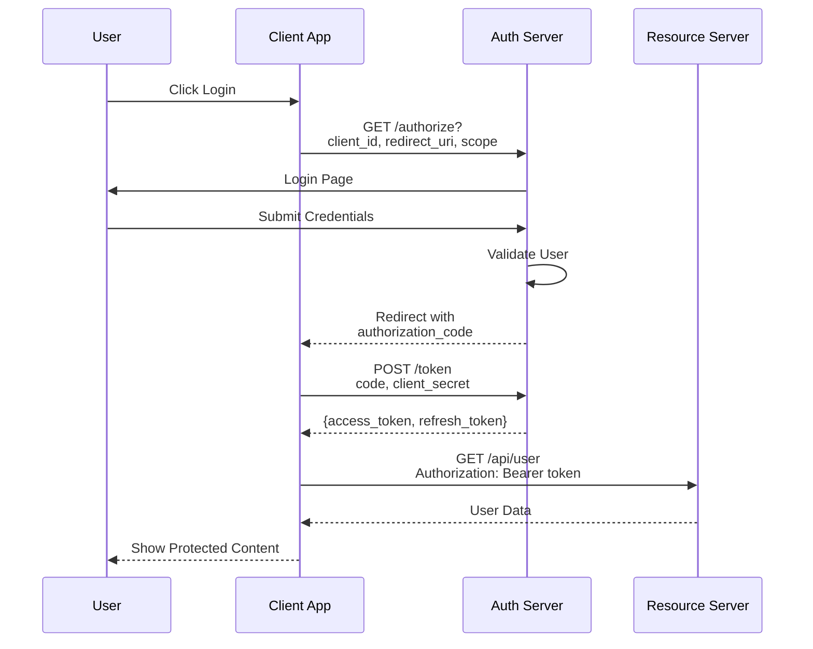

**Caption:** OAuth2 authorization code flow showing how a client app obtains user authorization. User logs in via auth server, which redirects back with authorization code. Client exchanges code for access token, then uses token to access protected resources. This flow ensures client never sees user credentials.

## Related Templates

- **HOOK_SYSTEM_FLOW.md** - For showing how hooks integrate with sequences
- **DATA_FLOW.md** - For showing data transformations (less actor-focused)
- **COMPONENT_RELATIONSHIPS.md** - For showing static relationships (not sequential)

## Anti-Patterns

**Missing Responses:**

```
Client->>Server: Request
Server->>Database: Query
Database->>Server: Data
Server->>Client: Response
```

(Use `-->>` for responses, not `->>`)

**Better:**

```
Client->>Server: Request
Server->>Database: Query
Database-->>Server: Data
Server-->>Client: Response
```

**Too Generic:**

```
A->>B: Do Something
B-->>A: Result
```

(What is being done? Be specific)

**Better:**

```
Client->>API: POST /orders {items, address}
API-->>Client: 201 Created {order_id}
```

**Too Detailed:**

```
Client->>Server: Request
Server->>Parser: Parse JSON
Parser->>Validator: Validate
Validator->>Controller: Route
Controller->>Service: Process
Service->>Repository: Query
Repository->>Database: SQL
Database->>Repository: Rows
Repository->>Service: Entities
Service->>Controller: Result
Controller->>Serializer: Format
Serializer->>Server: JSON
Server->>Client: Response
```

(Too many internal steps - group into logical phases)

**Better:**

```
Client->>Server: Request
Server->>Server: Validate & Route
Server->>Database: Query
Database-->>Server: Data
Server-->>Client: Response
```

## Advanced Example: Distributed Transaction (Saga Pattern)

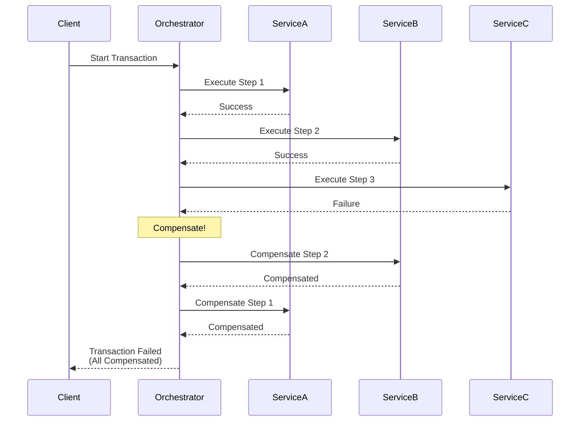

**Caption:** Saga pattern for distributed transactions. Orchestrator coordinates steps across services. When ServiceC fails, orchestrator executes compensating transactions in reverse order to rollback changes in ServiceB and ServiceA, ensuring consistency without distributed locks.

## Timing and Performance

For showing performance-critical sequences with timing:

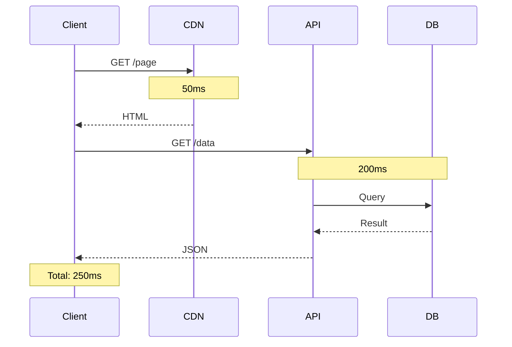

**Caption:** Request timing breakdown showing CDN serving static content in 50ms, while API + DB query takes 200ms for dynamic data. Total page load time is 250ms.

## Complex Example: E-commerce Checkout Flow

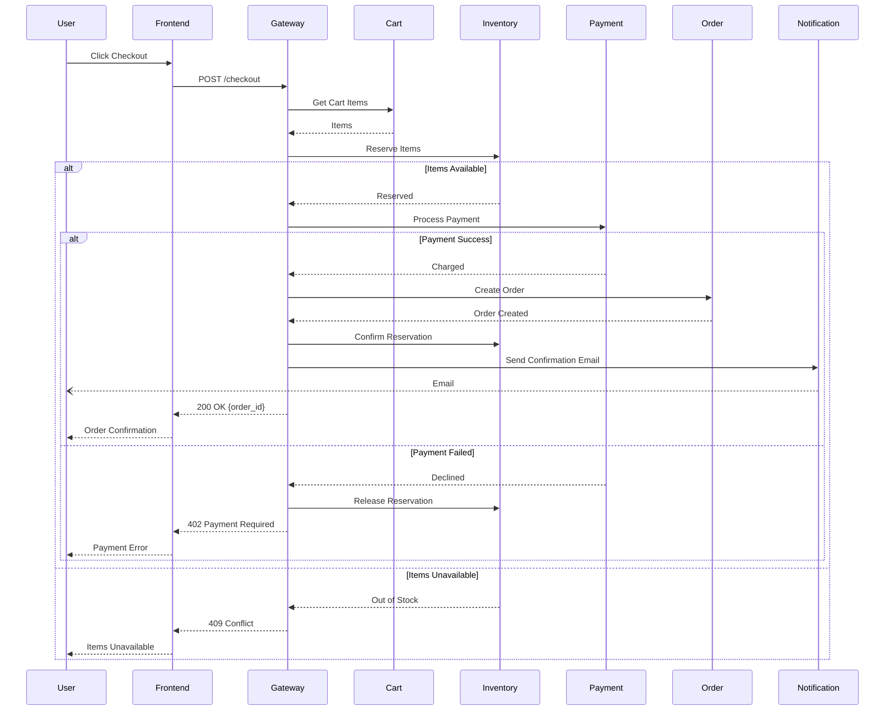

**Caption:** E-commerce checkout flow showing cart validation, inventory reservation, payment processing, and order creation. Includes error handling for out-of-stock items and payment failures, with compensation logic to release inventory reservations on failure.
