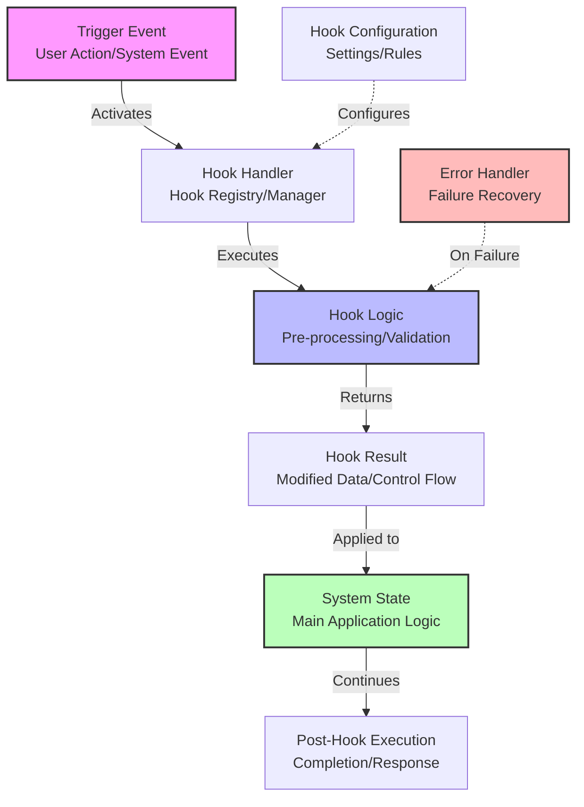
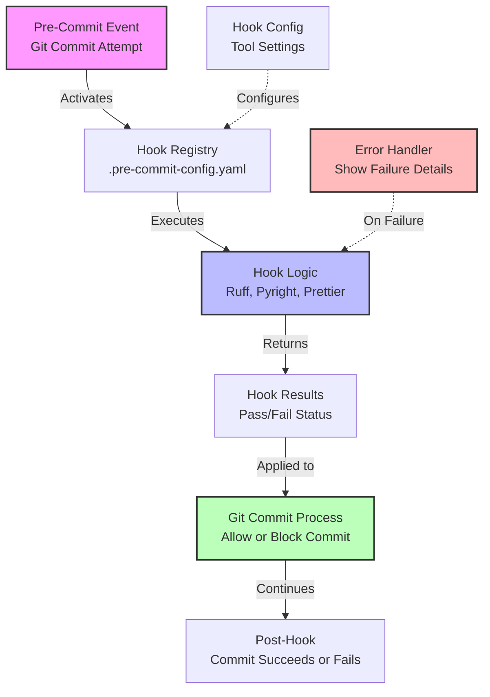
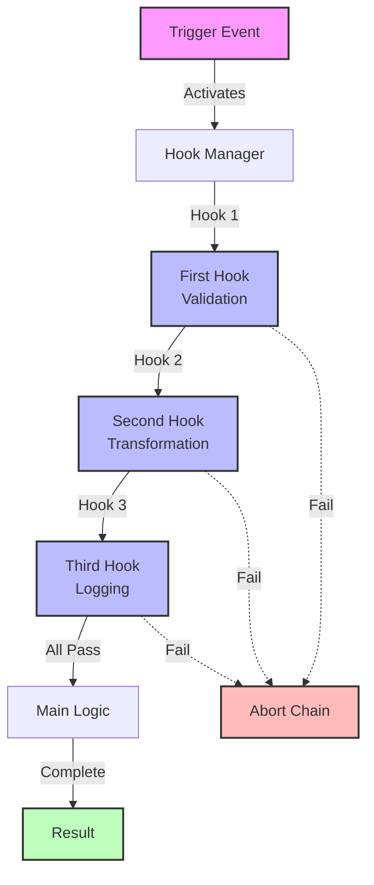
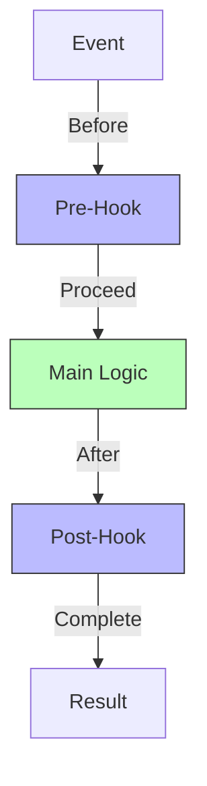
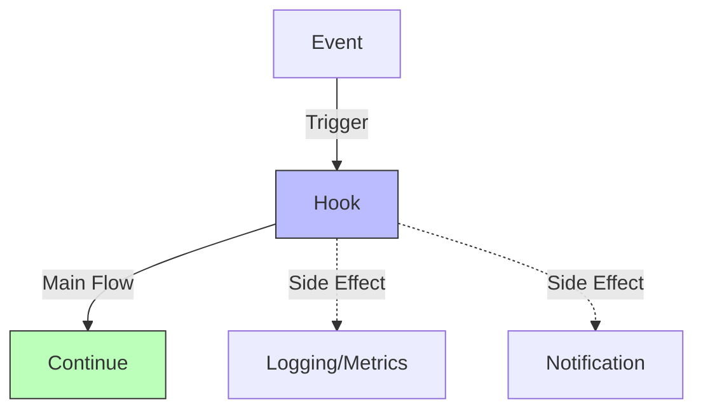
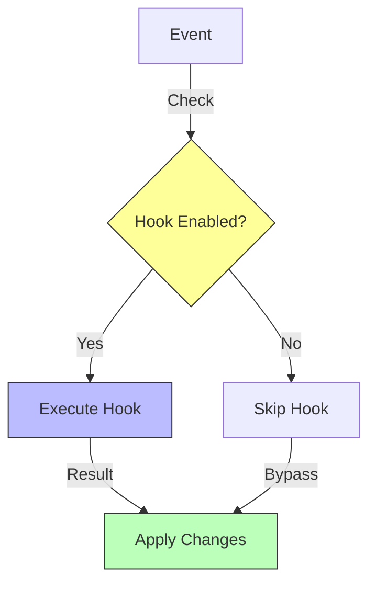
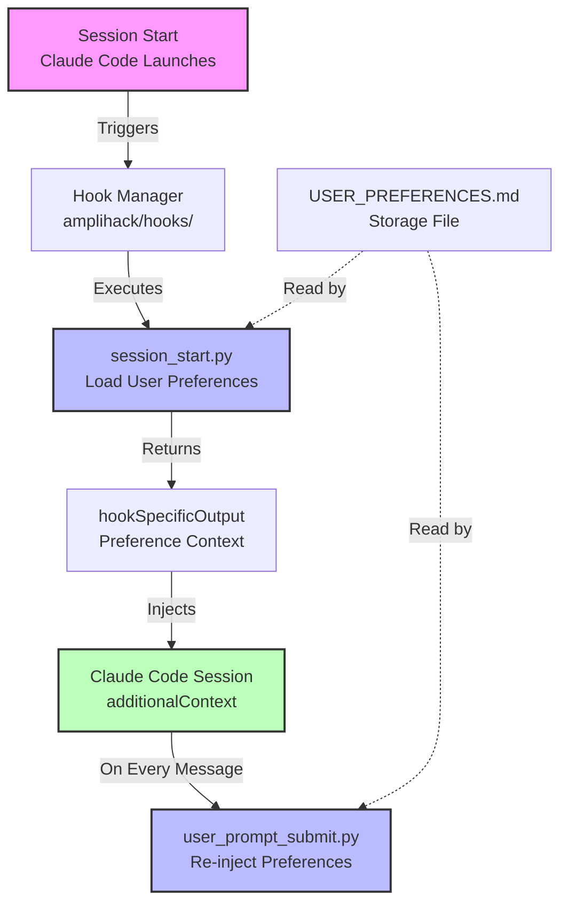

# Hook System Flow Template

## When to Use This Template

Use this template when investigating or explaining:

- Hook systems (pre-commit, post-process, lifecycle hooks)
- Middleware architectures (Express, Django middleware)
- Event handlers and interceptors
- Plugin systems with callback chains
- Request/response interceptors

**Trigger Conditions:**

- System intercepts and modifies behavior
- Code runs "before" or "after" main logic
- Multiple hooks can be chained together
- Hooks have specific trigger events

**Examples:**

- Pre-commit hooks in git workflows
- HTTP middleware in web frameworks
- Session lifecycle hooks in Claude Code
- Event listeners in JavaScript
- Filter chains in Java servlets

## Template Diagram



## Customization Guide

Replace these placeholders with your specific system components:

1. **Trigger Event** → Your actual trigger (e.g., "Pre-Commit Event", "HTTP Request Received")
2. **Hook Handler** → Your hook registry/manager (e.g., "PreCommitHookManager", "MiddlewareChain")
3. **Hook Logic** → Your hook implementation (e.g., "LintingHook", "AuthenticationMiddleware")
4. **Hook Result** → What hook produces (e.g., "Pass/Fail Status", "Modified Request Object")
5. **System State** → Where result is applied (e.g., "Git Commit Process", "Route Handler")
6. **Post-Hook Execution** → What happens after (e.g., "Commit Completes", "Response Sent")

**Optional Components:**

- **Hook Configuration** → If hooks are configurable (dotted line)
- **Error Handler** → If hook failures are handled specially (dotted line)

### Example: Pre-Commit Hook System



## Multi-Hook Chain Variation

For systems with multiple hooks in sequence:



## Quality Checklist

Before using this diagram, verify:

- [ ] **Trigger is clear** - What event activates the hook?
- [ ] **Hook logic is described** - What does the hook actually do?
- [ ] **Result is explicit** - What does the hook produce/return?
- [ ] **Application is shown** - Where does the result go?
- [ ] **Error handling visible** - What happens on hook failure?
- [ ] **Configuration shown** (if applicable) - How are hooks configured?
- [ ] **Labels are specific** - Use actual component names, not generic terms
- [ ] **Flow is logical** - Follows actual execution order

## Common Variations

### Variation 1: Before/After Hooks



### Variation 2: Hook with Side Effects



### Variation 3: Conditional Hook Execution



## Usage Tips

**When to use this template:**

- User asks "how do hooks work?"
- Explaining middleware architecture
- Documenting plugin systems
- Showing event-driven behavior

**What to emphasize:**

- Clear trigger event (what starts the flow)
- Hook execution order (if multiple hooks)
- Error handling (what breaks the chain)
- Configuration points (how hooks are set up)

**What to avoid:**

- Showing internal hook implementation details (keep high-level)
- Too many hooks in one diagram (group similar hooks)
- Unclear failure paths (always show error handling)

## Real-World Example: Claude Code Session Hooks



**Caption:** This diagram shows how Claude Code uses session lifecycle hooks to load and enforce user preferences. The SessionStart hook loads preferences once, and UserPromptSubmit re-injects them on every message for consistent enforcement.

## Related Templates

- **PREFERENCE_SYSTEM.md** - For configuration/settings systems (often used with hooks)
- **EXECUTION_SEQUENCE.md** - For detailed step-by-step flows (more granular than hooks)
- **COMPONENT_RELATIONSHIPS.md** - For showing how hook system integrates with larger architecture

## Anti-Patterns

**Too Generic:**

```
Event → Hook → Result
```

(Not helpful - no context about what hook does)

**Too Detailed:**

```
Event → Parse → Validate → Transform → Filter → Log → Cache → Store → Apply → Cleanup
```

(Too many steps - break into sub-diagrams or simplify)

**Unclear Failure:**

```
Event → Hook → Result
```

(No error handling shown - user doesn't know what happens on failure)

**Better:**

```
Event → Hook → Result
Hook -.->|On Failure| Error Handler
```
