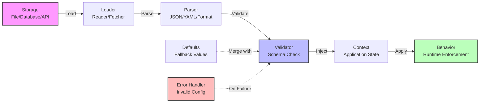
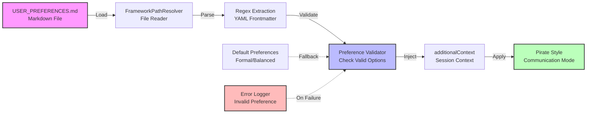
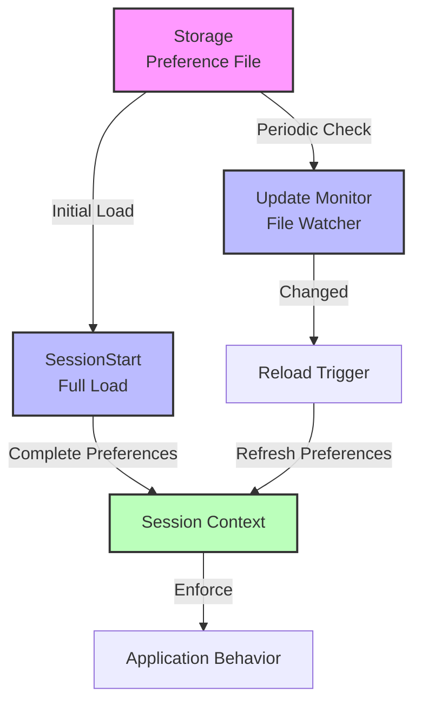
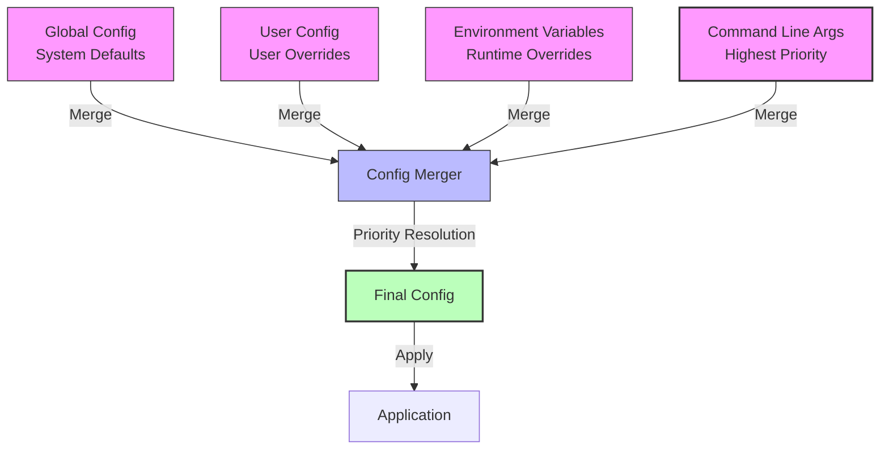
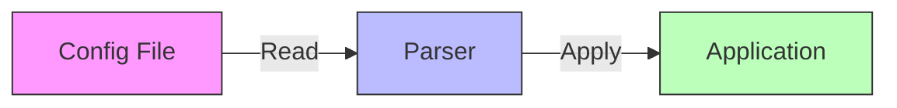
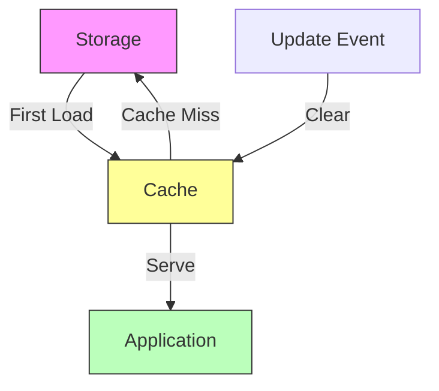
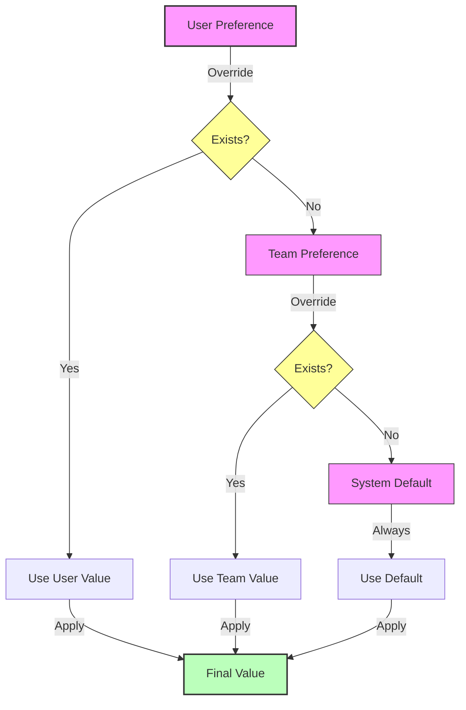
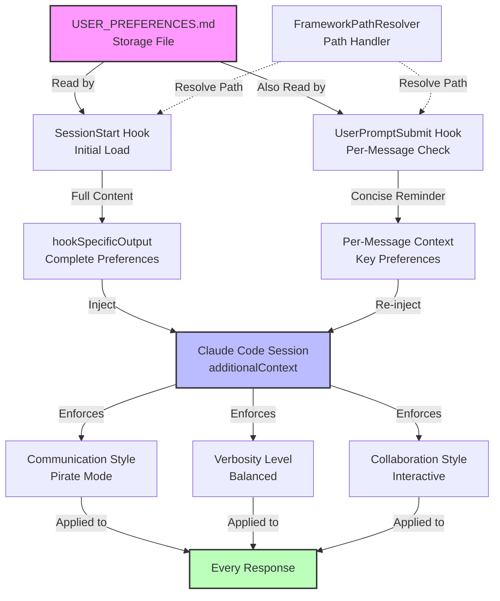
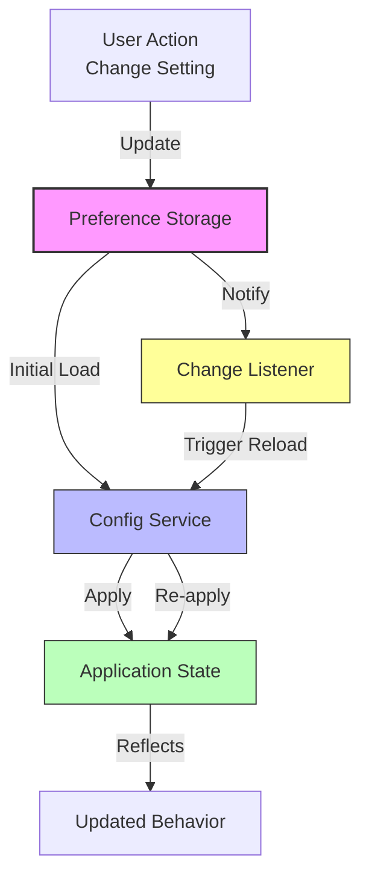
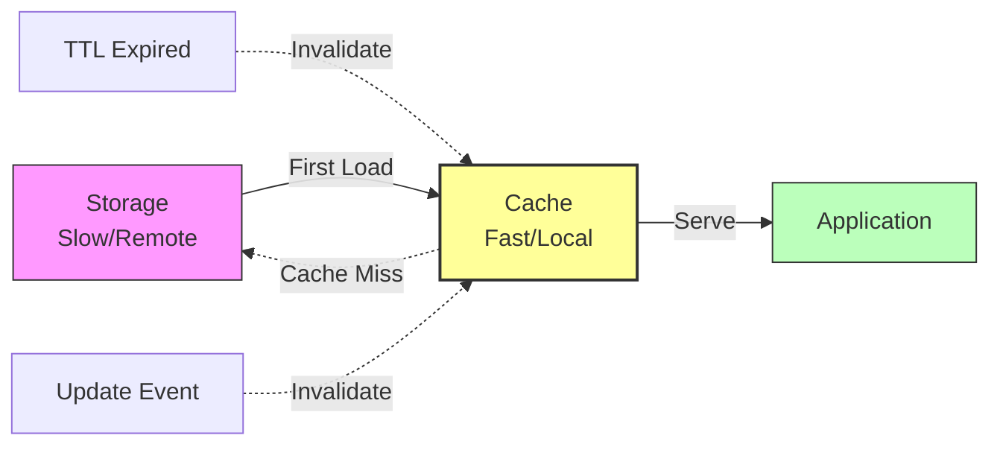

# Preference System Template

## When to Use This Template

Use this template when investigating or explaining:

- User preference systems
- Configuration management
- Settings storage and loading
- Profile management
- Environment variables and config files
- Feature flags and toggles

**Trigger Conditions:**

- System loads and applies user/system settings
- Configuration flows from storage to application
- Settings are validated and enforced
- Preferences persist across sessions

**Examples:**

- User preferences in applications
- Application configuration files (.env, config.yaml)
- Browser settings and cookies
- IDE preferences and workspaces
- Feature flag systems
- Environment-specific configurations

## Template Diagram



## Customization Guide

Replace these placeholders with your specific system components:

1. **Storage** → Your storage mechanism (e.g., "USER_PREFERENCES.md", "PostgreSQL", "localStorage")
2. **Loader** → Your loading logic (e.g., "FileReader", "ConfigService", "APIClient")
3. **Parser** → Your parsing logic (e.g., "MarkdownParser", "JSONParser", "YAMLParser")
4. **Validator** → Your validation logic (e.g., "SchemaValidator", "TypeChecker", "RulesEngine")
5. **Context** → Where preferences live (e.g., "SessionContext", "ApplicationState", "UserSession")
6. **Behavior** → How preferences are applied (e.g., "CommunicationStyle", "Theme", "FeatureFlags")

**Optional Components:**

- **Defaults** → If system provides fallback values (dotted line)
- **Error Handler** → If validation failures are handled (dotted line)

### Example: Claude Code User Preferences



## Two-Layer Preference System Variation

For systems with multiple loading stages (initial load + updates):



## Multi-Source Configuration Variation

For systems that merge preferences from multiple sources:



**Priority Order:** Command Line > Environment > User > Global

## Quality Checklist

Before using this diagram, verify:

- [ ] **Storage is clear** - Where are preferences stored?
- [ ] **Loading mechanism shown** - How are preferences read?
- [ ] **Parsing is described** - What format are preferences in?
- [ ] **Validation is explicit** - How are invalid preferences handled?
- [ ] **Application is shown** - Where/how are preferences used?
- [ ] **Defaults shown** (if applicable) - What happens if no preferences exist?
- [ ] **Error handling visible** - What happens with invalid config?
- [ ] **Labels are specific** - Use actual component names

## Common Variations

### Variation 1: Simple Load and Apply



### Variation 2: Cached Preferences



### Variation 3: Preference Hierarchy



## Usage Tips

**When to use this template:**

- User asks "how are preferences loaded?"
- Explaining configuration systems
- Documenting settings architecture
- Showing preference precedence/hierarchy

**What to emphasize:**

- Storage location (where preferences live)
- Loading order (if multi-source)
- Validation rules (what's allowed)
- Default behavior (fallback values)
- Application points (where preferences take effect)

**What to avoid:**

- Internal parsing implementation (keep high-level)
- Every possible configuration option (show pattern, not exhaustive list)
- File format details (unless critical to understanding)

## Real-World Example: Two-Layer User Preference Enforcement



**Caption:** This diagram shows Claude Code's two-layer preference enforcement. Layer 1 (SessionStart) loads full preferences once at initialization. Layer 2 (UserPromptSubmit) re-injects concise reminders on every message. Both layers read from the same USER_PREFERENCES.md file and inject into Claude's session context, where preferences enforce behavior like pirate communication style.

## Related Templates

- **HOOK_SYSTEM_FLOW.md** - For showing how preferences integrate with hooks
- **DATA_FLOW.md** - For showing preference data transformations
- **COMPONENT_RELATIONSHIPS.md** - For showing preference system within larger architecture

## Anti-Patterns

**Too Simple:**

```
File → App
```

(Not helpful - no context about loading, parsing, validation)

**Too Detailed:**

```
File → Open → Read → Close → Parse Line 1 → Parse Line 2 → Validate Field 1 → Validate Field 2 → Store → Apply
```

(Too granular - combine related steps)

**Unclear Precedence:**

```
Source A → Merge
Source B → Merge
Merge → App
```

(Which source has priority? Add labels or ordering)

**Better:**

```
Source A (Low Priority) → Merge
Source B (High Priority) → Merge
Merge → Final Config → App
```

## Advanced Pattern: Dynamic Preference Updates

For systems where preferences can change during runtime:



**Use Case:** Live preference updates without restart (theme switching, language changes)

## Caching and Performance Optimization

For systems with expensive preference loading:



**Use Case:** Remote config services, database-backed preferences, API-fetched settings
