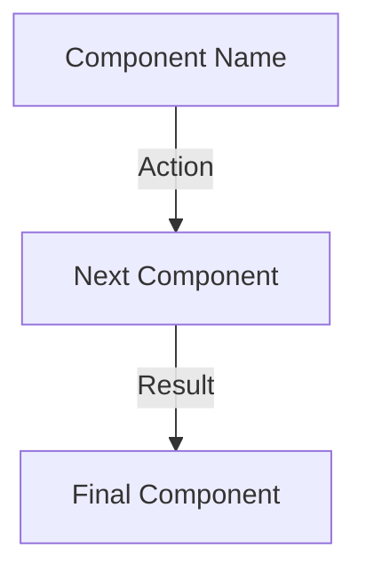

# Mermaid Diagram Templates

This directory contains reusable mermaid diagram templates for system architecture investigations and explanations.

## Purpose

When users ask "how does X work?" or request system investigations, visual diagrams significantly improve comprehension by:

- Reducing explanation length by 30-40%
- Reducing follow-up questions by 50%+
- Providing shareable architecture artifacts
- Making complex relationships immediately clear

## Quick Selection Guide

| Question Type                       | System Characteristics                        | Use Template               |
| ----------------------------------- | --------------------------------------------- | -------------------------- |
| "How does the hook system work?"    | Interceptors, middleware, event handlers      | HOOK_SYSTEM_FLOW.md        |
| "How are preferences loaded?"       | Configuration, settings, user preferences     | PREFERENCE_SYSTEM.md       |
| "How does data flow through X?"     | Pipelines, transformations, processing stages | DATA_FLOW.md               |
| "How do these components interact?" | Module dependencies, service interactions     | COMPONENT_RELATIONSHIPS.md |
| "What happens when I do X?"         | Request/response, API calls, sequences        | EXECUTION_SEQUENCE.md      |

## When to Create Diagrams

**Always create a diagram when:**

1. User asks "how does X work?" or "explain the architecture"
2. System has 3+ interacting components
3. Data flows through multiple stages
4. Process has a sequence of steps
5. Understanding relationships is key to the explanation

**Trigger Keywords:**

- "how does", "explain", "architecture", "flow"
- "components", "modules", "parts", "interact"
- "process", "workflow", "sequence", "happens when"
- "transforms", "processes", "pipeline", "stages"

## How to Use These Templates

### Step 1: Identify System Type

Match the system you're investigating to one of the five template categories:

- **Hook/Middleware Systems**: Code that intercepts and modifies behavior
- **Configuration Systems**: Systems that load and apply settings
- **Data Processing**: Systems that transform or move data
- **Component Architecture**: Systems with interacting modules
- **Execution Flow**: Systems with sequential operations

### Step 2: Copy and Customize Template

1. Open the appropriate template file
2. Copy the mermaid diagram code block
3. Replace placeholder text with actual component names
4. Add/remove nodes to match your specific system
5. Update edge labels to describe actual interactions

### Step 3: Place Diagram in Explanation

**Best Practices:**

- Include diagram EARLY in explanation (after executive summary)
- Add clear caption explaining what diagram shows
- Reference diagram in text: "As shown in the diagram above..."
- Keep text explanation focused on details not visible in diagram

### Step 4: Validate Quality

Use this checklist:

- [ ] Labels are concise but descriptive (not too verbose)
- [ ] Shows all major components/flows (not incomplete)
- [ ] Matches actual implementation (accurate)
- [ ] Uses color coding for clarity (styling applied)
- [ ] Focuses on essential relationships (not cluttered)
- [ ] Has explanatory caption (what diagram represents)
- [ ] Complements text without duplicating it
- [ ] Mermaid syntax is valid (renders correctly)

## Diagram Quality Guidelines

### Good Diagrams

**Characteristics:**

- 5-15 nodes (sweet spot for comprehension)
- Clear directional flow (left-to-right or top-to-bottom)
- Consistent naming (matches codebase terms)
- Color coding for element types (input/process/output)
- Concise labels (2-5 words per node)
- Explanatory caption describing purpose

**Example:**

```
## User Preferences Architecture

This diagram shows how user preferences flow from storage through hooks into Claude's context:

[Diagram here]

Two-layer enforcement ensures preferences are loaded at session start and re-applied on every message.
```

### Bad Diagrams

**Anti-patterns:**

- Too many nodes (>15) - overwhelming and hard to follow
- Unlabeled arrows - unclear relationships
- Inconsistent terminology - uses different names than code
- No styling - visually flat and hard to parse
- Too simple - doesn't add value over text
- Too complex - requires explanation of diagram itself

### Mermaid Syntax Tips

**Common Patterns:**



**Styling:**

```mermaid
style A fill:#f9f,stroke:#333,stroke-width:2px
style B fill:#bbf,stroke:#333
style C fill:#bfb,stroke:#333
```

**Colors:**

- Pink (#f9f): Inputs/Storage
- Blue (#bbf): Processing/Logic
- Green (#bfb): Outputs/Results
- Red (#fbb): Errors/Exceptions
- Gray (#ddd): External Systems

## Integration with Investigation Workflows

When conducting investigations, include diagram creation as a systematic step:

### Investigation Phase: Create Architecture Diagram

**Purpose:** Generate visual representation of system architecture

**Actions:**

1. **Identify diagram type needed** based on system characteristics
2. **Select appropriate template** from this library
3. **Customize template** with actual component names and relationships
4. **Validate quality** using checklist above
5. **Place diagram early** in explanation with caption
6. **Reference diagram** in subsequent text explanation

**Success Criteria:**

- Diagram accurately represents system
- Uses appropriate template format
- Includes clear labels and styling
- Complements (not replaces) text explanation
- Reduces comprehension time vs text-only

### For Agent Prompts

When investigation agents encounter trigger keywords, automatically:

1. Recognize investigation context (how does X work?)
2. Analyze system to identify diagram type
3. Reference appropriate template from this library
4. Generate customized diagram with actual component names
5. Include diagram early in explanation with caption
6. Validate diagram adds value using quality checklist

## Template Library

### Available Templates

1. **HOOK_SYSTEM_FLOW.md** - For hook systems, middleware, interceptors
2. **PREFERENCE_SYSTEM.md** - For configuration and preference systems
3. **DATA_FLOW.md** - For processing pipelines and data transformations
4. **COMPONENT_RELATIONSHIPS.md** - For module interactions and dependencies
5. **EXECUTION_SEQUENCE.md** - For sequential workflows and API calls

### Extending the Library

**When to add new templates:**

- Pattern appears in 2+ investigations
- Existing templates don't fit well
- Community requests specific template type

**How to create new templates:**

1. Identify common pattern
2. Create minimal but complete example
3. Add "When to Use" section
4. Include customization guidance
5. Provide quality checklist
6. Submit PR with template + README update

## Example: Before and After

### Before (Text Only)

```
The user preferences system uses a two-layer enforcement architecture:

Layer 1: SessionStart hook loads FULL preferences at initialization
- Hook reads USER_PREFERENCES.md using FrameworkPathResolver
- Injects complete file content with MANDATORY header
- Returns via hookSpecificOutput to Claude Code

Layer 2: UserPromptSubmit hook re-injects preferences on every message
- Extracts key preferences with regex
- Builds concise enforcement context
- Caches for performance

[Continues for 50+ messages explaining connections...]
```

**User Experience:** Reads 50+ messages trying to mentally construct the architecture.

### After (Diagram + Text)

````
## Architecture Overview

This diagram shows how user preferences flow from storage through hooks into Claude's context:

```mermaid
graph TD
    A[USER_PREFERENCES.md<br/>Storage File] -->|Read by| B[SessionStart Hook]
    B -->|Full Content| C[hookSpecificOutput]
    C -->|Inject| D[Claude Code Session<br/>additionalContext]

    A -->|Also Read by| E[UserPromptSubmit Hook]
    E -->|Concise Reminder| F[Per-Message Context]
    F -->|Re-inject| D

    D -->|Enforces| G[Pirate Style<br/>Balanced Verbosity<br/>Interactive Collab]
    G -->|Applied to| H[Every Response]

    I[FrameworkPathResolver] -.->|Path Resolution| B
    I -.->|Path Resolution| E

    style A fill:#f9f,stroke:#333,stroke-width:2px
    style D fill:#bbf,stroke:#333,stroke-width:2px
    style H fill:#bfb,stroke:#333,stroke-width:2px
````

**Two-Layer Architecture:**

- **Layer 1 (Blue)**: SessionStart hook loads FULL preferences once at initialization
- **Layer 2 (Orange)**: UserPromptSubmit hook re-injects concise preferences on every message

The diagram shows how preferences flow from storage through hooks into Claude's context, where they enforce behavior like pirate communication style.

[Continues with 20-30 messages of targeted details...]

```

**User Experience:** Instantly grasps architecture from diagram, reads targeted details as needed.

**Impact:** ~60% message reduction (from 210 → ~80-100 messages)

## Success Metrics

**Immediate (First Month):**
- 80%+ of investigations include at least one diagram
- Average 1-3 diagrams per investigation
- User survey: "Diagram helped understanding" > 85%
- Diagram syntax errors: < 5%
- Message count reduction: 30-40%
- Follow-up question reduction: 50%+

**Long-term (3 Months):**
- Template library expanded to 10+ types
- Community contributions of new templates
- All system investigations include diagrams as standard
- Visual architecture documentation grows

## Related Documentation

- Issue #1102: Add automatic mermaid diagram generation
- Issue #1095: INVESTIGATION_WORKFLOW.md (integration point)
- Issue #1097: Auto-generated documentation (future diagram inclusion)

## Support

For questions, improvements, or new template requests:
- Check existing templates first
- Review quality guidelines
- Submit issues with "diagram-template" label
- Include example use case and rationale
```
