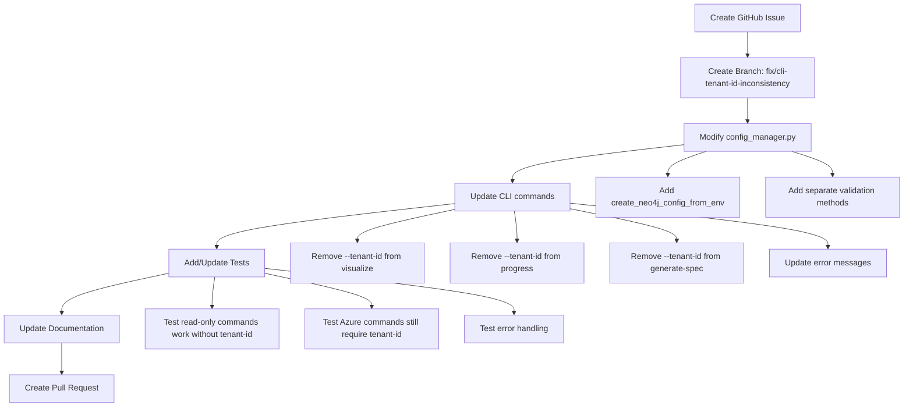

# CLI Inconsistency Fix Plan

## Problem Analysis

### Issue Description
The Azure Tenant Grapher CLI has an inconsistency where:
1. The `--help` command doesn't show `--tenant-id` as an option
2. The `visualize` command requires `--tenant-id` but it should only need Neo4j access
3. When users provide `--tenant-id` at the global level, it fails with "no such option"

### Root Cause
All commands use `create_config_from_env(tenant_id)` which requires tenant_id, but read-only operations like visualization only need Neo4j credentials, not Azure tenant access.

## Solution Overview

### Phase 1: Immediate Fix
1. **Create separate configuration functions**:
   - Keep `create_config_from_env()` for Azure operations requiring tenant_id
   - Add `create_neo4j_config_from_env()` for read-only operations

2. **Update command requirements**:
   - **Remove `--tenant-id` from**: `visualize`, `progress`, `generate-spec`
   - **Keep `--tenant-id` for**: `build`, `test`, `spec`

### Phase 2: Enhanced Architecture
3. **Add intelligent detection**:
   - Check if data exists in Neo4j for commands that could work either way
   - Provide helpful error messages when tenant_id is needed but missing

4. **Improve help documentation**:
   - Update command descriptions to clarify when tenant_id is needed
   - Add examples showing proper usage patterns

## Implementation Plan

## Commands After Fix

| Command | Requires tenant-id | Reason |
|---------|-------------------|---------|
| `build` | ✅ Yes | Needs Azure authentication |
| `test` | ✅ Yes | Uses build internally |
| `spec` | ✅ Yes | Needs tenant context for LLM |
| `visualize` | ❌ No | Reads existing Neo4j data |
| `progress` | ❌ No | Reads existing Neo4j data |
| `generate-spec` | ❌ No | Reads existing Neo4j data |
| `container` | ❌ No | Docker management only |
| `config` | ❌ No | Shows template only |

## Benefits
1. **Fixed user experience**: Commands work as expected
2. **Better separation of concerns**: Read vs. write operations clearly distinguished
3. **Improved help documentation**: Users understand when tenant-id is needed
4. **Backwards compatibility**: Existing build workflows unchanged

## Files to Modify
1. `src/config_manager.py` - Add new configuration functions
2. `scripts/cli.py` - Update command definitions
3. `tests/test_config_manager.py` - Add tests for new functions
4. `tests/test_cli.py` - Add CLI integration tests
5. `README.md` - Update usage examples

## Testing Strategy
1. Unit tests for new configuration functions
2. Integration tests for CLI commands
3. End-to-end tests with real Neo4j data
4. Backwards compatibility tests

## Risk Assessment
- **Low Risk**: Changes are additive and maintain backwards compatibility
- **Rollback Plan**: Can revert to requiring tenant-id for all commands if needed
- **Testing Coverage**: Comprehensive test suite will catch regressions
