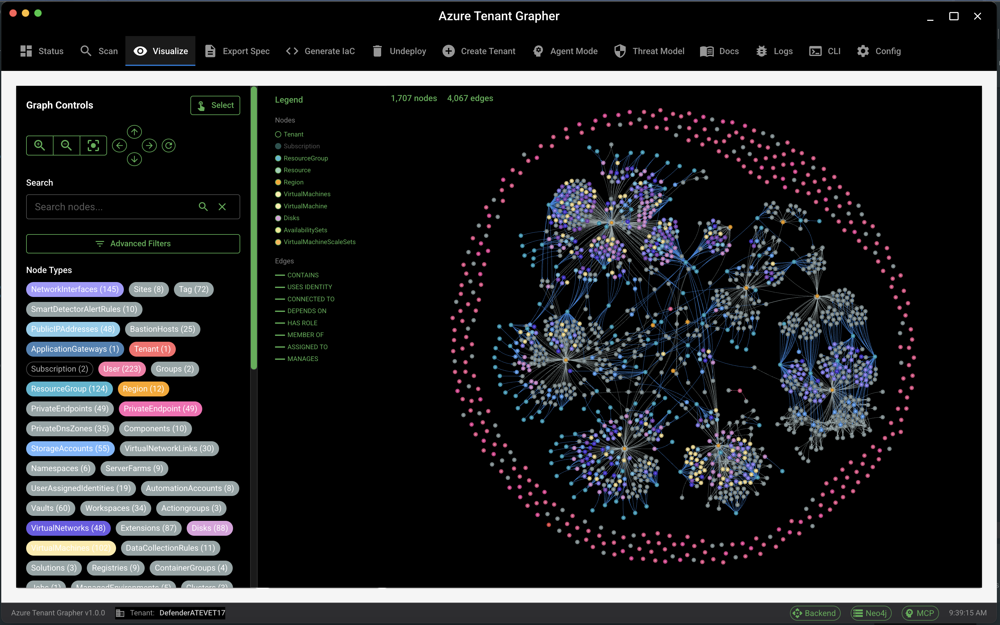

# Azure Tenant Grapher

Azure Tenant Grapher is a Python application that discovers all Azure resources in a tenant, builds a Neo4j graph database, and provides advanced visualization, documentation, and Infrastructure-as-Code (IaC) generation. It features a modular architecture, a Rich CLI dashboard, 3D graph visualization, anonymized tenant specifications, and optional AI-powered resource descriptions.

{ width=50% }
---

## Key Features

- **Exhaustive Azure resource discovery** across all subscriptions
- **Neo4j graph database** with rich schema and relationship modeling
- **Extensible relationship engine**: Modular rules for new node/edge types (Tag, Region, CreatedBy, etc.)
- **Interactive 3D visualization** (HTML export, filtering, search)
- **Rich CLI dashboard** with live progress, logs, and configuration
- **AI-powered documentation** and tenant specification generation
- **Infrastructure-as-Code generation** (Terraform, ARM, Bicep)
- **Automated CLI tool management** and cross-platform support
- **Comprehensive test suite** (unit, integration, end-to-end)
- **Agent Mode (MCP/AutoGen Integration)**: Ask natural language questions about your Azure graph/tenant data
- **Threat Modeling Agent**: Automatically generate Data Flow Diagrams (DFD), enumerate threats, and produce Markdown threat model reports for your Azure tenant.

---

## Agent Mode (MCP/AutoGen Integration)

**Agent mode** enables you to ask natural language questions about your Azure graph/tenant data. The agent automatically chains tool calls (via the MCP server) to answer questions using the Neo4j graph database.

### How it works

- The agent receives a question (from CLI or REPL)
- Calls `get_neo4j_schema` to understand the graph
- Calls `read_neo4j_cypher` to answer the question
- Prints a final answer (e.g., "There are 3 storage resources in the tenant.")
- If no results, prints a diagnostic sample of resource types

### Usage

```bash
# Start agent mode interactively
azure-tenant-grapher agent-mode

# Ask a question non-interactively
azure-tenant-grapher agent-mode --question "How many storage resources are in the tenant?"
```

### Example Output

```
MCP Agent is ready
🤖 Processing question: How many storage resources are in the tenant?
🔄 Step 1: Getting database schema...
✅ Schema retrieved
🔄 Step 2: Querying for storage resources...
✅ Query executed
🔄 Step 3: Processing results...
🎯 Final Answer: There are 3 storage resources in the tenant.

🔎 Diagnostic: Sampling resource types in the database...
Sample resource types: [{"type": "Microsoft.Storage/storageAccounts", "count": 3}, ...]
```

### End-to-End Testing

- See `tests/test_agent_mode_end_to_end.py` for full end-to-end tests that ensure agent mode answers questions completely and correctly.

---

## Threat Modeling Agent

The Threat Modeling Agent enables you to generate a Data Flow Diagram (DFD), enumerate threats, and produce a Markdown threat model report for your Azure tenant. It integrates with the AI-powered resource summaries and supports exporting artifacts for further analysis.

- See the [Threat Modeling Agent Demo](docs/threat_model_agent_demo.md) for a full walkthrough using the demo tenant, including command extracts and links to generated artifacts.

---

## CLI Reference

See `.github/azure-tenant-grapher-prd.md` and `.github/azure-tenant-grapher-spec.md` for full product requirements and project specification, including agent mode and MCP server details.

---

## Quick Start

```bash
# Install dependencies
uv pip install -r requirements.txt

# Start Neo4j (auto-managed by the app, or use docker-compose)
docker-compose up -d

# Activate the virtual environment
source .venv/bin/activate

# Copy and edit .env for your Azure tenant ID, openai configuration
cp .env.example .env

# Authenticate with Azure
az login --tenant <your-tenant-id>
```

### 2. Build Your Graph of the Azure Tenant

```bash
# Build the graph with the interactive dashboard
azure-tenant-grapher build --tenant-id <your-tenant-id>
```

### 3. Explore, Visualize, and Generate IaC

```bash
# Visualize your Azure graph in 3D
azure-tenant-grapher visualize

# Generate Bicep IaC for a subset of resources
# exclude the `--subset-filter` option to generate for the entire tenant
azure-tenant-grapher generate-iac \
  --format bicep \
  --subset-filter "types=Microsoft.Storage/*" \
  --rules-file ./config/replica-rules.yaml \
  --dest-rg "replica-rg" \
  --location "East US" \
  --output ./my-deployment

# Deploy the generated Bicep
cd my-deployment
./deploy.sh
```

---

## 📖 Table of Contents

- [Features](#features)
- [Installation](#installation)
- [Usage](#usage)
- [Graph Enrichment & Refactor Plan](GRAPH_ENRICHMENT_PLAN.md)
- [IaC Subset & Rules System](#iac-subset--rules-system)
- [Architecture](#architecture)
- [Development & Testing](#development--testing)
- [Troubleshooting](#troubleshooting)

---

## Features

- **Comprehensive Azure Discovery**: Enumerate all resources and relationships across all subscriptions in your tenant.
- **Neo4j Graph Database**: Build a rich, queryable graph of your Azure environment.
- **Interactive 3D Visualization**: Explore your environment visually with filtering, search, and node details.
- **IaC Generation**: Generate Bicep, ARM, or Terraform templates for your entire tenant or filtered subsets.
- **Transformation Rules**: Apply name, region, and tag transformations to resources via a YAML rules file.
- **Automated Deployment**: Generated IaC includes a ready-to-run deployment script.
- **AI Integration**: Optional AI-powered resource descriptions.
- **Modular, Testable Codebase**: Well-structured, with comprehensive test coverage.
- **Database Backup**: Easily back up your Neo4j graph database to a local file for disaster recovery or migration.

---

## Installation

### Prerequisites

- Python 3.8+
- [uv](https://docs.astral.sh/uv/) (recommended for dependency management)
- Docker & Docker Compose (for Neo4j)
- Azure CLI & Bicep CLI (for authentication and IaC deployment)

### Install Steps

```bash
uv sync
source .venv/bin/activate
cp .env.example .env
az login
```

---

## Usage

### CLI Commands

```bash
# Build the Azure graph
azure-tenant-grapher build --tenant-id <your-tenant-id>

# Start agent mode
azure-tenant-grapher agent-mode

# Ask a question non-interactively
azure-tenant-grapher agent-mode --question "How many storage resources are in the tenant?"

# Generate IaC (Bicep, ARM, Terraform)
azure-tenant-grapher generate-iac --help

# Check progress
azure-tenant-grapher progress

# Show configuration
azure-tenant-grapher config

# Backup the Neo4j database
azure-tenant-grapher backup-db ./my-neo4j-backup.dump
```

### Neo4j Database Backup

You can back up your Neo4j database to a local file using:

```bash
azure-tenant-grapher backup-db ./my-neo4j-backup.dump
```

This will create a portable dump file of your Neo4j database, which can be restored using Neo4j tools.

---
- [Threat Modeling Agent Demo](docs/threat_model_agent_demo.md)

## Documentation

- [Product Requirements](.github/azure-tenant-grapher-prd.md)
- [Project Specification](.github/azure-tenant-grapher-spec.md)
- [3D Visualization](docs/design/iac_subset_bicep.md)
- [IaC Generation](docs/design/iac_subset_bicep.md)
- [Testing](tests/)

---

## License

MIT License. See [LICENSE](LICENSE) for details.
