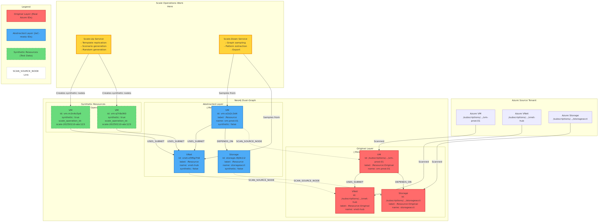
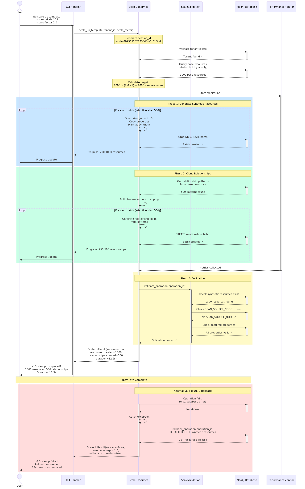
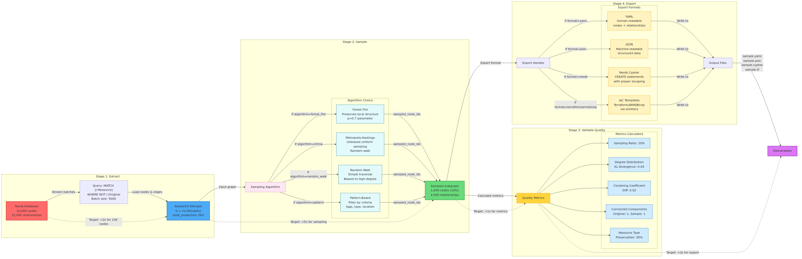
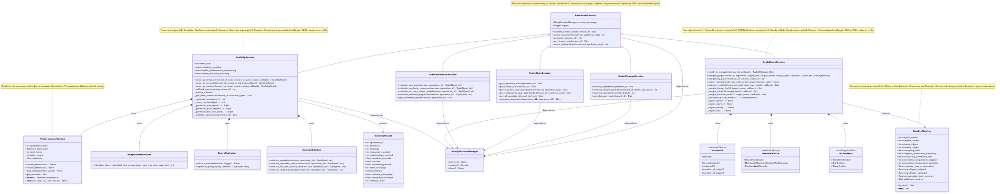

# Scale Operations Architecture Diagrams

Comprehensive visual documentation for Issue #427: Scale Operations feature.

## Overview

This document provides context and use cases for the Scale Operations architecture diagrams. All diagrams are available in both Mermaid source (`.mmd`) and high-resolution PNG (1920x1080) formats.

---

## Diagram Set

### 1. Dual-Graph Architecture



**What it shows:**
- How Azure resources are stored in two parallel graphs (Original and Abstracted)
- The `SCAN_SOURCE_NODE` relationship linking the layers
- Where synthetic resources (from scale operations) fit in the architecture
- Why scale operations work ONLY on the abstracted layer

**Key Insight:**
Scale operations generate synthetic test data in the abstracted layer without touching the original Azure resource data. This separation ensures:
- Original data integrity is preserved
- Synthetic data is clearly marked and traceable
- No confusion between real and test resources

**When to use this diagram:**
- Explaining the dual-graph architecture to new developers
- Training on why scale operations are safe
- Documenting the separation of concerns
- Presentations on graph database design

---

### 2. Scale-Up Sequence



**What it shows:**
- Complete flow from user command to operation completion
- Step-by-step phases: Validation → Resource Generation → Relationship Cloning → Validation
- Progress callback integration for UI/CLI updates
- Error handling and rollback mechanism
- Happy path and failure path scenarios

**Key Insight:**
Scale-up operations are transactional with automatic rollback on failure. The adaptive batching system processes large operations efficiently (target: 1000 resources in <30 seconds).

**When to use this diagram:**
- Debugging scale-up failures
- Understanding the rollback mechanism
- Training on operation phases
- Documenting error handling patterns
- Performance optimization planning

---

### 3. Scale-Down Pipeline



**What it shows:**
- Four-stage pipeline: Extract → Sample → Validate → Export
- Multiple sampling algorithms (Forest Fire, MHRW, Random Walk, Pattern)
- Quality metrics calculation (KL divergence, clustering coefficient)
- Export format options (YAML, JSON, Neo4j, IaC)
- Performance targets at each stage

**Key Insight:**
Scale-down uses state-of-the-art graph sampling algorithms to create representative subgraphs. Quality metrics ensure the sample preserves structural properties of the original graph.

**When to use this diagram:**
- Choosing the right sampling algorithm
- Understanding quality metrics
- Explaining the sampling process
- Documenting export formats
- Performance benchmarking

---

### 4. Component Architecture



**What it shows:**
- Class hierarchy with BaseScaleService as root
- All service classes and their methods
- Data models (ScaleUpResult, QualityMetrics)
- Dependencies between components
- External library integrations (NetworkX, LittleBallOfFur)
- Performance monitoring components

**Key Insight:**
The modular service architecture enables independent operation of scale-up, scale-down, validation, stats, and cleanup services while sharing common base functionality.

**When to use this diagram:**
- Onboarding new developers
- Planning new features
- Code navigation and understanding
- Architecture reviews
- Dependency analysis

---

## Usage Scenarios

### For Developers

**Understanding the codebase:**
1. Start with **Component Architecture** to see the overall structure
2. Read **Dual-Graph Architecture** to understand data model
3. Dive into **Scale-Up Sequence** or **Scale-Down Pipeline** based on your task

**Implementing new features:**
1. Check **Component Architecture** to see where to add new functionality
2. Review relevant sequence/pipeline diagram to understand flow
3. Ensure integration with **Dual-Graph Architecture** principles

**Debugging issues:**
1. Use **Sequence Diagram** to trace execution path
2. Check **Component Architecture** for service dependencies
3. Verify **Dual-Graph Architecture** assumptions

### For Architects

**System design reviews:**
- **Dual-Graph Architecture** explains the foundational design decision
- **Component Architecture** shows modularity and extensibility
- **Sequence/Pipeline diagrams** demonstrate operational patterns

**Performance optimization:**
- **Scale-Up Sequence** shows batching and adaptive sizing
- **Scale-Down Pipeline** includes performance targets for each stage
- **Component Architecture** identifies monitoring points

**Documentation:**
- All diagrams are PowerPoint-ready (transparent background, high resolution)
- Mermaid source allows easy customization and updates
- Professional appearance suitable for presentations

### For Product Managers

**Feature explanations:**
- **Dual-Graph Architecture** explains "why synthetic data is safe"
- **Scale-Up Sequence** demonstrates "how we generate test data"
- **Scale-Down Pipeline** shows "sampling algorithm options"

**Roadmap planning:**
- **Component Architecture** identifies extension points
- Diagrams reveal feature interdependencies
- Performance targets inform capacity planning

---

## Diagram Integration

### In PowerPoint Presentations

All PNG files have transparent backgrounds and are sized for 16:9 slides (1920x1080).

**Insertion:**
1. Insert → Pictures → Select PNG file
2. Resize to fit slide (maintains aspect ratio)
3. Add annotations or callouts as needed

**Tips:**
- Use diagrams full-screen for detailed presentations
- Zoom into specific sections for focused discussions
- Combine with bullet points for hybrid slides

### In Markdown Documentation

```markdown
# Scale Operations Overview

## Architecture


The dual-graph architecture ensures...

## Operation Flow


The scale-up operation follows these steps...
```

### In GitHub Pages

Place diagrams in `docs/diagrams/` and reference relatively:

```markdown

```

GitHub renders the PNG inline in markdown files.

---

## Performance Targets (from diagrams)

### Scale-Up
- **1000 resources in <30 seconds**
- Adaptive batch sizing (100-1000 per batch)
- Parallel batch inserts for >10K operations
- Validation in <1 second

### Scale-Down
- **10% of 10K nodes in <10 seconds**
- Extract: <2s for 10K nodes (streaming batches)
- Sample: <5s for algorithm execution
- Metrics: <1s for quality calculation
- Export: <2s for all formats

---

## Updating Diagrams

### Quick Update Workflow

1. **Edit source:** `vim docs/diagrams/diagram-name.mmd`
2. **Re-render:** `mmdc -i diagram-name.mmd -o diagram-name.png -w 1920 -H 1080 -b transparent`
3. **Verify:** Open PNG to check quality
4. **Commit:** Both `.mmd` and `.png` files

### Batch Re-render

```bash
cd docs/diagrams
for file in *.mmd; do
  mmdc -i "$file" -o "${file%.mmd}.png" -w 1920 -H 1080 -b transparent
done
```

### Style Consistency

Use these colors across all diagrams:
- **Original layer:** `#ff6b6b` (red)
- **Abstracted layer:** `#4dabf7` (blue)
- **Synthetic resources:** `#69db7c` (green)
- **Services/Operations:** `#ffd43b` (yellow)
- **Performance notes:** `#fce7f3` (pink)

---

## Comparison with Other Tools

### Why Mermaid?

1. **Version Control:** Text-based source lives in git
2. **Maintainability:** Easy to update without specialized tools
3. **Consistency:** Styling is enforced by syntax
4. **Portability:** Renders anywhere (GitHub, docs, presentations)
5. **Collaboration:** Plain text = easy diffs and PRs

### Alternatives Considered

- **Draw.io:** Good for complex diagrams, but binary format
- **PlantUML:** Similar to Mermaid, but less GitHub integration
- **Lucidchart:** Professional but requires subscription
- **Visio:** Windows-only, expensive, binary format

**Decision:** Mermaid provides best balance of features and ease-of-use.

---

## Related Documentation

- [Scale Operations Specification](SCALE_OPERATIONS.md) - Technical details
- [Scale Operations Examples](SCALE_OPERATIONS_E2E_DEMONSTRATION.md) - Usage examples
- [Scale Operations Quality Assessment](SCALE_OPERATIONS.md) - Test results
- [Neo4j Schema Reference](NEO4J_SCHEMA_REFERENCE.md) - Database schema
- [diagrams/README.md](diagrams/README.md) - Diagram-specific documentation

---

## FAQ

**Q: Why are the PNG files so large (100-400 KB)?**

A: High resolution (1920x1080) for clarity in presentations. Diagrams include:
- Anti-aliased text
- Multiple colors and gradients
- Complex layouts with many elements

For web use, consider converting to SVG or using lower resolution.

**Q: Can I edit the diagrams in a visual editor?**

A: Not directly. Mermaid is code-based. However:
- Mermaid Live Editor: https://mermaid.live/ (paste code, see preview)
- VS Code extension: "Markdown Preview Mermaid Support"
- GitHub renders Mermaid natively in markdown

**Q: How do I add a new diagram?**

A:
1. Create `.mmd` file in `docs/diagrams/`
2. Use consistent styling (see diagrams/README.md)
3. Render to PNG: `mmdc -i new-diagram.mmd -o new-diagram.png -w 1920 -H 1080 -b transparent`
4. Add entry to this document and diagrams/README.md
5. Commit both files

**Q: Why transparent background?**

A: Maximum flexibility for insertion into presentations, documents, and websites with different background colors.

**Q: How do I cite these diagrams?**

A:
```
Source: Azure Tenant Grapher Scale Operations Documentation
File: diagrams/dual-graph-architecture.png
Project: https://github.com/your-org/azure-tenant-grapher
License: [Your License]
```

---

## Quality Checklist

Before committing diagram updates:

- [ ] All text is readable at 1920x1080
- [ ] Colors are consistent with style guide
- [ ] Arrows show correct flow direction
- [ ] Labels are clear and concise
- [ ] Legend included (if needed)
- [ ] Transparent background
- [ ] File size <500 KB
- [ ] Mermaid source renders without errors
- [ ] README.md updated
- [ ] This document updated (if concepts changed)

---

*Created: 2025-11-11*
*Last Updated: 2025-11-11*
*Maintained by: Azure Tenant Grapher Team*
