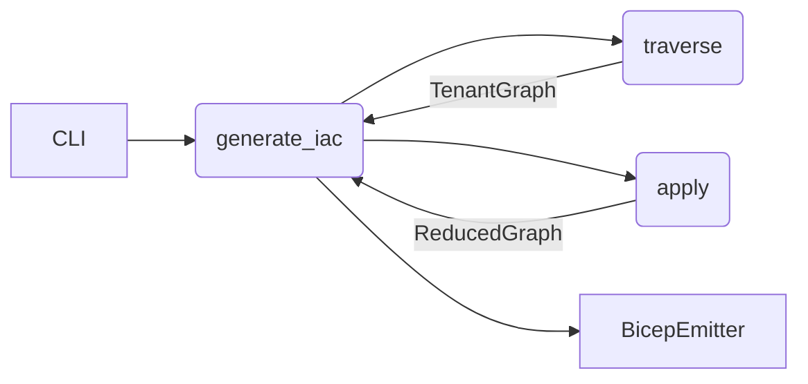

# Design Specification: Sub-Graph Bicep Generation
*(docs/design/iac_subset_bicep.md)*

---

## 1 — Purpose
Provide the capability to generate **Bicep** IaC for an **arbitrary subset** of the tenant graph and deploy those resources into a **new resource group** (RG) specified at generation time, all while preserving inter-resource dependencies. This feature is additive and must not affect current full-graph generation behaviour.

---

## 2 — Current Subsystem Analysis

| Area | Key Types / Functions | Observations |
|------|-----------------------|--------------|
| Traverser | [`src/iac/traverser.py:GraphTraverser`](../../src/iac/traverser.py) – `traverse(filter_cypher=None)` | Accepts one Cypher `WHERE` clause. Returns a `TenantGraph`. No native subset support beyond Cypher. |
| Engine | [`src/iac/engine.py:TransformationEngine`](../../src/iac/engine.py) – `apply(resource_dict)` | Performs graph-to-IaC transformations; unaware of selection logic. |
| Bicep Emitter | [`src/iac/emitters/bicep_emitter.py:BicepEmitter.emit`](../../src/iac/emitters/bicep_emitter.py) | Emits a flat `main.bicep`. No resource-group wrapping or custom scopes. |
| CLI | [`src/iac/cli_handler.py:generate_iac_command_handler`](../../src/iac/cli_handler.py) | Flags: `--format-type`, `--resource-filters`. No subset selection or destination RG arguments. |

---

## 3 — Subset-Selection Mechanism

### 3.1 CLI Surface

```
generate-iac \
  --format bicep \
  --subset-filter "nodeIds=abc,def;types=Microsoft.Storage/*;label=Shared" \
  --dest-rg myNewRG \
  --location westus2
```

Supported predicates (encoded in a `SubsetFilter` dataclass):

| Predicate | Example | Semantics |
|-----------|---------|-----------|
| `nodeIds` | `nodeIds=guid1,guid2` | Explicit inclusion set. |
| `types`   | `types=Microsoft.Sql/*` | Wild-card match on `resourceType`. |
| `label`   | `label=DMZ` | Matches a Neo4j node label. |
| `cypher`  | `cypher=MATCH ...` | Expert escape hatch. |

### 3.2 Processing Flow



* **New helper:** `SubsetSelector` (`src/iac/subset.py`)
  1. Build initial inclusion set from `SubsetFilter`.
  2. Perform graph closure to include all parent scopes and any explicit `dependsOn` ancestors.
  3. Return the trimmed `TenantGraph`.

*Rationale:* Keeps Traverser unchanged; supports non-Cypher predicates; Engine remains the orchestrator.

---

## 4 — Bicep RG Homing Strategy

### 4.1 Chosen Template Structure (Module Pattern)

```
main.bicep                  (targetScope = 'subscription')
 └─ module rgDeploy './modules/rg.bicep' = {
      name: 'subsetModule'
      scope: subscription()
      params: {
        rgName:  rgName
        rgLocation: rgLocation
      }
   }

modules/rg.bicep            (targetScope = 'resourceGroup')
   ├─ resource …            // all subset resources
   └─ ...
```

* **Parameters**
  ```bicep
  param rgName string
  param rgLocation string = 'eastus'
  ```

* Each emitted resource gains
  ```bicep
  scope: resourceGroup()
  ```

* `dependsOn` is recomputed inside the module.

### 4.2 Emitter Refactor Points

| Function | Change |
|----------|--------|
| `BicepEmitter.emit` | Signature extended to accept `rg_name`, `rg_location`. |
| `_emit_subscription_wrapper()` | New helper to write `main.bicep`. |
| `_emit_resource_group_module()` | Emits `modules/rg.bicep` containing trimmed resource set. |

---

## 5 — Engine & CLI Changes

| Component | Change |
|-----------|--------|
| **Engine** | Add kwargs: `subset_filter=None`, `rg_name=None`, `rg_location=None`. After traversal, pipe graph through `SubsetSelector` when a filter is supplied. |
| **CLI** | Add flags `--subset-filter`, `--dest-rg`, `--location`. Validate that `--dest-rg` is supplied if `--subset-filter` is used. |

> Existing flags continue to work unmodified; new flags are additive.

### 5.1 Rules-File Integration

The existing [`--rules-file`](../../src/iac/engine.py) capability can be combined with subset-Bicep generation to provide advanced resource transformation and naming strategies.

#### 5.1.1 Enhanced CLI Usage

```bash
generate-iac \
  --format bicep \
  --subset-filter "types=Microsoft.Storage/*,Microsoft.Compute/*" \
  --dest-rg myReplicaRG \
  --location westus2 \
  --rules-file ./config/replica-rules.yaml
```

#### 5.1.2 Rules File Format

The rules file supports YAML format with transformation rules for resource renaming, region changes, and tagging:

```yaml
rules:
  - resource_type: "Microsoft.Storage/storageAccounts"
    actions:
      rename:
        pattern: "repl-{orig}"
      region:
        target: "westus2"
      tag:
        add:
          environment: "replica"
          source: "tenant-graph"

  - resource_type: "Microsoft.Compute/*"
    actions:
      rename:
        pattern: "repl-{orig}-{index}"
      tag:
        add:
          environment: "replica"
```

#### 5.1.3 Name-Prefix Transformations

Rules files can define name-prefix rewrites using the [`rename.pattern`](../../src/iac/engine.py) action:
- `{orig}` - Original resource name
- `{index}` - Incremental counter (for disambiguation)
- Custom prefixes like `repl-`, `test-`, `dev-` can be applied consistently

This enables creating replica environments with predictable naming conventions while preserving resource relationships.

---

## 6 — Testing Plan

| Layer | Test | Focus |
|-------|------|-------|
| Unit  | `tests/iac/test_subset_selector.py` | Predicate parsing and dependency closure. |
| Golden| `tests/iac/test_bicep_subset.py`   | `main.bicep` & `modules/rg.bicep` diff-against fixtures. |
| CLI   | `tests/iac/test_cli_subset_flag.py`| End-to-end invocation with new flags. |
| CI    | Re-use `az bicep build` step       | Validate all Bicep output compiles. |

---

## 7 — Migration & Backwards Compatibility

* **Default behaviour unchanged** when no new flags are supplied.
* `TransformationEngine.generate_iac` maintains positional arguments; new ones are keyword-only.
* All existing tests remain green; new tests are additive.

---

## 8 — Appendix: Sequence Diagram

```mermaid
sequenceDiagram
    participant U as User (CLI)
    participant C as CLI Handler
    participant T as GraphTraverser
    participant S as SubsetSelector
    participant E as TransformationEngine
    participant B as BicepEmitter

    U->>C: generate-iac --subset-filter ... --dest-rg ...
    C->>T: traverse(filter_cypher)
    T-->>C: TenantGraph
    C->>S: apply(graph, subsetFilter)
    S-->>C: ReducedGraph
    C->>E: transform(ReducedGraph)
    E-->>C: TransformedGraph
    C->>B: emit(…, rgName, rgLocation)
    B-->>C: Artifact paths
    C-->>U: ✅ success
