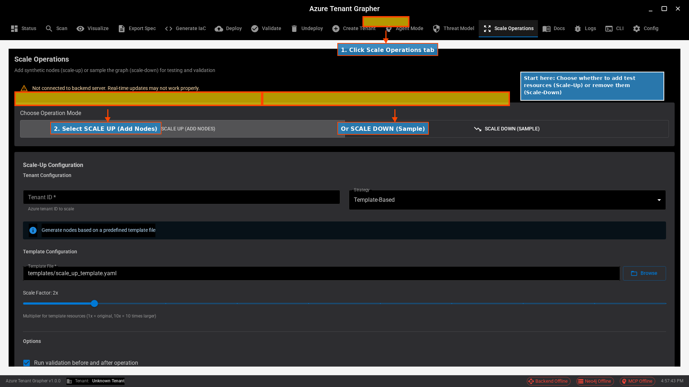
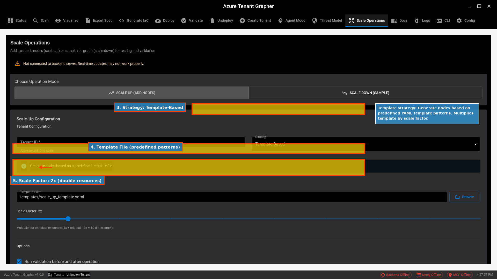
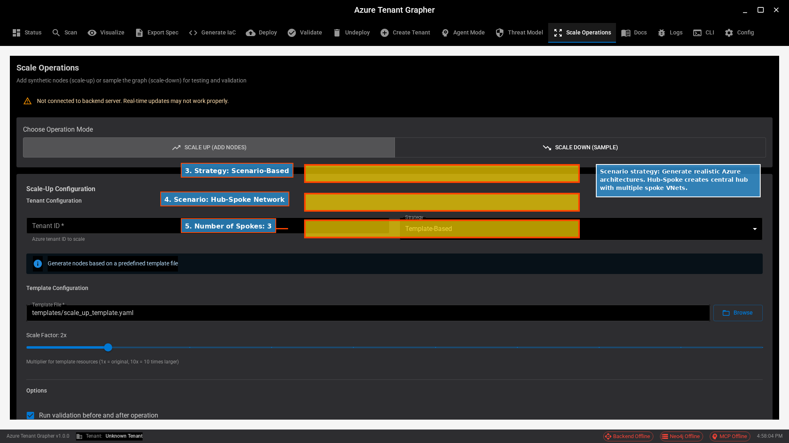
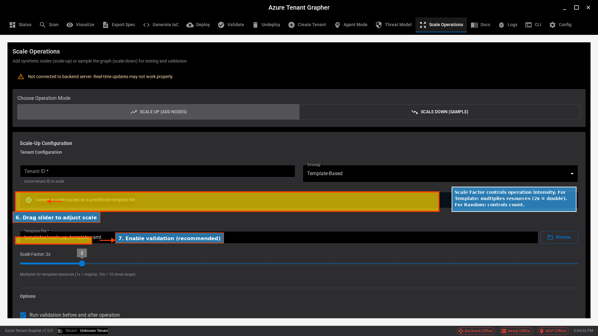
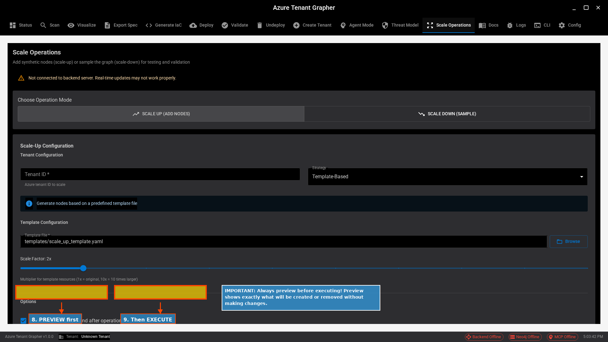
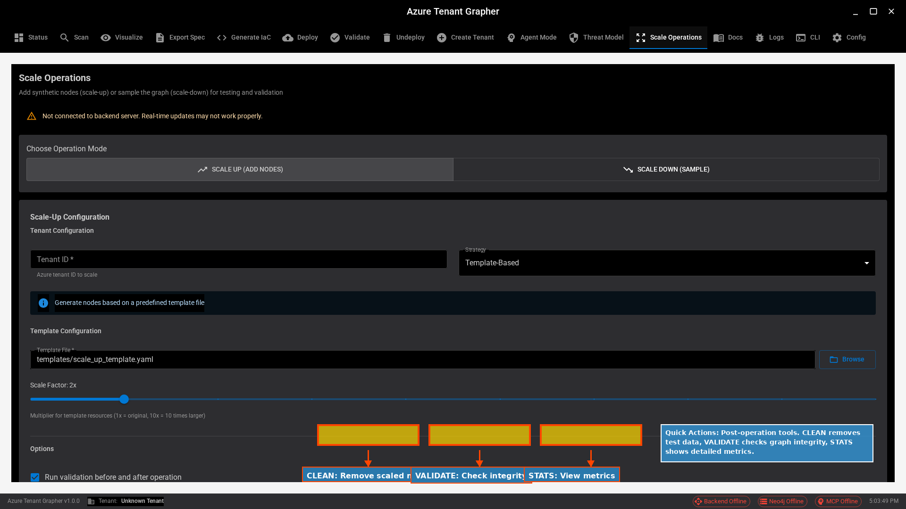
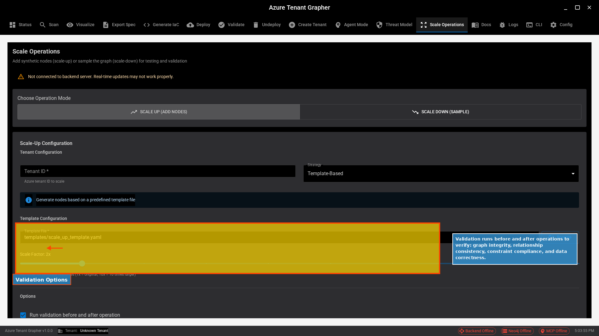
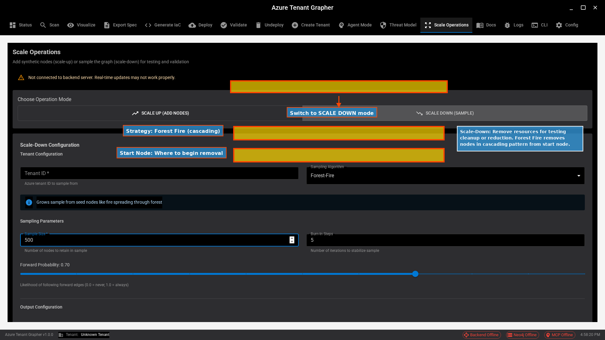

# Scale Operations UI Tutorial - Quick Index

Visual index of all tutorial screenshots with descriptions.

## Tutorial Screenshots

### 1. Getting Started

**What you'll learn:**
- Navigate to Scale Operations tab
- Choose between Scale-Up and Scale-Down modes
- Understand operation basics

---

### 2. Template Strategy

**What you'll learn:**
- Select Template-Based strategy
- Choose template file
- Configure scale factor

---

### 3. Scenario Selection

**What you'll learn:**
- Select Scenario-Based strategy
- Choose Hub-Spoke architecture
- Configure scenario parameters

---

### 4. Scale Factor Configuration

**What you'll learn:**
- Adjust scale factor slider
- Understand intensity control
- Enable validation options

---

### 5. Preview & Execute

**What you'll learn:**
- Preview changes before applying
- Execute operations safely
- Follow best practices

---

### 6. Quick Actions

**What you'll learn:**
- Clean up scaled resources
- Validate graph integrity
- View operation statistics

---

### 7. Validation Options

**What you'll learn:**
- Configure validation behavior
- Pre and post-validation
- Graph integrity checks

---

### 8. Scale-Down Mode

**What you'll learn:**
- Switch to Scale-Down mode
- Forest Fire removal strategy
- Cascading node removal

---

## Quick Reference

| Screenshot | Topic | Key Features |
|------------|-------|--------------|
| Tutorial 1 | Getting Started | Tab navigation, mode selection |
| Tutorial 2 | Template Strategy | Template files, scale factor |
| Tutorial 3 | Scenario Strategy | Hub-Spoke, parameters |
| Tutorial 4 | Scale Factor | Slider control, validation |
| Tutorial 5 | Preview & Execute | Safe workflow, verification |
| Tutorial 6 | Quick Actions | Clean, validate, stats |
| Tutorial 7 | Validation | Pre/post checks, integrity |
| Tutorial 8 | Scale-Down | Forest Fire, cascading removal |

---

## Usage Tips

1. **View in order** (1-8) for complete learning path
2. **Focus on workflows** that match your use case
3. **Refer back** as needed during actual operations
4. **Combine tutorials** for complex scenarios

## Next Steps

After completing this tutorial:
1. Try the workflows in the application
2. Start with small scale factors
3. Always preview before executing
4. Use validation for safety
5. Clean up test data regularly

---

**See also:**
- [Full Tutorial Guide](README.md) - Detailed explanations
- [Quick Reference](../scale-operations/QUICK_REFERENCE.md) - Command cheat sheet
- [Specification](../../../docs/SCALE_OPERATIONS_SPECIFICATION.md) - Technical details
